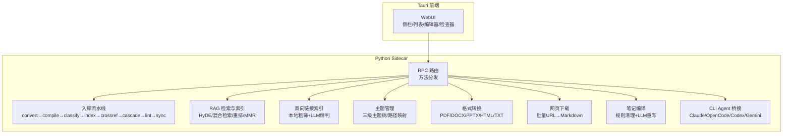
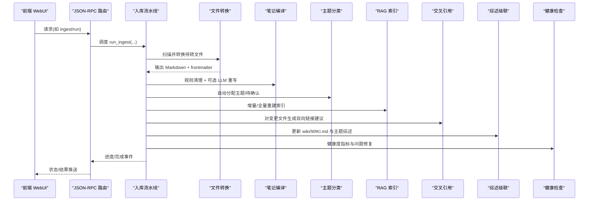
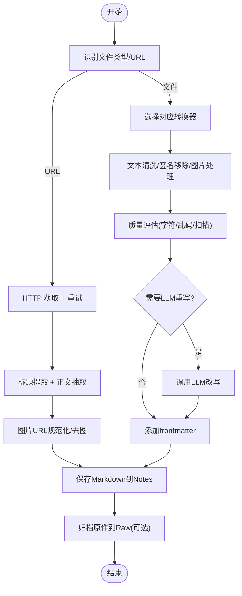
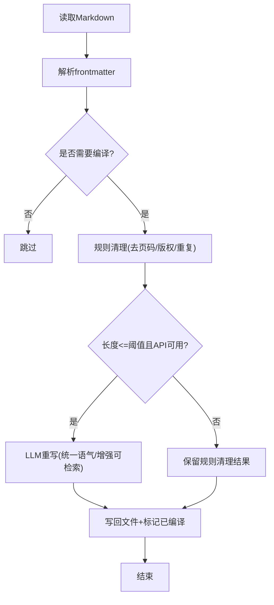
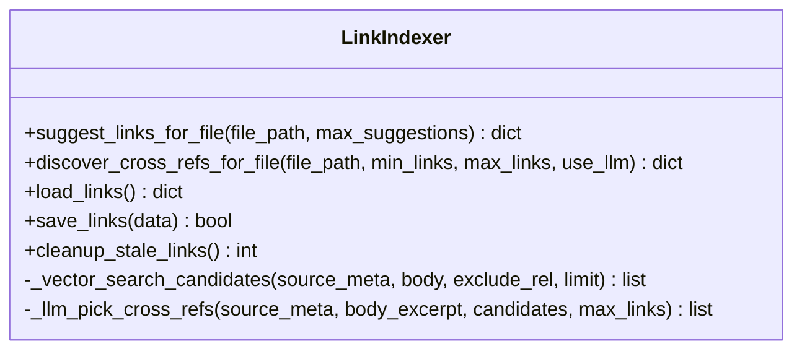
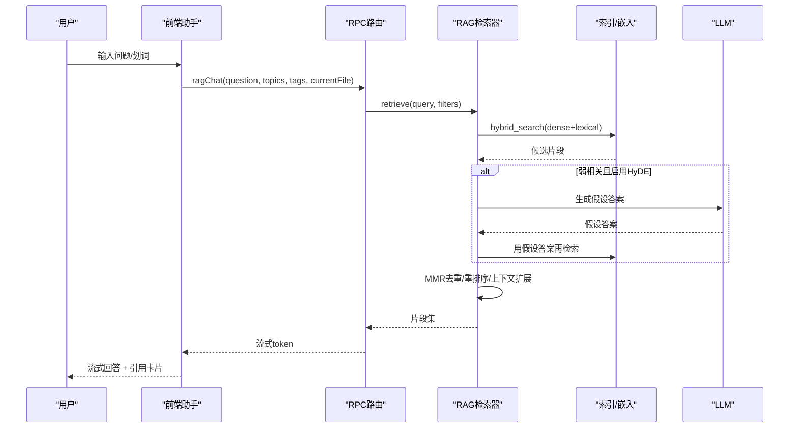
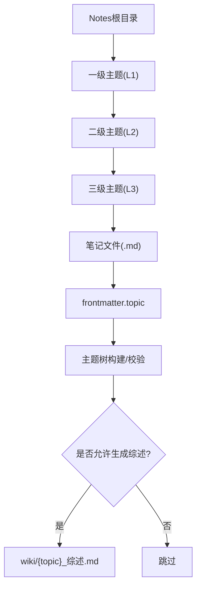
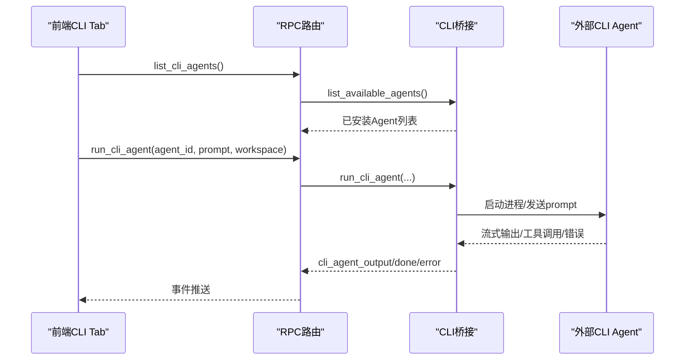
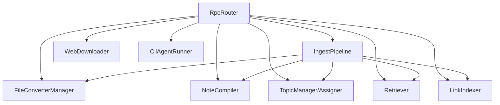

# 核心功能特性

<cite>
**本文引用的文件**   
- [README.md](file://README.md)
- [python/main.py](file://python/main.py)
- [modules/file_converter.py](file://modules/file_converter.py)
- [modules/web_downloader.py](file://modules/web_downloader.py)
- [utils/note_compiler.py](file://utils/note_compiler.py)
- [utils/topic_manager.py](file://utils/topic_manager.py)
- [utils/topic_assigner.py](file://utils/topic_assigner.py)
- [utils/link_indexer.py](file://utils/link_indexer.py)
- [python/sidecar/rag/retriever.py](file://python/sidecar/rag/retriever.py)
- [python/sidecar/ingest_pipeline.py](file://python/sidecar/ingest_pipeline.py)
- [python/sidecar/rpc_router.py](file://python/sidecar/rpc_router.py)
- [webui/js/assistant.js](file://webui/js/assistant.js)
- [webui/js/cli-agent.js](file://webui/js/cli-agent.js)
- [python/sidecar/cli_agent_runner.py](file://python/sidecar/cli_agent_runner.py)
</cite>

## 目录
1. [简介](#简介)
2. [项目结构](#项目结构)
3. [核心组件](#核心组件)
4. [架构总览](#架构总览)
5. [详细组件分析](#详细组件分析)
6. [依赖关系分析](#依赖关系分析)
7. [性能与可用性](#性能与可用性)
8. [故障排查指南](#故障排查指南)
9. [结论](#结论)
10. [附录：使用示例与最佳实践](#附录使用示例与最佳实践)

## 简介
NoteAI 是一款 AI 原生的个人知识库桌面应用，围绕“资料采集 → 知识编译 → 关联发现 → 智能问答”四大能力构建。其特色包括：
- 自动入库流水线（转换→编译→分类→索引→交叉引用→综述→健康检查）
- 三级主题体系（L1 > L2 > L3），驱动 Notes 目录结构与 wiki 综述
- RAG 助手（问答模式 / 助手模式），支持 HyDE + 混合检索 + 重排序 + MMR
- CLI Agent 桥接，将外部终端 AI 工具接入工作区并自动生成 AGENTS.md

本章节为总体概览，不直接分析具体代码文件。

## 项目结构
NoteAI 采用 Tauri v2（Rust）+ Python sidecar 的架构。前端通过 JSON-RPC 调用后端服务，sidecar 负责文件处理、RAG、入库流水线、CLI agent 桥接等。

图表来源
- [python/sidecar/rpc_router.py:1-106](file://python/sidecar/rpc_router.py#L1-L106)
- [python/sidecar/ingest_pipeline.py:1-120](file://python/sidecar/ingest_pipeline.py#L1-L120)
- [python/sidecar/rag/retriever.py:1-120](file://python/sidecar/rag/retriever.py#L1-L120)
- [utils/link_indexer.py:1-120](file://utils/link_indexer.py#L1-L120)
- [utils/topic_manager.py:1-60](file://utils/topic_manager.py#L1-L60)
- [modules/file_converter.py:1-80](file://modules/file_converter.py#L1-L80)
- [modules/web_downloader.py:1-60](file://modules/web_downloader.py#L1-L60)
- [utils/note_compiler.py:1-60](file://utils/note_compiler.py#L1-L60)
- [python/sidecar/cli_agent_runner.py:1-60](file://python/sidecar/cli_agent_runner.py#L1-L60)

章节来源
- [README.md:155-204](file://README.md#L155-L204)

## 核心组件
- 资料采集
  - 多格式转换：PDF/DOCX/PPTX/HTML/TXT → Markdown，含签名/页眉页脚清理与质量评估
  - 网页下载：批量 URL → Markdown，标题提取与图片链接规范化
- 知识编译
  - 规则清理：去页码/版权/重复行；可选 LLM 重写以统一语气与可检索性
- 关联发现
  - 双向链接：同主题/共享标签/标题提及/向量候选 → LLM 精判 → 持久化 .links.json
  - 知识图谱：基于主题、标签、链接的可视化
- 智能问答（RAG 助手）
  - 问答模式：HyDE + 稠密/稀疏混合检索 + 重排序 + MMR + 上下文扩展
  - 助手模式：在问答基础上支持创建主题、移动笔记、刷新综述、触发入库整理

章节来源
- [modules/file_converter.py:407-535](file://modules/file_converter.py#L407-L535)
- [modules/web_downloader.py:29-120](file://modules/web_downloader.py#L29-L120)
- [utils/note_compiler.py:43-103](file://utils/note_compiler.py#L43-L103)
- [utils/link_indexer.py:223-303](file://utils/link_indexer.py#L223-L303)
- [python/sidecar/rag/retriever.py:102-196](file://python/sidecar/rag/retriever.py#L102-L196)

## 架构总览
NoteAI 的端到端交互由前端发起，经 JSON-RPC 路由到 sidecar 各模块，最终落盘或返回流式结果。

图表来源
- [python/sidecar/rpc_router.py:44-106](file://python/sidecar/rpc_router.py#L44-L106)
- [python/sidecar/ingest_pipeline.py:480-800](file://python/sidecar/ingest_pipeline.py#L480-L800)
- [modules/file_converter.py:569-731](file://modules/file_converter.py#L569-L731)
- [utils/note_compiler.py:128-210](file://utils/note_compiler.py#L128-L210)
- [utils/topic_assigner.py:318-328](file://utils/topic_assigner.py#L318-L328)
- [python/sidecar/rag/retriever.py:459-626](file://python/sidecar/rag/retriever.py#L459-L626)
- [utils/link_indexer.py:430-560](file://utils/link_indexer.py#L430-L560)

## 详细组件分析

### 资料采集（多格式转换与网页下载）
- 多格式转换
  - 模板方法抽象 BaseConverter，子类实现 _extract_text，统一日志、异常与后处理
  - PDF 转换器具备签名/页眉页脚检测与移除；DOCX/PPTX/HTML/TXT 各有专用解析
  - 转换质量评估：字符密度、乱码比例、疑似扫描 PDF 判定
  - 可选 LLM 重写：当内容结构不佳且长度受限时进行改写
- 网页下载
  - 多策略标题提取（OG/twitter/平台特定 meta/h1/article 等）
  - HTML 预处理：懒加载属性归一化、srcset 解析、相对路径转绝对 URL
  - 批量下载：写入 Notes，归档原始 HTML 到 Raw，维护 tags.md

图表来源
- [modules/file_converter.py:27-92](file://modules/file_converter.py#L27-L92)
- [modules/file_converter.py:407-535](file://modules/file_converter.py#L407-L535)
- [modules/file_converter.py:569-731](file://modules/file_converter.py#L569-L731)
- [modules/web_downloader.py:29-120](file://modules/web_downloader.py#L29-L120)
- [modules/web_downloader.py:356-425](file://modules/web_downloader.py#L356-L425)
- [modules/web_downloader.py:446-533](file://modules/web_downloader.py#L446-L533)

章节来源
- [modules/file_converter.py:27-92](file://modules/file_converter.py#L27-L92)
- [modules/file_converter.py:407-535](file://modules/file_converter.py#L407-L535)
- [modules/file_converter.py:569-731](file://modules/file_converter.py#L569-L731)
- [modules/web_downloader.py:29-120](file://modules/web_downloader.py#L29-L120)
- [modules/web_downloader.py:356-425](file://modules/web_downloader.py#L356-L425)
- [modules/web_downloader.py:446-533](file://modules/web_downloader.py#L446-L533)

### 知识编译（规则清理与 LLM 优化）
- 规则清理：去除页码、版权声明、重复分隔线、高频短行
- 编译决策：仅对来自 PDF/Word 等已转换源的文件执行；长文跳过整篇 LLM 重写
- 状态记录：mark_compiled 避免重复编译

图表来源
- [utils/note_compiler.py:43-103](file://utils/note_compiler.py#L43-L103)
- [utils/note_compiler.py:128-210](file://utils/note_compiler.py#L128-L210)

章节来源
- [utils/note_compiler.py:43-103](file://utils/note_compiler.py#L43-L103)
- [utils/note_compiler.py:128-210](file://utils/note_compiler.py#L128-L210)

### 关联发现（双向链接与知识图谱）
- 两阶段发现
  - 本地粗筛：同 topic / 共享 tag / 文件名 token 重叠 / 标题互提
  - AI 精判：批处理候选对，LLM 判断相关性并输出 JSON 数组
- 存储与去重：.links.json 有向边，自动确认非 README 链接，去重自引用
- 向量辅助：失败冷却机制，避免频繁失败影响体验

图表来源
- [utils/link_indexer.py:223-303](file://utils/link_indexer.py#L223-L303)
- [utils/link_indexer.py:430-560](file://utils/link_indexer.py#L430-L560)
- [utils/link_indexer.py:310-360](file://utils/link_indexer.py#L310-L360)
- [utils/link_indexer.py:378-428](file://utils/link_indexer.py#L378-L428)

章节来源
- [utils/link_indexer.py:223-303](file://utils/link_indexer.py#L223-L303)
- [utils/link_indexer.py:430-560](file://utils/link_indexer.py#L430-L560)
- [utils/link_indexer.py:310-360](file://utils/link_indexer.py#L310-L360)
- [utils/link_indexer.py:378-428](file://utils/link_indexer.py#L378-L428)

### 智能问答（RAG 助手）
- 检索链路
  - 查询编码 → 混合检索（稠密 0.7 + BM25 0.3）→ 可选 HyDE → MMR 去重 → 可选重排序 → 上下文扩展 → 限制唯一来源
  - TTL 缓存相同查询结果，提升响应速度
- 两种模式
  - 问答模式：默认，基于笔记与综述回答，附带引用来源
  - 助手模式：除问答外，支持新建主题、移动笔记、刷新综述、触发入库整理
- 前端交互
  - 右侧面板流式渲染、引用高亮、一键保存答案到 Notes/RAG对话/wiki

图表来源
- [python/sidecar/rag/retriever.py:102-196](file://python/sidecar/rag/retriever.py#L102-L196)
- [python/sidecar/rag/retriever.py:198-227](file://python/sidecar/rag/retriever.py#L198-L227)
- [python/sidecar/rag/retriever.py:229-324](file://python/sidecar/rag/retriever.py#L229-L324)
- [webui/js/assistant.js:285-339](file://webui/js/assistant.js#L285-L339)
- [webui/js/assistant.js:442-496](file://webui/js/assistant.js#L442-L496)

章节来源
- [python/sidecar/rag/retriever.py:102-196](file://python/sidecar/rag/retriever.py#L102-L196)
- [python/sidecar/rag/retriever.py:198-227](file://python/sidecar/rag/retriever.py#L198-L227)
- [python/sidecar/rag/retriever.py:229-324](file://python/sidecar/rag/retriever.py#L229-L324)
- [webui/js/assistant.js:285-339](file://webui/js/assistant.js#L285-L339)
- [webui/js/assistant.js:442-496](file://webui/js/assistant.js#L442-L496)

### 三级主题体系（设计理念与工作机制）
- 设计目标
  - 以 Notes/L1/L2/L3 目录结构承载知识层级，frontmatter 中 topic 字段描述同一份笔记的主题归属
  - 一级/二级可生成综述，三级不支持综述；一级与二级不可同时存在综述
- 工作机制
  - 从文件系统扫描构建主题树，统计文件数与综述文件存在性
  - 根据路径推断主题层级，校验删除保护与综述冲突
  - 自动分配：优先文件夹路径推断，其次 LLM 建议匹配，否则进入待确认队列

图表来源
- [utils/topic_manager.py:32-109](file://utils/topic_manager.py#L32-L109)
- [utils/topic_manager.py:377-426](file://utils/topic_manager.py#L377-L426)
- [utils/topic_manager.py:291-345](file://utils/topic_manager.py#L291-L345)
- [utils/topic_assigner.py:95-118](file://utils/topic_assigner.py#L95-L118)
- [utils/topic_assigner.py:318-328](file://utils/topic_assigner.py#L318-L328)

章节来源
- [utils/topic_manager.py:32-109](file://utils/topic_manager.py#L32-L109)
- [utils/topic_manager.py:377-426](file://utils/topic_manager.py#L377-L426)
- [utils/topic_manager.py:291-345](file://utils/topic_manager.py#L291-L345)
- [utils/topic_assigner.py:95-118](file://utils/topic_assigner.py#L95-L118)
- [utils/topic_assigner.py:318-328](file://utils/topic_assigner.py#L318-L328)

### 自动入库流水线（阶段说明）
- 阶段顺序：rules → convert → compile → classify → index → crossref → cascade → lint → sync
- 关键行为
  - rules：检查工作区规则配置
  - convert：扫描未转换文件，批量转换并归档原件
  - compile：对已转换来源进行规则清理与可选 LLM 重写
  - classify：自动分配主题，必要时进入待确认
  - index：增量/全量重建 RAG 索引（含完整性修复）
  - crossref：对变更文件计算双向链接建议
  - cascade：更新 WIKI.md 与主题综述
  - lint：健康检查与问题修复
  - sync：云同步（实验性）

图表来源
- [python/sidecar/ingest_pipeline.py:23-24](file://python/sidecar/ingest_pipeline.py#L23-L24)
- [python/sidecar/ingest_pipeline.py:480-800](file://python/sidecar/ingest_pipeline.py#L480-L800)

章节来源
- [python/sidecar/ingest_pipeline.py:23-24](file://python/sidecar/ingest_pipeline.py#L23-L24)
- [python/sidecar/ingest_pipeline.py:480-800](file://python/sidecar/ingest_pipeline.py#L480-L800)

### CLI Agent 桥接（集成外部 AI 工具）
- 能力
  - 列出可用 agent（Claude Code / OpenCode / Codex / Gemini 等）
  - 以工作区为 cwd 派发提示词，流式输出事件
  - 自动生成 AGENTS.md，描述 vault 结构与规范
- 前端
  - Inspector 独立 CLI Tab，会话管理、工具调用卡片、工作流步骤展示、超时提示
- 后端
  - 兼容入口封装，内部迁移至 sidecar/cli_agent/ 包

图表来源
- [python/sidecar/cli_agent_runner.py:53-76](file://python/sidecar/cli_agent_runner.py#L53-L76)
- [webui/js/cli-agent.js:670-780](file://webui/js/cli-agent.js#L670-L780)
- [webui/js/cli-agent.js:496-533](file://webui/js/cli-agent.js#L496-L533)

章节来源
- [python/sidecar/cli_agent_runner.py:53-76](file://python/sidecar/cli_agent_runner.py#L53-L76)
- [webui/js/cli-agent.js:670-780](file://webui/js/cli-agent.js#L670-L780)
- [webui/js/cli-agent.js:496-533](file://webui/js/cli-agent.js#L496-L533)

## 依赖关系分析
- 前端通过 JSON-RPC 与 sidecar 通信，所有业务方法注册于 RpcRouter
- 入库流水线聚合多个子模块：转换、编译、分类、索引、交叉引用、综述、健康检查
- RAG 检索器依赖索引与嵌入模块，提供 HyDE、MMR、重排序与上下文扩展
- 双向链接索引复用 RAG 的混合检索作为候选来源，结合本地启发式与 LLM 精判

图表来源
- [python/sidecar/rpc_router.py:44-106](file://python/sidecar/rpc_router.py#L44-L106)
- [python/sidecar/ingest_pipeline.py:480-800](file://python/sidecar/ingest_pipeline.py#L480-L800)
- [python/sidecar/rag/retriever.py:102-196](file://python/sidecar/rag/retriever.py#L102-L196)
- [utils/link_indexer.py:430-560](file://utils/link_indexer.py#L430-L560)
- [utils/topic_manager.py:377-426](file://utils/topic_manager.py#L377-L426)
- [utils/topic_assigner.py:318-328](file://utils/topic_assigner.py#L318-L328)
- [modules/file_converter.py:407-535](file://modules/file_converter.py#L407-L535)
- [modules/web_downloader.py:446-533](file://modules/web_downloader.py#L446-L533)
- [utils/note_compiler.py:128-210](file://utils/note_compiler.py#L128-L210)
- [python/sidecar/cli_agent_runner.py:53-76](file://python/sidecar/cli_agent_runner.py#L53-L76)

章节来源
- [python/sidecar/rpc_router.py:44-106](file://python/sidecar/rpc_router.py#L44-L106)
- [python/sidecar/ingest_pipeline.py:480-800](file://python/sidecar/ingest_pipeline.py#L480-L800)
- [python/sidecar/rag/retriever.py:102-196](file://python/sidecar/rag/retriever.py#L102-L196)
- [utils/link_indexer.py:430-560](file://utils/link_indexer.py#L430-L560)
- [utils/topic_manager.py:377-426](file://utils/topic_manager.py#L377-L426)
- [utils/topic_assigner.py:318-328](file://utils/topic_assigner.py#L318-L328)
- [modules/file_converter.py:407-535](file://modules/file_converter.py#L407-L535)
- [modules/web_downloader.py:446-533](file://modules/web_downloader.py#L446-L533)
- [utils/note_compiler.py:128-210](file://utils/note_compiler.py#L128-L210)
- [python/sidecar/cli_agent_runner.py:53-76](file://python/sidecar/cli_agent_runner.py#L53-L76)

## 性能与可用性
- 并发与线程池
  - RPC 路由使用线程池执行处理器，避免阻塞主循环
  - RAG 检索器使用线程池并行分块与编码，控制候选上限与冷却时间
- 增量与缓存
  - 入库流水线按 mtime/size 指纹快速判断变更，避免全量扫描
  - RAG 检索结果 TTL 缓存，减少重复计算
- 降级与容错
  - 重排序器失败冷却，链接向量搜索失败冷却，保障稳定性
  - 转换质量评估与 LLM 重写失败回退，确保流程健壮

[本节为通用指导，无需源码引用]

## 故障排查指南
- 常见问题定位
  - 转换失败：查看 FileConverterManager.convert_file 返回 error 与 quality 字段
  - 索引不一致：检查 is_index_up_to_date 与 count_indexed_chunks vs manifest
  - 链接异常：确认 .links.json 去重与 README 过滤逻辑
  - RAG 无结果：确认索引是否存在、当前文件是否在 Notes 下被排除
- 调试建议
  - 观察入库流水线 send_progress 回调的阶段与消息
  - 使用 RPC 错误信息（路径脱敏）定位问题
  - 前端助手面板的事件类型（rag_chat_chunk/done/index_built）辅助诊断

章节来源
- [modules/file_converter.py:569-731](file://modules/file_converter.py#L569-L731)
- [python/sidecar/rag/retriever.py:362-384](file://python/sidecar/rag/retriever.py#L362-L384)
- [utils/link_indexer.py:136-168](file://utils/link_indexer.py#L136-L168)
- [python/sidecar/rpc_router.py:54-94](file://python/sidecar/rpc_router.py#L54-L94)
- [webui/js/assistant.js:442-496](file://webui/js/assistant.js#L442-L496)

## 结论
NoteAI 通过统一的入库流水线与三级主题体系，将分散的资料转化为结构化、可检索的知识资产；RAG 助手与双向链接进一步打通“读—问—改—存”的闭环；CLI Agent 桥接则把外部 AI 工具纳入同一工作区生态，形成持续增值的个人知识库。

[本节为总结，无需源码引用]

## 附录：使用示例与最佳实践
- 快速上手
  - 打开工作区 → 设置模型 API Key → 导入 PDF/DOCX 或批量网页下载 → 打开 RAG 助手提问
- 最佳实践
  - 保持 Notes 目录遵循 L1/L2/L3 结构，便于自动分类与综述生成
  - 定期运行入库流水线，确保索引与交叉引用最新
  - 在助手模式下谨慎新建主题（二级需明确一级父级），避免误挂
  - 利用健康检查与 Lint 报告修复低质量条目
- 参考路径
  - 转换与质量评估：[modules/file_converter.py:569-731](file://modules/file_converter.py#L569-L731)
  - 网页下载与标题提取：[modules/web_downloader.py:356-425](file://modules/web_downloader.py#L356-L425)
  - 笔记编译与状态：[utils/note_compiler.py:128-210](file://utils/note_compiler.py#L128-L210)
  - 主题管理与综述控制：[utils/topic_manager.py:291-345](file://utils/topic_manager.py#L291-L345)
  - 自动分类与待确认：[utils/topic_assigner.py:318-328](file://utils/topic_assigner.py#L318-L328)
  - 双向链接建议与持久化：[utils/link_indexer.py:430-560](file://utils/link_indexer.py#L430-L560)
  - RAG 检索与缓存：[python/sidecar/rag/retriever.py:102-196](file://python/sidecar/rag/retriever.py#L102-L196)
  - 入库流水线编排：[python/sidecar/ingest_pipeline.py:480-800](file://python/sidecar/ingest_pipeline.py#L480-L800)
  - CLI Agent 前端交互：[webui/js/cli-agent.js:670-780](file://webui/js/cli-agent.js#L670-L780)

章节来源
- [modules/file_converter.py:569-731](file://modules/file_converter.py#L569-L731)
- [modules/web_downloader.py:356-425](file://modules/web_downloader.py#L356-L425)
- [utils/note_compiler.py:128-210](file://utils/note_compiler.py#L128-L210)
- [utils/topic_manager.py:291-345](file://utils/topic_manager.py#L291-L345)
- [utils/topic_assigner.py:318-328](file://utils/topic_assigner.py#L318-L328)
- [utils/link_indexer.py:430-560](file://utils/link_indexer.py#L430-L560)
- [python/sidecar/rag/retriever.py:102-196](file://python/sidecar/rag/retriever.py#L102-L196)
- [python/sidecar/ingest_pipeline.py:480-800](file://python/sidecar/ingest_pipeline.py#L480-L800)
- [webui/js/cli-agent.js:670-780](file://webui/js/cli-agent.js#L670-L780)