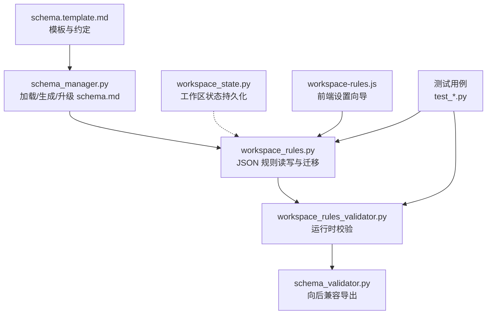
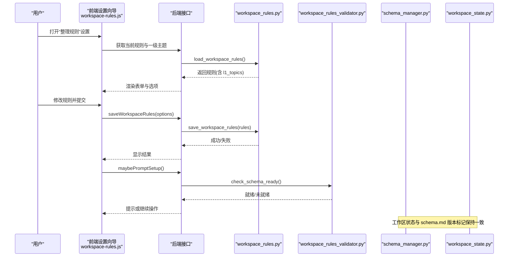
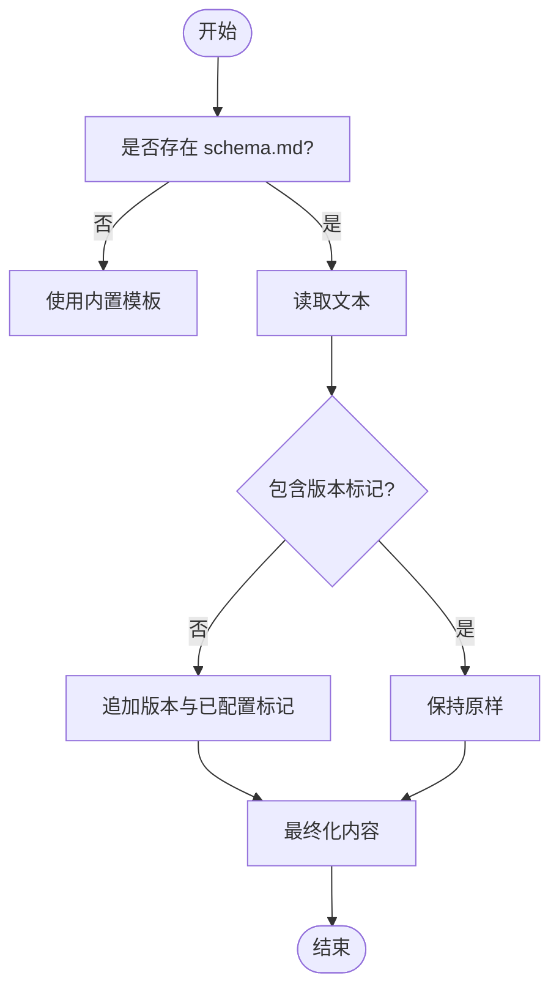
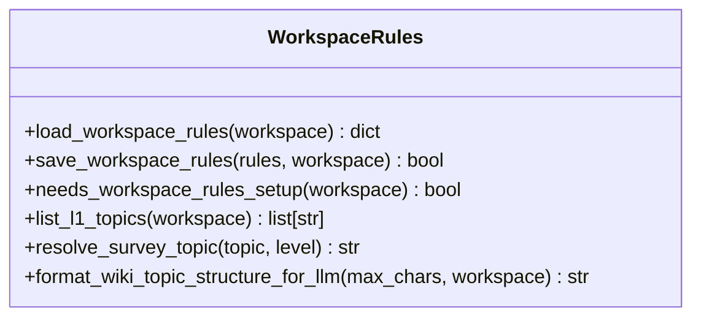
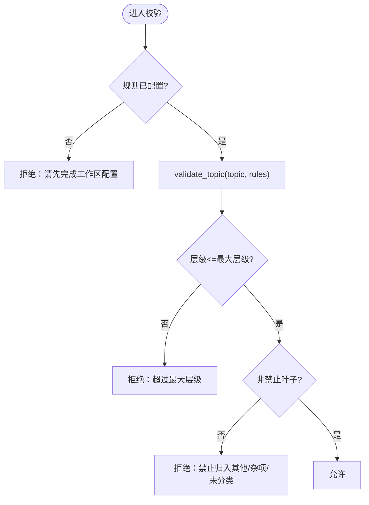
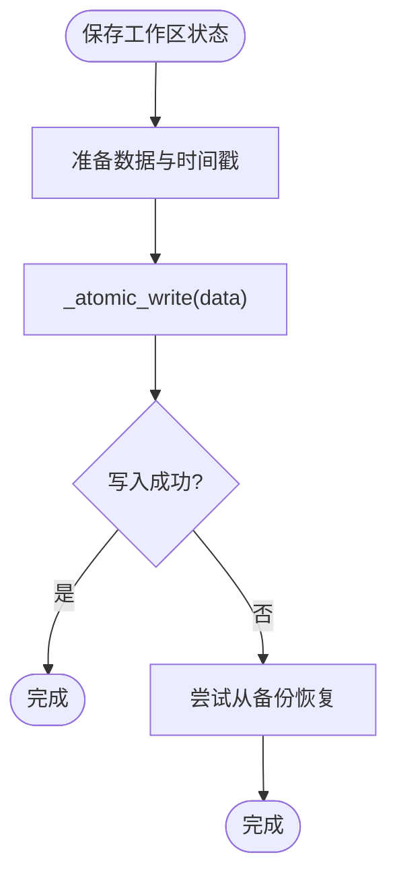
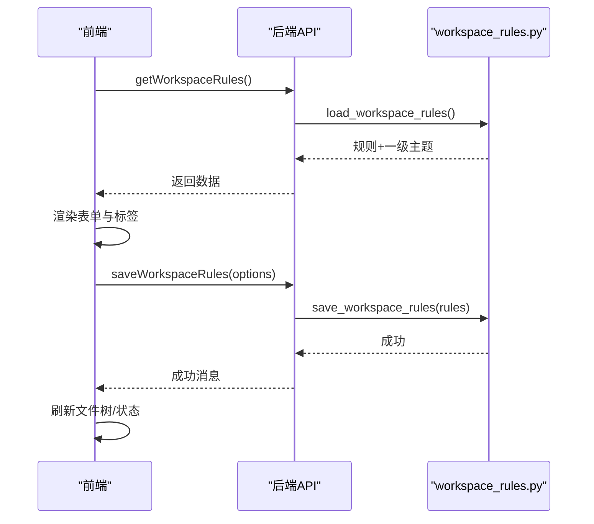
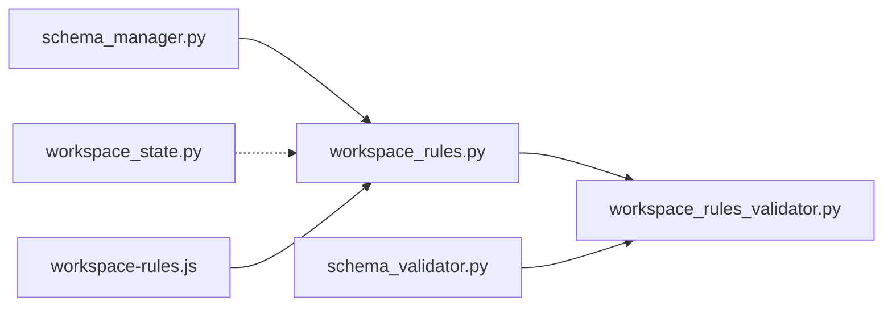

# Schema 工作区规范

<cite>
**本文引用的文件**   
- [schema_manager.py](file://python/sidecar/schema_manager.py)
- [workspace_rules.py](file://python/sidecar/workspace_rules.py)
- [workspace_rules_validator.py](file://python/sidecar/workspace_rules_validator.py)
- [schema_validator.py](file://python/sidecar/schema_validator.py)
- [workspace_state.py](file://config/workspace_state.py)
- [schema.template.md](file://docs/schema.template.md)
- [workspace-rules.js](file://webui/js/workspace-rules.js)
- [test_schema_validator.py](file://tests/unit/test_schema_validator.py)
- [test_workspace_rules.py](file://tests/unit/test_workspace_rules.py)
</cite>

## 目录
1. [简介](#简介)
2. [项目结构](#项目结构)
3. [核心组件](#核心组件)
4. [架构总览](#架构总览)
5. [详细组件分析](#详细组件分析)
6. [依赖关系分析](#依赖关系分析)
7. [性能与可扩展性](#性能与可扩展性)
8. [故障排查指南](#故障排查指南)
9. [结论](#结论)
10. [附录：最佳实践与常见模式](#附录最佳实践与常见模式)

## 简介
本文件系统化阐述 NoteAI 的“Schema 工作区规范”体系，围绕以下目标展开：
- schema.md 的作用与重要性：定义 AI 可写范围、主题层级规则、冲突解决策略。
- Schema 验证机制：规则检查、违规拦截与处理。
- 工作区状态同步管理：版本与变更历史维护。
- Schema 扩展机制：如何添加自定义规则以适配不同场景。
- 前端集成：用户友好的规则配置界面与实时反馈。
- 最佳实践与常见模式：帮助用户建立高效的知识管理工作流。

## 项目结构
NoteAI 的 Schema 相关能力由后端 Python 模块与前端 JS 模块协同实现，关键文件分布如下：
- 规则定义与模板：docs/schema.template.md
- 规则解析与持久化：python/sidecar/schema_manager.py、python/sidecar/workspace_rules.py
- 运行时校验：python/sidecar/workspace_rules_validator.py（兼容导出：python/sidecar/schema_validator.py）
- 工作区状态：config/workspace_state.py
- 前端交互：webui/js/workspace-rules.js
- 单元测试：tests/unit/test_schema_validator.py、tests/unit/test_workspace_rules.py

图示来源
- [schema_manager.py:1-307](file://python/sidecar/schema_manager.py#L1-L307)
- [workspace_rules.py:1-200](file://python/sidecar/workspace_rules.py#L1-L200)
- [workspace_rules_validator.py:1-94](file://python/sidecar/workspace_rules_validator.py#L1-L94)
- [schema_validator.py:1-15](file://python/sidecar/schema_validator.py#L1-L15)
- [workspace_state.py:1-198](file://config/workspace_state.py#L1-L198)
- [workspace-rules.js:1-311](file://webui/js/workspace-rules.js#L1-L311)
- [test_schema_validator.py:1-64](file://tests/unit/test_schema_validator.py#L1-L64)
- [test_workspace_rules.py:1-90](file://tests/unit/test_workspace_rules.py#L1-L90)

章节来源
- [schema_manager.py:1-307](file://python/sidecar/schema_manager.py#L1-L307)
- [workspace_rules.py:1-200](file://python/sidecar/workspace_rules.py#L1-L200)
- [workspace_rules_validator.py:1-94](file://python/sidecar/workspace_rules_validator.py#L1-L94)
- [schema_validator.py:1-15](file://python/sidecar/schema_validator.py#L1-L15)
- [workspace_state.py:1-198](file://config/workspace_state.py#L1-L198)
- [workspace-rules.js:1-311](file://webui/js/workspace-rules.js#L1-L311)
- [test_schema_validator.py:1-64](file://tests/unit/test_schema_validator.py#L1-L64)
- [test_workspace_rules.py:1-90](file://tests/unit/test_workspace_rules.py#L1-L90)

## 核心组件
- schema.md 模板与生成器
  - 提供完整的工作区宪法说明，包括目录结构、主题体系、Frontmatter、入库与级联、AI 可写范围、冲突与异常等。
  - 支持自动注入版本标记与“已配置”标记，便于系统识别与升级。
- 规则解析与持久化
  - 从 schema.md 轻量解析运行期开关；同时提供 JSON 规则文件进行稳定持久化与迁移。
  - 支持从旧版 schema.md 迁移到 .noteai/workspace_rules.json。
- 运行时校验
  - 对主题路径合法性、层级深度、禁止叶子节点等进行严格校验。
  - 对 wiki/Notes 的可写权限进行基于规则的拦截。
- 工作区状态
  - 原子写入、备份恢复、信息读取，保障工作区元数据一致性。
- 前端集成
  - 提供“整理规则”设置向导，可视化选择最大层级、综述粒度、是否自动更新综述等，并保存至后端。

章节来源
- [schema.template.md:1-208](file://docs/schema.template.md#L1-L208)
- [schema_manager.py:144-177](file://python/sidecar/schema_manager.py#L144-L177)
- [workspace_rules.py:32-96](file://python/sidecar/workspace_rules.py#L32-L96)
- [workspace_rules_validator.py:29-94](file://python/sidecar/workspace_rules_validator.py#L29-L94)
- [workspace_state.py:26-86](file://config/workspace_state.py#L26-L86)
- [workspace-rules.js:100-140](file://webui/js/workspace-rules.js#L100-L140)

## 架构总览
下图展示了 Schema 工作区规范在系统中的整体交互：模板驱动生成、规则解析与持久化、运行时校验、前端配置与提示。

图示来源
- [workspace-rules.js:100-140](file://webui/js/workspace-rules.js#L100-L140)
- [workspace_rules.py:59-96](file://python/sidecar/workspace_rules.py#L59-L96)
- [workspace_rules_validator.py:55-63](file://python/sidecar/workspace_rules_validator.py#L55-L63)
- [schema_manager.py:85-92](file://python/sidecar/schema_manager.py#L85-L92)
- [workspace_state.py:62-86](file://config/workspace_state.py#L62-L86)

## 详细组件分析

### schema.md 模板与生成器
- 作用与重要性
  - 作为“工作区宪法”，明确目录结构、主题体系、Frontmatter 规范、入库与级联流程、AI 可写范围、冲突与异常处理原则。
  - 通过版本标记与“已配置”标记，使系统能识别是否需要初始化或升级。
- 关键行为
  - 自动检测是否需要升级并补全标记。
  - 根据工作区实际的一级主题动态生成 schema 内容。
  - 输出供 LLM 使用的摘要片段，包含关键开关。
- 建议
  - 保持 schema.md 与工作区实际结构一致；当 Notes/ 变化时，系统会重建 WIKI 索引以保持事实来源唯一性。

图示来源
- [schema_manager.py:46-92](file://python/sidecar/schema_manager.py#L46-L92)
- [schema_manager.py:207-272](file://python/sidecar/schema_manager.py#L207-L272)
- [schema.template.md:1-208](file://docs/schema.template.md#L1-L208)

章节来源
- [schema_manager.py:144-177](file://python/sidecar/schema_manager.py#L144-L177)
- [schema_manager.py:207-272](file://python/sidecar/schema_manager.py#L207-L272)
- [schema.template.md:1-208](file://docs/schema.template.md#L1-L208)

### 规则解析与持久化（workspace_rules.py）
- 职责
  - 从 .noteai/workspace_rules.json 加载/保存规则，合并默认值。
  - 从旧版 schema.md 一次性迁移规则到 JSON。
  - 提供一级主题列表、综述粒度计算、格式化主题结构给 LLM 使用。
- 关键点
  - 字段类型与边界：max_topic_depth 限制在 1~3；survey_at_level 限制在 1~2。
  - configured 标志用于判定是否需要引导用户完成设置。
  - 优先以 Notes/ 文件夹为事实来源，避免 stale wiki 影响分类。

图示来源
- [workspace_rules.py:59-96](file://python/sidecar/workspace_rules.py#L59-L96)
- [workspace_rules.py:129-141](file://python/sidecar/workspace_rules.py#L129-L141)
- [workspace_rules.py:163-168](file://python/sidecar/workspace_rules.py#L163-L168)
- [workspace_rules.py:171-200](file://python/sidecar/workspace_rules.py#L171-L200)

章节来源
- [workspace_rules.py:32-96](file://python/sidecar/workspace_rules.py#L32-L96)
- [workspace_rules.py:129-141](file://python/sidecar/workspace_rules.py#L129-L141)
- [workspace_rules.py:163-168](file://python/sidecar/workspace_rules.py#L163-L168)
- [workspace_rules.py:171-200](file://python/sidecar/workspace_rules.py#L171-L200)

### 运行时校验（workspace_rules_validator.py）
- 职责
  - 校验主题路径合法性、层级深度、禁止叶子节点。
  - 检查工作区是否已完成规则配置。
  - 依据规则判断 wiki/Notes 的可写权限。
- 错误模型
  - 抛出 WorkspaceRulesValidationError（含别名 SchemaValidationError），上层可统一捕获并提示用户。
- 典型调用链
  - require_topic -> validate_topic -> 返回 (ok, msg)
  - check_wiki_writable / check_notes_writable -> 基于规则拒绝越权写入

图示来源
- [workspace_rules_validator.py:29-53](file://python/sidecar/workspace_rules_validator.py#L29-L53)
- [workspace_rules_validator.py:55-83](file://python/sidecar/workspace_rules_validator.py#L55-L83)

章节来源
- [workspace_rules_validator.py:29-94](file://python/sidecar/workspace_rules_validator.py#L29-L94)

### 向后兼容导出（schema_validator.py）
- 职责
  - 将新的 workspace_rules_validator 能力以旧名称导出，保证既有调用方无需改动。
- 要点
  - 保留 allows_wiki_edit、check_notes_writable、require_topic、topic_depth、validate_topic 等函数名。

章节来源
- [schema_validator.py:1-15](file://python/sidecar/schema_validator.py#L1-L15)

### 工作区状态同步（workspace_state.py）
- 职责
  - 原子写入工作区状态文件，失败时回退并创建备份。
  - 提供加载、清理、信息读取等方法，确保状态可读且可恢复。
- 特性
  - 使用临时文件 + fsync + 移动替换的方式保证原子性。
  - 自动备份 .json.bak，并在解析失败时尝试恢复。

图示来源
- [workspace_state.py:26-86](file://config/workspace_state.py#L26-L86)
- [workspace_state.py:108-126](file://config/workspace_state.py#L108-L126)

章节来源
- [workspace_state.py:26-86](file://config/workspace_state.py#L26-L86)
- [workspace_state.py:108-126](file://config/workspace_state.py#L108-L126)

### 前端集成（workspace-rules.js）
- 职责
  - 加载当前规则与一级主题，渲染设置卡片与单选按钮。
  - 保存规则到后端，并在成功后刷新树视图与状态栏。
  - 在未配置时弹出设置向导，引导用户完成配置。
- 交互流程
  - 打开设置 → 拉取规则 → 渲染表单 → 用户修改 → 提交保存 → 提示结果 → 可选触发后续动作（如刷新文件树）。

图示来源
- [workspace-rules.js:95-140](file://webui/js/workspace-rules.js#L95-L140)
- [workspace_rules.py:59-96](file://python/sidecar/workspace_rules.py#L59-L96)

章节来源
- [workspace-rules.js:100-140](file://webui/js/workspace-rules.js#L100-L140)
- [workspace-rules.js:187-206](file://webui/js/workspace-rules.js#L187-L206)

## 依赖关系分析
- 模块耦合
  - schema_manager.py 依赖 workspace_rules.py 的规则解析与主题列表，负责 schema.md 的生成与升级。
  - workspace_rules_validator.py 依赖 workspace_rules.py 的加载逻辑，执行运行时校验。
  - schema_validator.py 仅做重导出，不引入新依赖。
  - workspace_state.py 独立于规则模块，但常被工作区生命周期调用。
  - 前端 workspace-rules.js 通过 API 与后端交互，间接依赖 workspace_rules.py。
- 外部依赖
  - 文件系统 I/O、JSON 序列化、正则表达式匹配。
  - 常量 TOPIC_SEP 来自 config.constants。

图示来源
- [schema_manager.py:144-177](file://python/sidecar/schema_manager.py#L144-L177)
- [workspace_rules.py:59-96](file://python/sidecar/workspace_rules.py#L59-L96)
- [workspace_rules_validator.py:5-6](file://python/sidecar/workspace_rules_validator.py#L5-L6)
- [schema_validator.py:3-14](file://python/sidecar/schema_validator.py#L3-L14)
- [workspace_state.py:1-20](file://config/workspace_state.py#L1-L20)
- [workspace-rules.js:95-140](file://webui/js/workspace-rules.js#L95-L140)

章节来源
- [schema_manager.py:144-177](file://python/sidecar/schema_manager.py#L144-L177)
- [workspace_rules.py:59-96](file://python/sidecar/workspace_rules.py#L59-L96)
- [workspace_rules_validator.py:5-6](file://python/sidecar/workspace_rules_validator.py#L5-L6)
- [schema_validator.py:3-14](file://python/sidecar/schema_validator.py#L3-L14)
- [workspace_state.py:1-20](file://config/workspace_state.py#L1-L20)
- [workspace-rules.js:95-140](file://webui/js/workspace-rules.js#L95-L140)

## 性能与可扩展性
- 性能
  - 规则解析采用轻量正则与字典合并，开销极低。
  - 主题结构构建优先扫描 Notes/ 目录，避免读取大体积 wiki 文件。
  - 状态保存采用原子写入，减少并发竞争导致的损坏风险。
- 可扩展性
  - 新增规则字段：在 DEFAULT_RULES 与 save_workspace_rules 中增加默认值与类型约束。
  - 新增校验：在 validate_topic 或新增专用检查函数，并在需要处调用。
  - 前端扩展：在 workspace-rules.js 中添加对应控件与保存逻辑，并通过 API 传递。

[本节为通用指导，不直接分析具体文件]

## 故障排查指南
- 常见问题
  - 主题层级超限：检查 max_topic_depth 与 topic 分隔符数量。
  - 禁止叶子节点：避免使用“其他/杂项/未分类”等命名。
  - 未配置工作区：先通过设置向导完成规则配置。
  - 无法写入 wiki/Notes：确认 ai_may_edit_wiki/ai_may_edit_notes 开关。
- 定位方法
  - 查看校验返回值与错误消息，快速定位原因。
  - 检查工作区状态文件是否存在且可读，必要时从备份恢复。
  - 对比 schema.md 与 .noteai/workspace_rules.json 的一致性。

章节来源
- [workspace_rules_validator.py:29-53](file://python/sidecar/workspace_rules_validator.py#L29-L53)
- [workspace_rules_validator.py:65-83](file://python/sidecar/workspace_rules_validator.py#L65-L83)
- [workspace_state.py:108-126](file://config/workspace_state.py#L108-L126)

## 结论
Schema 工作区规范通过“模板 + 规则解析 + 运行时校验 + 前端向导 + 状态持久化”的组合，实现了：
- 明确的 AI 可写边界与冲突解决策略。
- 严格的主题层级与命名约束。
- 稳定的工作区状态管理与恢复能力。
- 良好的用户体验与可扩展性。

[本节为总结性内容，不直接分析具体文件]

## 附录：最佳实践与常见模式
- 设计原则
  - 以 Notes/ 文件夹为唯一事实来源，WIKI 与之保持一致。
  - 控制主题层级不超过 3 级，避免过深导致检索与维护困难。
  - 谨慎开启 ai_may_edit_notes，默认关闭以保证源稿安全。
- 常见模式
  - 增量综述：只更新受影响主题的综述，不动同主题其它笔记正文。
  - 待办分流：不确定归类时写入待办，不强行自动归类。
  - 人工锁定：在需保留段落外加锁定标记，综述更新不得删改。
- 扩展建议
  - 新增领域细则：在 .ai_memory/project_rules.md 中补充行业黑话表与禁止清单。
  - 自定义校验：在 workspace_rules_validator.py 中新增检查函数，并在业务入口调用。
  - 前端增强：在 workspace-rules.js 中增加更多可视化控件与即时反馈。

[本节为通用指导，不直接分析具体文件]