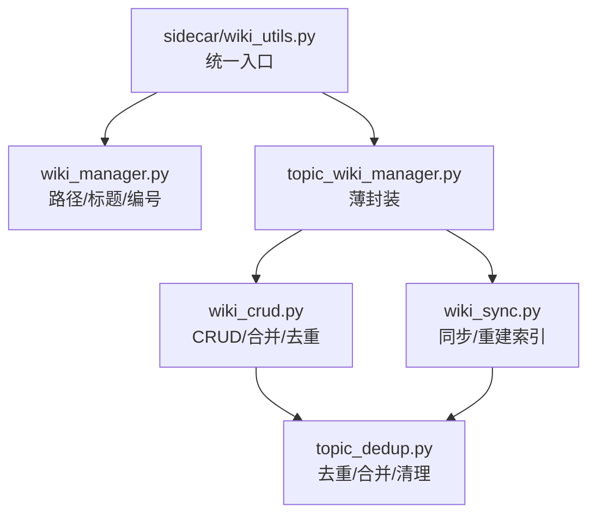
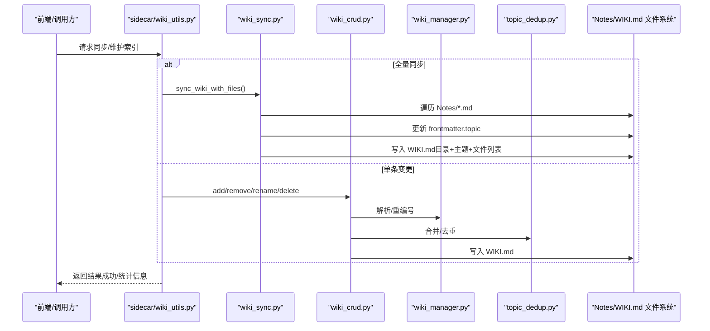
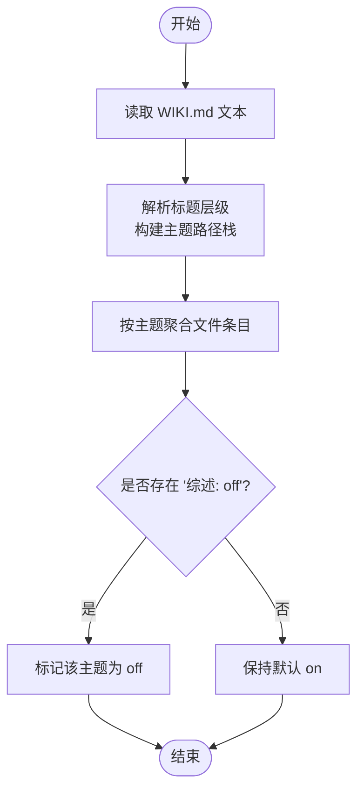
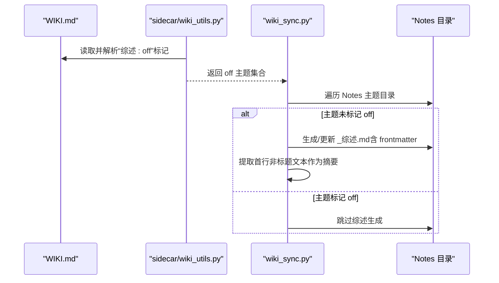
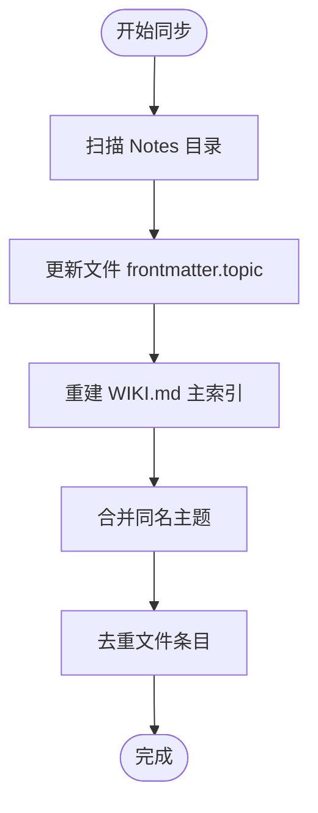
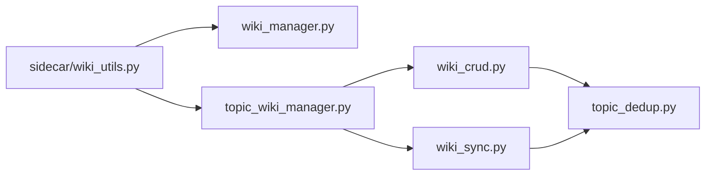

# WIKI 索引系统

<cite>
**本文引用的文件**   
- [utils/wiki_manager.py](file://utils/wiki_manager.py)
- [utils/wiki_crud.py](file://utils/wiki_crud.py)
- [utils/wiki_sync.py](file://utils/wiki_sync.py)
- [python/sidecar/wiki_utils.py](file://python/sidecar/wiki_utils.py)
- [utils/topic_wiki_manager.py](file://utils/topic_wiki_manager.py)
- [utils/topic_dedup.py](file://utils/topic_dedup.py)
</cite>

## 目录
1. [简介](#简介)
2. [项目结构](#项目结构)
3. [核心组件](#核心组件)
4. [架构总览](#架构总览)
5. [详细组件分析](#详细组件分析)
6. [依赖关系分析](#依赖关系分析)
7. [性能与一致性](#性能与一致性)
8. [故障排查指南](#故障排查指南)
9. [结论](#结论)
10. [附录：配置与自定义](#附录：配置与自定义)

## 简介
本文件为 NoteAI 的 WIKI 索引系统提供全面文档，覆盖以下方面：
- WIKI.md 主索引文件的自动生成与维护机制（目录结构、内容格式、更新策略）
- 主题综述文件 _综述.md 的生成逻辑与触发时机、内容模板、AI 摘要生成方式
- wiki 目录的组织结构与管理方式（主索引、主题综述、分类索引）
- WIKI 同步机制（增量更新、冲突检测、版本管理）
- WIKI 检索功能（全文搜索、分类浏览、快速导航）
- 配置选项与自定义方法（索引策略调整、内容优化建议）

## 项目结构
WIKI 索引系统围绕 WIKI.md 主索引文件展开，采用“统一入口 + 分层实现”的设计：
- 统一入口层：sidecar/wiki_utils.py 对外暴露统一的 WIKI.md I/O 接口，所有读写必须经过该模块
- 解析与路径层：wiki_manager.py 负责路径解析、标题解析、编号重排等基础能力
- CRUD 层：wiki_crud.py 提供增删改查与合并/去重等高级操作
- 同步层：wiki_sync.py 负责从 Notes 目录扫描并重建 WIKI.md，同时维护 frontmatter topic 字段
- 薄封装层：topic_wiki_manager.py 对 CRUD 与同步函数进行再导出，供上层调用
- 去重与清理：topic_dedup.py 提供重复主题合并、重复条目去重、空主题清理等工具

图表来源
- [python/sidecar/wiki_utils.py:1-122](file://python/sidecar/wiki_utils.py#L1-L122)
- [utils/wiki_manager.py:1-234](file://utils/wiki_manager.py#L1-L234)
- [utils/topic_wiki_manager.py:1-19](file://utils/topic_wiki_manager.py#L1-L19)
- [utils/wiki_crud.py:1-530](file://utils/wiki_crud.py#L1-L530)
- [utils/wiki_sync.py:1-202](file://utils/wiki_sync.py#L1-L202)
- [utils/topic_dedup.py:1-185](file://utils/topic_dedup.py#L1-L185)

章节来源
- [python/sidecar/wiki_utils.py:1-122](file://python/sidecar/wiki_utils.py#L1-L122)
- [utils/topic_wiki_manager.py:1-19](file://utils/topic_wiki_manager.py#L1-L19)

## 核心组件
- 统一入口 sidecar/wiki_utils.py
  - 提供 resolve_wiki_path、parse_wiki_headings、parse_wiki_structure、ensure_wiki_exists、read/write_wiki_text、get_all_topic_names、get_survey_status、toggle_survey、collect_survey_off_topics 等能力
  - 所有 WIKI.md 的读/写必须通过此模块，避免下游直接访问文件系统
- 解析与路径 utils/wiki_manager.py
  - 解析 WIKI.md 的二级/三级标题，构建主题路径与层级栈
  - 解析主题下的文件列表项，支持按主题聚合
  - 提供 _renumber_wiki_files 用于重新编号文件条目
- CRUD utils/wiki_crud.py
  - add_file_to_wiki_topic：在指定主题下添加文件条目，自动创建缺失父级标题
  - remove_file_from_wiki_topic：删除某文件条目并返回其所属主题
  - rename_wiki_topic/_remove_topic_from_wiki：重命名/删除主题标题及对应文件条目
  - create_topic/delete_topic/rename_topic：创建/删除/重命名主题，联动 Notes 目录与文件 frontmatter
- 同步 utils/wiki_sync.py
  - sync_wiki_with_files：遍历 Notes 目录，重建 WIKI.md 主索引，维护每个文件的 frontmatter.topic
  - topic_from_notes_path：根据文件相对路径推导主题路径（最多三层）
  - _write_file_topic_from_folder：将主题写入文件 frontmatter，保持 BOM 与 YAML 格式一致
  - _topic_one_line_summary：优先从同主题 _综述.md 提取首行非标题文本作为摘要
- 去重与清理 utils/topic_dedup.py
  - _merge_duplicate_topics_in_wiki：合并同名主题的文件条目
  - _deduplicate_files_in_wiki：去除同一主题内的重复文件条目
  - _remove_empty_topic_sections：移除无文件条目的空主题段

章节来源
- [python/sidecar/wiki_utils.py:1-260](file://python/sidecar/wiki_utils.py#L1-L260)
- [utils/wiki_manager.py:1-234](file://utils/wiki_manager.py#L1-L234)
- [utils/wiki_crud.py:1-530](file://utils/wiki_crud.py#L1-L530)
- [utils/wiki_sync.py:1-202](file://utils/wiki_sync.py#L1-L202)
- [utils/topic_dedup.py:1-185](file://utils/topic_dedup.py#L1-L185)

## 架构总览
WIKI 索引系统的核心流程包括：
- 索引生成：基于 Notes 目录结构与文件 frontmatter，重建 WIKI.md 主索引
- 索引维护：通过 CRUD 接口动态增删改主题与文件条目，并执行去重与重编号
- 综述控制：通过 WIKI.md 中的“综述: off”标记控制是否生成或展示主题综述
- 前端集成：侧边栏与搜索界面读取 WIKI.md 的结构化信息，提供分类浏览与快速导航

图表来源
- [python/sidecar/wiki_utils.py:77-122](file://python/sidecar/wiki_utils.py#L77-L122)
- [utils/wiki_sync.py:104-202](file://utils/wiki_sync.py#L104-L202)
- [utils/wiki_crud.py:13-102](file://utils/wiki_crud.py#L13-L102)
- [utils/topic_dedup.py:50-133](file://utils/topic_dedup.py#L50-L133)
- [utils/wiki_manager.py:128-151](file://utils/wiki_manager.py#L128-L151)

## 详细组件分析

### WIKI.md 主索引文件：结构与格式
- 位置与兼容
  - 优先使用 workspace/wiki/WIKI.md；若不存在则回退到 workspace/WIKI.md
- 头部元信息
  - 包含“生成时间”“主题数量”等元数据
- 目录与主题
  - “## 目录”后列出各主题标题（## 或 ###），支持多层嵌套
  - 每个主题下以有序列表形式列出文件条目，格式为“序号. **文件名**”，序号按主题内顺序连续
- 综述开关
  - 主题标题后可跟一行“> 综述: off”表示关闭该主题的综述生成/展示
- 解析规则
  - 忽略“目录”“来源文件”等特殊标题
  - 通过标题级别计算主题路径，使用分隔符拼接形成唯一主题名

图表来源
- [utils/wiki_manager.py:36-125](file://utils/wiki_manager.py#L36-L125)
- [python/sidecar/wiki_utils.py:129-151](file://python/sidecar/wiki_utils.py#L129-L151)

章节来源
- [utils/wiki_manager.py:22-64](file://utils/wiki_manager.py#L22-L64)
- [utils/wiki_manager.py:71-125](file://utils/wiki_manager.py#L71-L125)
- [python/sidecar/wiki_utils.py:129-151](file://python/sidecar/wiki_utils.py#L129-L151)

### 主题综述文件：_综述.md 的生成与摘要
- 生成时机
  - 当主题处于“综述: on”状态时，系统会在主题目录下生成或更新 _综述.md
  - 综述开关由 WIKI.md 中“> 综述: off”标记控制，可通过 toggle_survey 切换
- 内容模板
  - 通常包含 frontmatter 与正文摘要；正文首行非标题文本会被提取为“一句话摘要”
- AI 摘要生成
  - 当前代码未直接实现 LLM 摘要生成逻辑，但提供了“一句话摘要”的提取与展示
  - 如需接入 AI 摘要，可在综述生成流程中插入 LLM 重写步骤，并将结果写入 _综述.md 正文

图表来源
- [python/sidecar/wiki_utils.py:154-227](file://python/sidecar/wiki_utils.py#L154-L227)
- [utils/wiki_sync.py:72-101](file://utils/wiki_sync.py#L72-L101)

章节来源
- [python/sidecar/wiki_utils.py:154-227](file://python/sidecar/wiki_utils.py#L154-L227)
- [utils/wiki_sync.py:72-101](file://utils/wiki_sync.py#L72-L101)

### wiki 目录组织结构与管理
- 主索引
  - workspace/wiki/WIKI.md（或 workspace/WIKI.md）
- 主题综述
  - 位于 Notes 目录对应主题路径下，如 Notes/A/B/_综述.md
- 分类索引
  - 由 WIKI.md 的标题层级体现，无需额外索引文件
- 管理方式
  - 通过 CRUD 接口维护主题与文件条目
  - 通过同步接口重建索引，确保与 Notes 目录一致

章节来源
- [utils/wiki_manager.py:22-33](file://utils/wiki_manager.py#L22-L33)
- [utils/wiki_sync.py:104-202](file://utils/wiki_sync.py#L104-L202)

### WIKI 同步机制：增量、冲突与版本
- 增量更新
  - 同步过程会遍历 Notes 目录，仅对存在 frontmatter 差异的文件进行更新
  - 新增/移动/删除文件时，通过同步重建 WIKI.md，保证索引与文件系统一致
- 冲突检测
  - 合并同名主题时，保留首个主题的文件条目，其余主题的文件条目合并入首个主题
  - 同一主题内重复文件条目会被去重
- 版本管理
  - 当前未实现显式版本控制；建议在外部引入 Git 或类似机制进行版本追踪
  - 可结合工作区元数据记录同步时间与统计信息

图表来源
- [utils/wiki_sync.py:104-202](file://utils/wiki_sync.py#L104-L202)
- [utils/topic_dedup.py:50-133](file://utils/topic_dedup.py#L50-L133)
- [utils/topic_dedup.py:136-184](file://utils/topic_dedup.py#L136-L184)

章节来源
- [utils/wiki_sync.py:104-202](file://utils/wiki_sync.py#L104-L202)
- [utils/topic_dedup.py:50-133](file://utils/topic_dedup.py#L50-L133)
- [utils/topic_dedup.py:136-184](file://utils/topic_dedup.py#L136-L184)

### WIKI 检索功能：全文搜索、分类浏览、快速导航
- 分类浏览
  - 通过 parse_wiki_headings/parse_wiki_structure 获取主题层级与文件列表，用于侧边栏树形展示
- 快速导航
  - 点击主题或文件条目可直接跳转到对应笔记或打开预览
- 全文搜索
  - 当前仓库未提供 WIKI.md 全文搜索的具体实现；可在前端或后端扩展基于倒排索引或轻量搜索引擎的能力

[本节为概念性说明，不直接分析具体文件]

## 依赖关系分析
- 耦合与内聚
  - sidecar/wiki_utils.py 作为统一入口，降低下游模块对文件系统的直接耦合
  - wiki_manager.py 专注解析与路径处理，职责单一，内聚度高
  - wiki_crud.py 与 wiki_sync.py 分别承担变更与重建职责，边界清晰
  - topic_dedup.py 提供通用去重与合并工具，被 CRUD 与同步共同复用
- 循环依赖规避
  - 通过延迟导入与薄封装层避免循环引用
- 外部依赖
  - 配置文件 config 与常量 TOPIC_SEP
  - 日志 logger
  - YAML 解析库（frontmatter 处理）

图表来源
- [python/sidecar/wiki_utils.py:1-122](file://python/sidecar/wiki_utils.py#L1-L122)
- [utils/topic_wiki_manager.py:1-19](file://utils/topic_wiki_manager.py#L1-L19)
- [utils/wiki_crud.py:1-530](file://utils/wiki_crud.py#L1-L530)
- [utils/wiki_sync.py:1-202](file://utils/wiki_sync.py#L1-L202)
- [utils/topic_dedup.py:1-185](file://utils/topic_dedup.py#L1-L185)

章节来源
- [python/sidecar/wiki_utils.py:1-122](file://python/sidecar/wiki_utils.py#L1-L122)
- [utils/topic_wiki_manager.py:1-19](file://utils/topic_wiki_manager.py#L1-L19)

## 性能与一致性
- 性能
  - 同步过程为 O(N) 扫描 Notes 目录，N 为 Markdown 文件数量
  - 合并与去重操作为线性扫描与哈希集合去重，整体复杂度可控
- 一致性
  - 通过“综述: off”标记与 frontmatter.topic 双向校验，减少不一致风险
  - 重编号与去重确保 WIKI.md 条目稳定有序
- 建议
  - 在大仓库场景下，考虑增量同步策略（仅变更主题与文件）
  - 引入并发读取以提升扫描速度（注意文件锁与一致性）

[本节提供一般性指导，不直接分析具体文件]

## 故障排查指南
- 常见问题
  - WIKI.md 路径无效：检查工作区配置与 wiki 目录权限
  - 读取失败：确认编码为 UTF-8，且文件未被占用
  - 写入失败：检查磁盘空间与权限
  - 主题不存在或已存在：在创建/重命名前进行存在性检查
- 定位方法
  - 查看日志输出（logger.warning/error）
  - 使用 get_survey_status/toggle_survey 验证综述开关状态
  - 使用 parse_wiki_headings/parse_wiki_structure 检查解析结果是否符合预期

章节来源
- [utils/wiki_crud.py:13-102](file://utils/wiki_crud.py#L13-L102)
- [utils/wiki_sync.py:104-202](file://utils/wiki_sync.py#L104-L202)
- [python/sidecar/wiki_utils.py:129-151](file://python/sidecar/wiki_utils.py#L129-L151)

## 结论
NoteAI 的 WIKI 索引系统通过统一入口、分层实现与去重合并机制，实现了稳定的主索引生成与维护。配合 Notes 目录结构与 frontmatter.topic，系统能够高效地组织知识、控制综述生成，并提供良好的可扩展性。未来可在全文搜索、增量同步与版本管理方面进一步增强。

[本节为总结性内容，不直接分析具体文件]

## 附录：配置与自定义
- 配置项
  - 工作区路径：config.workspace_path
  - 主题分隔符：config.constants.TOPIC_SEP
  - 目录名称：config.NOTES_FOLDER、config.ABSTRACT_FOLDER
- 自定义方法
  - 修改索引策略：调整同步过程中的过滤条件与排序规则
  - 内容优化建议：规范文件命名与 frontmatter 字段，提升摘要质量
  - 接入 AI 摘要：在综述生成流程中插入 LLM 重写步骤，并将结果写入 _综述.md

章节来源
- [utils/wiki_sync.py:104-202](file://utils/wiki_sync.py#L104-L202)
- [utils/wiki_manager.py:1-20](file://utils/wiki_manager.py#L1-L20)