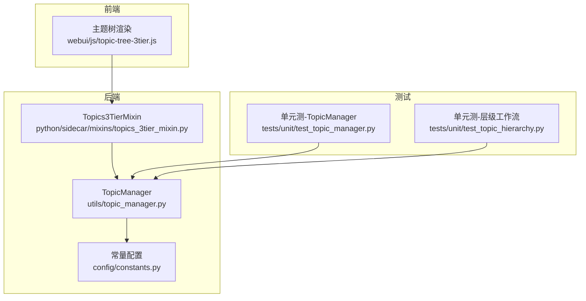
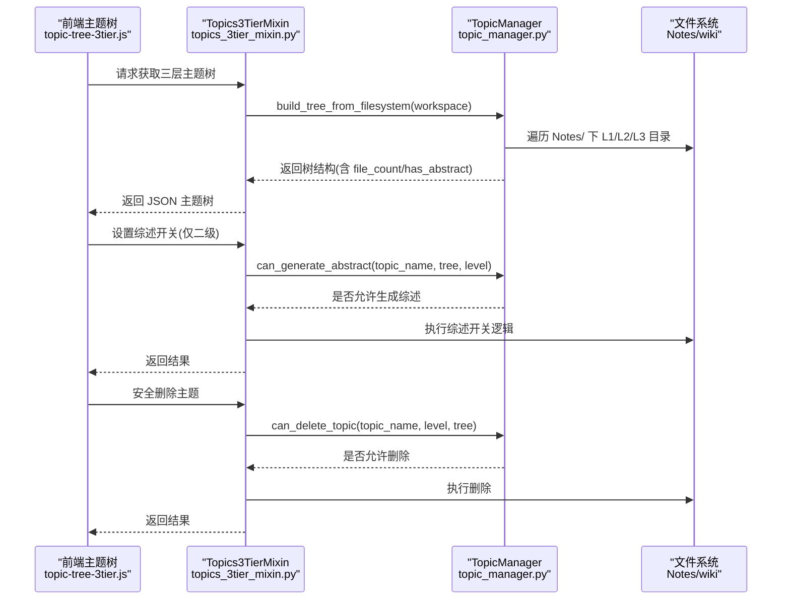
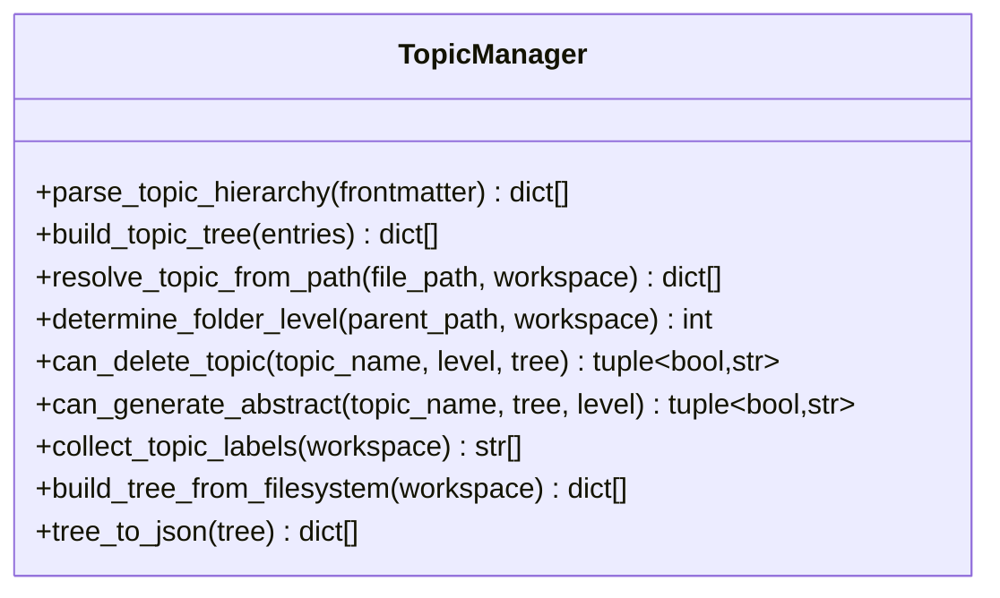
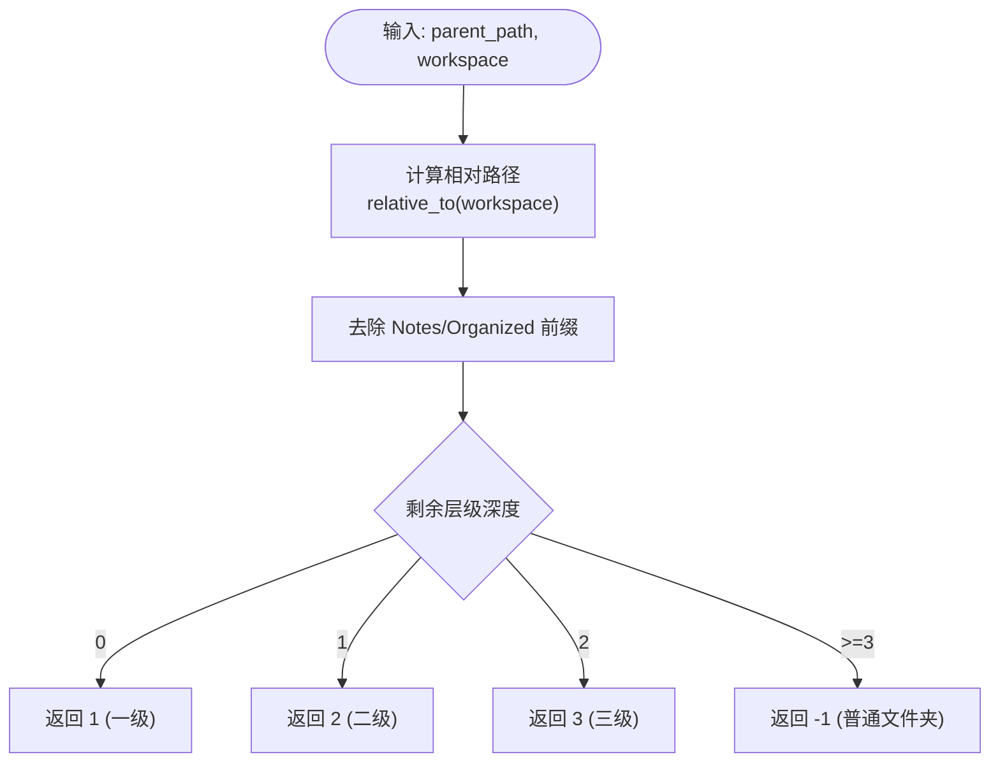
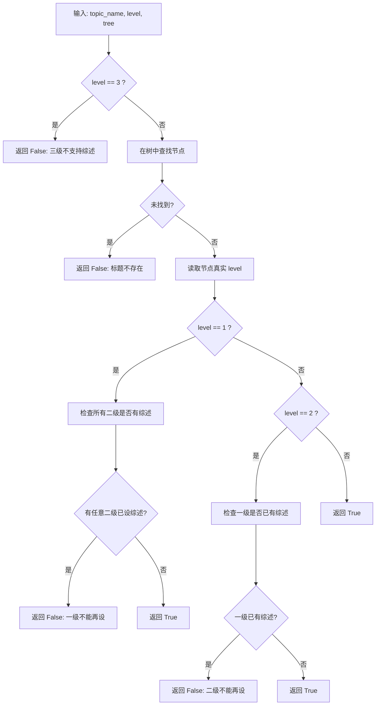
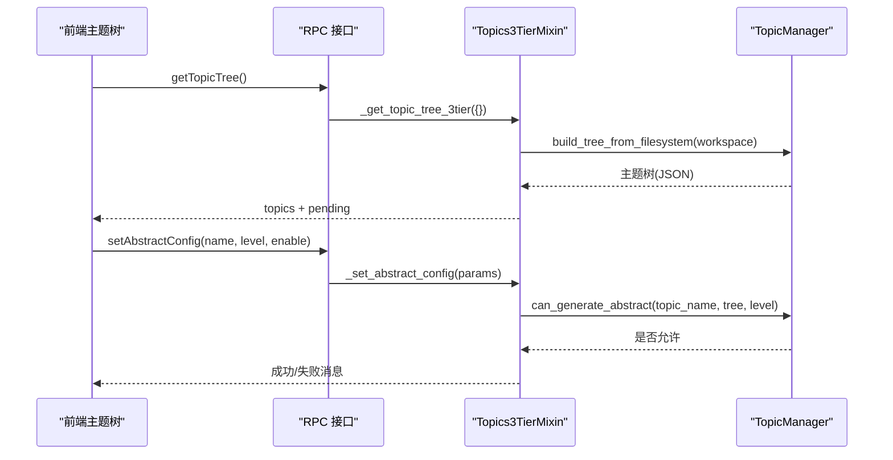
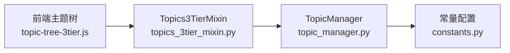

# 三级主题体系

<cite>
**本文引用的文件**   
- [utils/topic_manager.py](file://utils/topic_manager.py)
- [python/sidecar/mixins/topics_3tier_mixin.py](file://python/sidecar/mixins/topics_3tier_mixin.py)
- [webui/js/topic-tree-3tier.js](file://webui/js/topic-tree-3tier.js)
- [config/constants.py](file://config/constants.py)
- [tests/unit/test_topic_manager.py](file://tests/unit/test_topic_manager.py)
- [tests/unit/test_topic_hierarchy.py](file://tests/unit/test_topic_hierarchy.py)
</cite>

## 目录
1. [简介](#简介)
2. [项目结构](#项目结构)
3. [核心组件](#核心组件)
4. [架构总览](#架构总览)
5. [详细组件分析](#详细组件分析)
6. [依赖关系分析](#依赖关系分析)
7. [性能考量](#性能考量)
8. [故障排查指南](#故障排查指南)
9. [结论](#结论)
10. [附录：使用示例与最佳实践](#附录使用示例与最佳实践)

## 简介
本文件系统化阐述 NoteAI 的“三级主题体系”：一级标题（领域）、二级标题（方向）、三级标题（子题）的设计、实现与使用规范。重点覆盖以下方面：
- TopicManager 的核心能力：解析 YAML frontmatter 中的 topic 层级、构建嵌套主题树、根据文件路径解析所属主题层级
- 文件系统映射规则：Notes/ 目录结构与主题层级的对应关系，新建文件夹的层级判定逻辑
- 安全机制：删除保护 can_delete_topic()、综述控制 can_generate_abstract()
- 前端交互：主题树渲染、综述开关、删除操作的安全校验
- 实际使用示例与知识库组织最佳实践

## 项目结构
围绕三级主题体系的关键代码分布在如下位置：
- 后端核心逻辑：TopicManager 类位于 utils/topic_manager.py
- 侧车扩展（mixin）：提供三层主题相关 RPC 方法，位于 python/sidecar/mixins/topics_3tier_mixin.py
- 前端渲染与交互：webui/js/topic-tree-3tier.js
- 常量配置：NOTES_FOLDER、ABSTRACT_FOLDER、TOPIC_SEP 等定义于 config/constants.py
- 单元测试：验证解析、树构建、路径解析、删除保护与综述互斥等，位于 tests/unit/test_topic_manager.py 与 tests/unit/test_topic_hierarchy.py

图表来源
- [utils/topic_manager.py:32-110](file://utils/topic_manager.py#L32-L110)
- [python/sidecar/mixins/topics_3tier_mixin.py:44-86](file://python/sidecar/mixins/topics_3tier_mixin.py#L44-L86)
- [config/constants.py:25-32](file://config/constants.py#L25-L32)
- [webui/js/topic-tree-3tier.js:5-20](file://webui/js/topic-tree-3tier.js#L5-L20)
- [tests/unit/test_topic_manager.py:15-50](file://tests/unit/test_topic_manager.py#L15-L50)
- [tests/unit/test_topic_hierarchy.py:12-41](file://tests/unit/test_topic_hierarchy.py#L12-L41)

章节来源
- [utils/topic_manager.py:32-110](file://utils/topic_manager.py#L32-L110)
- [python/sidecar/mixins/topics_3tier_mixin.py:44-86](file://python/sidecar/mixins/topics_3tier_mixin.py#L44-L86)
- [config/constants.py:25-32](file://config/constants.py#L25-L32)
- [webui/js/topic-tree-3tier.js:5-20](file://webui/js/topic-tree-3tier.js#L5-L20)
- [tests/unit/test_topic_manager.py:15-50](file://tests/unit/test_topic_manager.py#L15-L50)
- [tests/unit/test_topic_hierarchy.py:12-41](file://tests/unit/test_topic_hierarchy.py#L12-L41)

## 核心组件
- TopicManager：负责三层主题的解析、树构建、路径到主题映射、文件夹层级判定、删除保护与综述控制、从文件系统扫描构建主题树及序列化输出
- Topics3TierMixin：将 TopicManager 的能力封装为可被路由调用的方法，包括获取主题树、创建主题文件夹、设置综述开关、获取图谱数据、安全删除主题
- 前端主题树模块：渲染三层主题树、处理点击/双击事件、加载文件列表、新建文件夹、切换综述开关、删除主题

章节来源
- [utils/topic_manager.py:32-110](file://utils/topic_manager.py#L32-L110)
- [python/sidecar/mixins/topics_3tier_mixin.py:44-86](file://python/sidecar/mixins/topics_3tier_mixin.py#L44-L86)
- [webui/js/topic-tree-3tier.js:5-20](file://webui/js/topic-tree-3tier.js#L5-L20)

## 架构总览
下图展示了从前端到后端的调用链以及核心处理流程：

图表来源
- [python/sidecar/mixins/topics_3tier_mixin.py:50-86](file://python/sidecar/mixins/topics_3tier_mixin.py#L50-L86)
- [utils/topic_manager.py:378-426](file://utils/topic_manager.py#L378-L426)
- [utils/topic_manager.py:291-345](file://utils/topic_manager.py#L291-L345)
- [utils/topic_manager.py:250-286](file://utils/topic_manager.py#L250-L286)
- [webui/js/topic-tree-3tier.js:12-20](file://webui/js/topic-tree-3tier.js#L12-L20)

## 详细组件分析

### TopicManager 核心功能
- parse_topic_hierarchy(frontmatter): 解析 YAML frontmatter 中的 topic 字段，支持多级缩进表示层级，输出扁平的主题条目列表
- build_topic_tree(entries): 将扁平条目构造成嵌套的 L1→L2→L3 树结构，并排序 children
- resolve_topic_from_path(file_path, workspace): 根据文件相对路径解析其所属的一级/二级/三级主题
- determine_folder_level(parent_path, workspace): 判断在指定父目录下新建文件夹应归属的层级（1/2/3/-1）
- can_delete_topic(topic_name, level, tree): 删除保护规则（一级需无二级才可删；二级可删但会提示级联删除三级；三级可直接删）
- can_generate_abstract(topic_name, tree, level=0): 综述互斥控制（三级不支持；一级与二级不能同时存在综述）
- collect_topic_labels()/build_tree_from_filesystem(): 从 Notes/ 目录扫描构建主题树，统计文件数，识别综述状态
- tree_to_json(tree): 将内部树结构序列化为前端可用的 JSON 格式

图表来源
- [utils/topic_manager.py:45-109](file://utils/topic_manager.py#L45-L109)
- [utils/topic_manager.py:114-179](file://utils/topic_manager.py#L114-L179)
- [utils/topic_manager.py:184-217](file://utils/topic_manager.py#L184-L217)
- [utils/topic_manager.py:222-245](file://utils/topic_manager.py#L222-L245)
- [utils/topic_manager.py:250-286](file://utils/topic_manager.py#L250-L286)
- [utils/topic_manager.py:291-345](file://utils/topic_manager.py#L291-L345)
- [utils/topic_manager.py:350-426](file://utils/topic_manager.py#L350-L426)
- [utils/topic_manager.py:446-484](file://utils/topic_manager.py#L446-L484)

章节来源
- [utils/topic_manager.py:45-109](file://utils/topic_manager.py#L45-L109)
- [utils/topic_manager.py:114-179](file://utils/topic_manager.py#L114-L179)
- [utils/topic_manager.py:184-217](file://utils/topic_manager.py#L184-L217)
- [utils/topic_manager.py:222-245](file://utils/topic_manager.py#L222-L245)
- [utils/topic_manager.py:250-286](file://utils/topic_manager.py#L250-L286)
- [utils/topic_manager.py:291-345](file://utils/topic_manager.py#L291-L345)
- [utils/topic_manager.py:350-426](file://utils/topic_manager.py#L350-L426)
- [utils/topic_manager.py:446-484](file://utils/topic_manager.py#L446-L484)

### 文件系统映射规则与层级判定
- 目录约定：Notes/ 作为根目录，其下一级为一级标题（领域），再下一级为二级标题（方向），再下一级为三级标题（子题）
- 路径解析：resolve_topic_from_path() 会跳过 Notes/ 前缀，最多提取三层目录名作为主题层级
- 新建文件夹层级：determine_folder_level() 依据当前父目录相对 Notes/ 的深度决定新文件夹层级（Notes 下新建→一级；一级下新建→二级；二级下新建→三级；三级下新建→普通文件夹）

图表来源
- [utils/topic_manager.py:222-245](file://utils/topic_manager.py#L222-L245)
- [utils/topic_manager.py:184-217](file://utils/topic_manager.py#L184-L217)

章节来源
- [utils/topic_manager.py:184-217](file://utils/topic_manager.py#L184-L217)
- [utils/topic_manager.py:222-245](file://utils/topic_manager.py#L222-L245)

### 安全机制：删除保护与综述控制
- 删除保护 can_delete_topic()
  - 三级：直接允许删除
  - 二级：允许删除，但会提示将级联删除其下的三级
  - 一级：若存在二级子题则禁止删除，并列出未删除的二级名称
- 综述控制 can_generate_abstract()
  - 三级：不支持综述
  - 一级：若任一二级已开启综述，则禁止一级开启综述
  - 二级：若其一级已开启综述，则禁止该二级开启综述

图表来源
- [utils/topic_manager.py:291-345](file://utils/topic_manager.py#L291-L345)

章节来源
- [utils/topic_manager.py:250-286](file://utils/topic_manager.py#L250-L286)
- [utils/topic_manager.py:291-345](file://utils/topic_manager.py#L291-L345)

### 前端交互与渲染
- 主题树渲染：按 L1→L2→L3 顺序渲染，显示文件数量与综述标识
- 单击：选中主题并展开/折叠子级，右侧面板加载该主题下的文件列表
- 双击：若节点具备综述，打开综述预览；否则不做任何操作
- 新建文件夹：根据当前父主题层级自动判定新文件夹层级
- 综述开关：仅在二级主题可见并可切换
- 删除主题：触发安全删除流程，受 can_delete_topic() 保护

图表来源
- [webui/js/topic-tree-3tier.js:12-20](file://webui/js/topic-tree-3tier.js#L12-L20)
- [webui/js/topic-tree-3tier.js:267-277](file://webui/js/topic-tree-3tier.js#L267-L277)
- [python/sidecar/mixins/topics_3tier_mixin.py:126-153](file://python/sidecar/mixins/topics_3tier_mixin.py#L126-L153)
- [utils/topic_manager.py:291-345](file://utils/topic_manager.py#L291-L345)

章节来源
- [webui/js/topic-tree-3tier.js:25-105](file://webui/js/topic-tree-3tier.js#L25-L105)
- [webui/js/topic-tree-3tier.js:109-164](file://webui/js/topic-tree-3tier.js#L109-L164)
- [webui/js/topic-tree-3tier.js:241-277](file://webui/js/topic-tree-3tier.js#L241-L277)
- [python/sidecar/mixins/topics_3tier_mixin.py:50-86](file://python/sidecar/mixins/topics_3tier_mixin.py#L50-L86)
- [python/sidecar/mixins/topics_3tier_mixin.py:126-153](file://python/sidecar/mixins/topics_3tier_mixin.py#L126-L153)

## 依赖关系分析
- TopicManager 依赖常量配置（如 NOTES_FOLDER、ABSTRACT_FOLDER、TOPIC_SEP）以定位 Notes/ 与 wiki/ 目录
- Topics3TierMixin 通过 TopicManager 完成主题树构建与安全校验，并暴露为 RPC 方法供前端调用
- 前端主题树模块通过 api 调用后端方法，渲染主题树并处理用户操作

图表来源
- [webui/js/topic-tree-3tier.js:5-20](file://webui/js/topic-tree-3tier.js#L5-L20)
- [python/sidecar/mixins/topics_3tier_mixin.py:44-86](file://python/sidecar/mixins/topics_3tier_mixin.py#L44-L86)
- [utils/topic_manager.py:378-426](file://utils/topic_manager.py#L378-L426)
- [config/constants.py:25-32](file://config/constants.py#L25-L32)

章节来源
- [webui/js/topic-tree-3tier.js:5-20](file://webui/js/topic-tree-3tier.js#L5-L20)
- [python/sidecar/mixins/topics_3tier_mixin.py:44-86](file://python/sidecar/mixins/topics_3tier_mixin.py#L44-L86)
- [utils/topic_manager.py:378-426](file://utils/topic_manager.py#L378-L426)
- [config/constants.py:25-32](file://config/constants.py#L25-L32)

## 性能考量
- 主题树构建：基于 Notes/ 目录遍历，时间复杂度与目录数量线性相关；对每个目录进行文件计数时排除特定系统文件与元数据文件，避免误计
- 综述状态检测：扫描 wiki/ 或 ABSTRACT_FOLDER 下的综述文件，存在磁盘 I/O 开销；建议缓存综述状态并在变更时刷新
- 前端渲染：按需展开/折叠子级，减少 DOM 渲染压力；文件列表懒加载提升交互体验

[本节为通用指导，不直接分析具体文件]

## 故障排查指南
- 无法解析主题层级
  - 检查 YAML frontmatter 中 topic 字段的缩进是否符合规范（横杠缩进）
  - 确认文件路径是否在 Notes/ 下且不超过三级
- 删除主题失败
  - 一级标题下有二级标题时会被阻止删除；请先删除二级或其下的三级
  - 查看 can_delete_topic() 返回的原因信息
- 无法开启综述
  - 三级标题不支持综述
  - 一级与二级不能同时存在综述；若冲突，先关闭另一层的综述
- 主题树为空或不完整
  - 确认 Notes/ 目录是否存在且包含有效的一级/二级/三级文件夹
  - 检查 ABSTRACT_FOLDER 或 wiki/ 下的综述文件命名是否正确

章节来源
- [utils/topic_manager.py:250-286](file://utils/topic_manager.py#L250-L286)
- [utils/topic_manager.py:291-345](file://utils/topic_manager.py#L291-L345)
- [utils/topic_manager.py:378-426](file://utils/topic_manager.py#L378-L426)

## 结论
NoteAI 的三级主题体系通过清晰的层次划分与严格的命名与映射规则，实现了知识结构的可视化与可控管理。TopicManager 提供了从 frontmatter 解析到文件系统映射的全链路能力，Topics3TierMixin 将其封装为易用的服务接口，前端则以直观的方式呈现并支持关键操作。删除保护与综述互斥机制确保了知识库的一致性与安全性。遵循本文的最佳实践，可有效组织与维护大规模笔记库。

[本节为总结性内容，不直接分析具体文件]

## 附录：使用示例与最佳实践

### 正确组织知识库结构
- 在 Notes/ 下创建一级标题（领域）文件夹
- 在每个一级标题下创建二级标题（方向）文件夹
- 在二级标题下创建三级标题（子题）文件夹
- 将 Markdown 文件放入对应的三级标题文件夹中

章节来源
- [utils/topic_manager.py:184-217](file://utils/topic_manager.py#L184-L217)
- [utils/topic_manager.py:222-245](file://utils/topic_manager.py#L222-L245)

### YAML frontmatter 主题标记规范
- 使用横杠缩进表示层级：
  - 一级标题：0 空格缩进
  - 二级标题：2 空格缩进
  - 三级标题：4 空格缩进
- 示例结构参考测试用例中的构造方式

章节来源
- [utils/topic_manager.py:45-109](file://utils/topic_manager.py#L45-L109)
- [tests/unit/test_topic_manager.py:15-50](file://tests/unit/test_topic_manager.py#L15-L50)

### 综述开关与文件位置
- 综述文件通常位于 wiki/ 或配置的 ABSTRACT_FOLDER 下
- 一级与二级主题可开启综述，但二者互斥；三级不支持综述
- 开启综述后，前端主题树节点会显示“综述”标识，双击可预览

章节来源
- [python/sidecar/mixins/topics_3tier_mixin.py:62-76](file://python/sidecar/mixins/topics_3tier_mixin.py#L62-L76)
- [utils/topic_manager.py:291-345](file://utils/topic_manager.py#L291-L345)
- [webui/js/topic-tree-3tier.js:137-164](file://webui/js/topic-tree-3tier.js#L137-L164)

### 删除主题的安全流程
- 删除三级：直接删除
- 删除二级：允许删除，但会提示将级联删除其下的三级
- 删除一级：若存在二级子题则禁止删除，需先清理二级及其下的三级

章节来源
- [utils/topic_manager.py:250-286](file://utils/topic_manager.py#L250-L286)
- [python/sidecar/mixins/topics_3tier_mixin.py:288-315](file://python/sidecar/mixins/topics_3tier_mixin.py#L288-L315)
- [webui/js/topic-tree-3tier.js:282-293](file://webui/js/topic-tree-3tier.js#L282-L293)