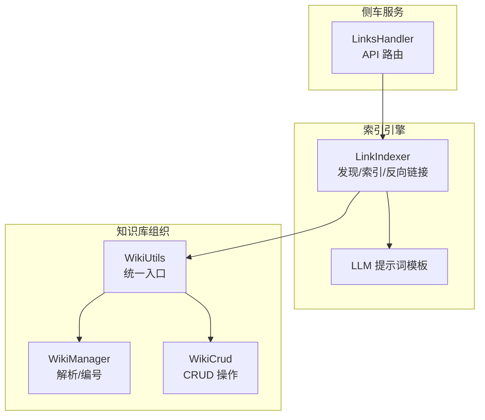
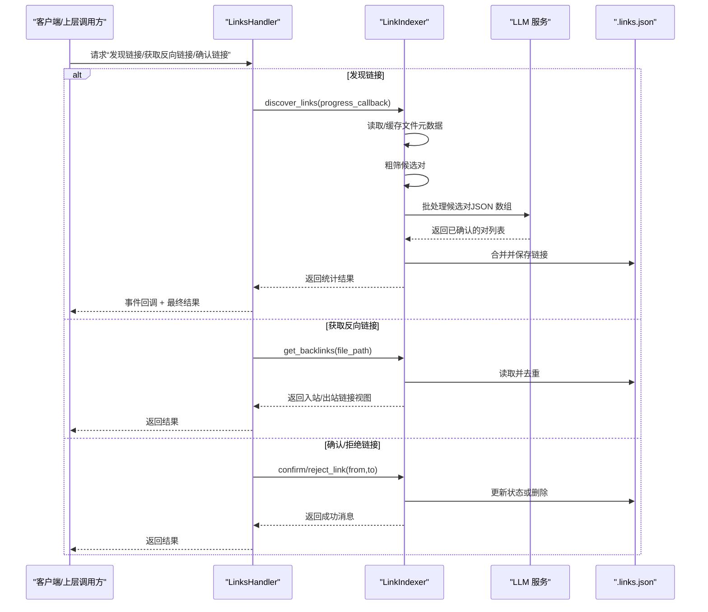
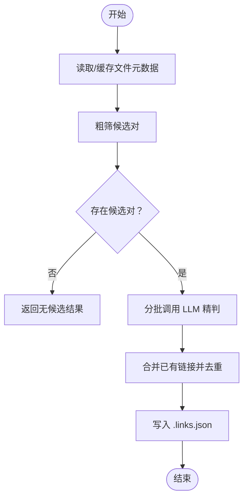
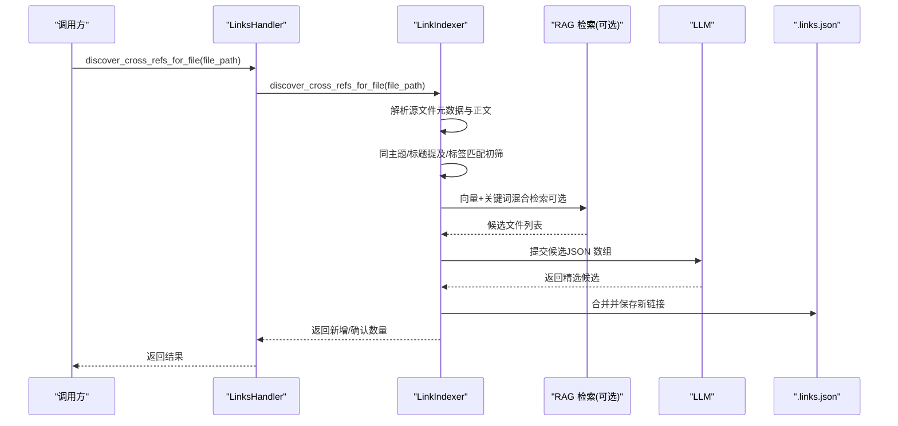
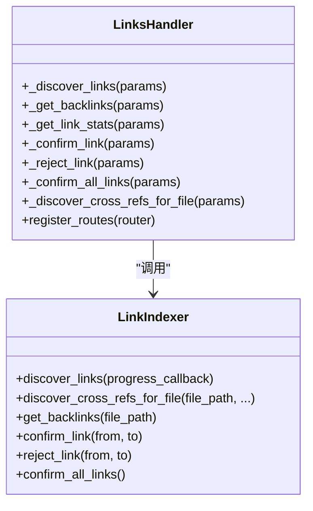
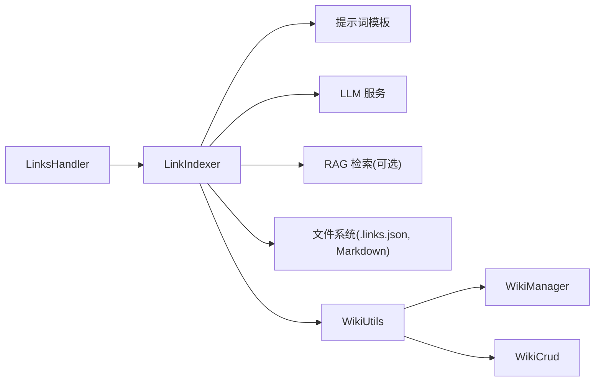

# 双向链接系统

<cite>
**本文引用的文件**   
- [utils/link_indexer.py](file://utils/link_indexer.py)
- [prompts/link_indexer.py](file://prompts/link_indexer.py)
- [python/sidecar/handlers/links_handler.py](file://python/sidecar/handlers/links_handler.py)
- [python/sidecar/wiki_utils.py](file://python/sidecar/wiki_utils.py)
- [utils/wiki_manager.py](file://utils/wiki_manager.py)
- [utils/wiki_crud.py](file://utils/wiki_crud.py)
</cite>

## 目录
1. [简介](#简介)
2. [项目结构](#项目结构)
3. [核心组件](#核心组件)
4. [架构总览](#架构总览)
5. [详细组件分析](#详细组件分析)
6. [依赖关系分析](#依赖关系分析)
7. [性能与扩展性](#性能与扩展性)
8. [故障排查指南](#故障排查指南)
9. [最佳实践与高级技巧](#最佳实践与高级技巧)
10. [结论](#结论)

## 简介
本文件系统化梳理 NoteAI 的双向链接系统，覆盖以下关键主题：
- 双向链接的核心概念与 Wiki 风格 [[链接]] 的语义关联机制
- LinkIndexer 的实现机制：链接发现、索引构建、反向链接查询
- 链接的存储与管理：持久化格式、状态同步与冲突解决
- 可视化展示：知识图谱渲染、关系图与导航辅助
- 智能推荐：基于内容相似度的链接建议与新笔记自动提示
- 使用最佳实践与维护策略

## 项目结构
与双向链接相关的代码主要分布在如下模块：
- utils/link_indexer.py：双向链接索引引擎（发现、候选生成、LLM 精判、持久化、反向链接）
- prompts/link_indexer.py：用于 LLM 判断的提示词模板
- python/sidecar/handlers/links_handler.py：RPC 路由与异步调度，暴露链接相关 API
- python/sidecar/wiki_utils.py、utils/wiki_manager.py、utils/wiki_crud.py：WIKI.md 的统一入口与 CRUD，支撑“主题/目录”组织，间接影响链接推荐（同主题优先）

图表来源
- [python/sidecar/handlers/links_handler.py:1-85](file://python/sidecar/handlers/links_handler.py#L1-L85)
- [utils/link_indexer.py:807-987](file://utils/link_indexer.py#L807-L987)
- [prompts/link_indexer.py:1-30](file://prompts/link_indexer.py#L1-L30)
- [python/sidecar/wiki_utils.py:1-120](file://python/sidecar/wiki_utils.py#L1-L120)
- [utils/wiki_manager.py:1-120](file://utils/wiki_manager.py#L1-L120)
- [utils/wiki_crud.py:1-120](file://utils/wiki_crud.py#L1-L120)

章节来源
- [python/sidecar/handlers/links_handler.py:1-85](file://python/sidecar/handlers/links_handler.py#L1-L85)
- [utils/link_indexer.py:807-987](file://utils/link_indexer.py#L807-L987)
- [prompts/link_indexer.py:1-30](file://prompts/link_indexer.py#L1-L30)
- [python/sidecar/wiki_utils.py:1-120](file://python/sidecar/wiki_utils.py#L1-L120)
- [utils/wiki_manager.py:1-120](file://utils/wiki_manager.py#L1-L120)
- [utils/wiki_crud.py:1-120](file://utils/wiki_crud.py#L1-L120)

## 核心组件
- 链接索引引擎（LinkIndexer）
  - 负责扫描工作区 Markdown 文件，提取元数据（标题、标签、主题、摘要），进行粗筛与 AI 精判，产出有向链接记录并持久化到 .links.json。
  - 提供反向链接查询、单条确认/拒绝、批量确认等能力。
- 链接发现处理器（LinksHandler）
  - 将 LinkIndexer 的能力以 RPC 接口暴露，支持异步执行、进度上报、错误处理。
- 提示词模板（Prompts）
  - 定义跨引用选择与成对判断的 LLM 提示词，保证输出为 JSON 数组，便于程序解析。
- Wiki 组织层（WikiUtils/Manager/Crud）
  - 提供 WIKI.md 的统一读写入口与主题管理，LinkIndexer 在“同主题优先”的策略中会利用主题信息提升候选质量。

章节来源
- [utils/link_indexer.py:1-120](file://utils/link_indexer.py#L1-L120)
- [python/sidecar/handlers/links_handler.py:1-85](file://python/sidecar/handlers/links_handler.py#L1-L85)
- [prompts/link_indexer.py:1-30](file://prompts/link_indexer.py#L1-L30)
- [python/sidecar/wiki_utils.py:1-120](file://python/sidecar/wiki_utils.py#L1-L120)
- [utils/wiki_manager.py:1-120](file://utils/wiki_manager.py#L1-L120)
- [utils/wiki_crud.py:1-120](file://utils/wiki_crud.py#L1-L120)

## 架构总览
下图展示了从前端或外部调用到后端链路的全流程：

图表来源
- [python/sidecar/handlers/links_handler.py:1-85](file://python/sidecar/handlers/links_handler.py#L1-L85)
- [utils/link_indexer.py:807-987](file://utils/link_indexer.py#L807-L987)
- [prompts/link_indexer.py:1-30](file://prompts/link_indexer.py#L1-L30)

## 详细组件分析

### LinkIndexer 实现机制
- 链接发现流程
  - 收集所有 Markdown 文件的元数据（标题、标签、主题、摘要），按 mtime 增量缓存，避免全量重复解析。
  - 粗筛候选对：同主题 > 共享标签 > 文件名 token 重叠，限制进入 AI 精判的候选数量。
  - AI 精判：分批发送候选对给 LLM，要求返回 JSON 数组，包含被选中的对及原因。
  - 合并与持久化：去重、忽略自引用与 README，新增链接直接标记为 confirmed，写入 .links.json。
- 反向链接查询
  - 根据中心文件路径过滤出入站/出站链接，统一视图包含方向、原因与状态。
- 单条/批量状态管理
  - 支持确认/拒绝单条链接，以及一键确认所有 pending 链接。

图表来源
- [utils/link_indexer.py:807-898](file://utils/link_indexer.py#L807-L898)
- [utils/link_indexer.py:690-738](file://utils/link_indexer.py#L690-L738)
- [utils/link_indexer.py:740-806](file://utils/link_indexer.py#L740-L806)
- [utils/link_indexer.py:136-169](file://utils/link_indexer.py#L136-L169)

章节来源
- [utils/link_indexer.py:1-120](file://utils/link_indexer.py#L1-L120)
- [utils/link_indexer.py:690-738](file://utils/link_indexer.py#L690-L738)
- [utils/link_indexer.py:740-806](file://utils/link_indexer.py#L740-L806)
- [utils/link_indexer.py:807-898](file://utils/link_indexer.py#L807-L898)
- [utils/link_indexer.py:900-987](file://utils/link_indexer.py#L900-L987)

#### 链接发现序列图（单文件交叉引用）

图表来源
- [python/sidecar/handlers/links_handler.py:69-76](file://python/sidecar/handlers/links_handler.py#L69-L76)
- [utils/link_indexer.py:430-561](file://utils/link_indexer.py#L430-L561)
- [utils/link_indexer.py:310-360](file://utils/link_indexer.py#L310-L360)
- [utils/link_indexer.py:378-428](file://utils/link_indexer.py#L378-L428)
- [utils/link_indexer.py:136-169](file://utils/link_indexer.py#L136-L169)

章节来源
- [python/sidecar/handlers/links_handler.py:69-76](file://python/sidecar/handlers/links_handler.py#L69-L76)
- [utils/link_indexer.py:430-561](file://utils/link_indexer.py#L430-L561)
- [utils/link_indexer.py:310-360](file://utils/link_indexer.py#L310-L360)
- [utils/link_indexer.py:378-428](file://utils/link_indexer.py#L378-L428)
- [utils/link_indexer.py:136-169](file://utils/link_indexer.py#L136-L169)

### LinksHandler 接口与并发控制
- 接口清单
  - discover_links：启动全局链接发现，线程内执行并通过进度事件上报
  - discover_cross_refs_for_file：为指定文件发现交叉引用
  - get_backlinks：获取反向链接（全部或针对某文件）
  - get_link_stats：统计链接总数、已确认、待确认
  - confirm_link / reject_link：确认/拒绝单条有向链接
  - confirm_all_links：一键确认所有 pending 链接
- 并发与健壮性
  - 使用锁防止重复发现任务并行执行
  - 异常捕获后通过事件通道回传失败信息

图表来源
- [python/sidecar/handlers/links_handler.py:1-85](file://python/sidecar/handlers/links_handler.py#L1-L85)
- [utils/link_indexer.py:807-987](file://utils/link_indexer.py#L807-L987)

章节来源
- [python/sidecar/handlers/links_handler.py:1-85](file://python/sidecar/handlers/links_handler.py#L1-L85)
- [utils/link_indexer.py:807-987](file://utils/link_indexer.py#L807-L987)

### 提示词与 LLM 交互
- 跨引用选择提示词：输入源文章标题与摘要，候选列表，要求返回 JSON 数组，每项包含 id 与 reason。
- 成对判断提示词：输入若干编号的文章对，要求仅返回有关联的对及其原因。
- 输出解析：先尝试完整 JSON 解析，再退化为寻找最外层平衡的 [...] 片段进行解析，增强鲁棒性。

章节来源
- [prompts/link_indexer.py:1-30](file://prompts/link_indexer.py#L1-L30)
- [utils/link_indexer.py:48-76](file://utils/link_indexer.py#L48-L76)
- [utils/link_indexer.py:378-428](file://utils/link_indexer.py#L378-L428)
- [utils/link_indexer.py:740-806](file://utils/link_indexer.py#L740-L806)

### Wiki 组织与链接推荐的协同
- 主题优先：LinkIndexer 在评分时优先考虑同主题笔记，提升相关性。
- 统一入口：所有 WIKI.md 的读写均通过 wiki_utils 聚合，确保一致性。
- 主题变更联动：重命名/删除主题时，会同步更新文件 frontmatter 与 WIKI.md 条目，间接影响后续链接推荐。

章节来源
- [utils/link_indexer.py:500-517](file://utils/link_indexer.py#L500-L517)
- [python/sidecar/wiki_utils.py:1-120](file://python/sidecar/wiki_utils.py#L1-L120)
- [utils/wiki_manager.py:1-120](file://utils/wiki_manager.py#L1-L120)
- [utils/wiki_crud.py:433-530](file://utils/wiki_crud.py#L433-L530)

## 依赖关系分析
- 内部依赖
  - LinksHandler 依赖 LinkIndexer 提供的函数式接口
  - LinkIndexer 依赖提示词模板与 LLM 工具、RAG 检索（可选）、文件系统与配置
  - Wiki 层提供主题信息，辅助 LinkIndexer 提高候选质量
- 外部依赖
  - LLM 服务：用于跨引用选择与成对判断
  - RAG 检索：用于向量+关键词混合召回候选
  - 文件系统：读取/写入 Markdown 与 .links.json

图表来源
- [python/sidecar/handlers/links_handler.py:1-85](file://python/sidecar/handlers/links_handler.py#L1-L85)
- [utils/link_indexer.py:807-987](file://utils/link_indexer.py#L807-L987)
- [prompts/link_indexer.py:1-30](file://prompts/link_indexer.py#L1-L30)
- [python/sidecar/wiki_utils.py:1-120](file://python/sidecar/wiki_utils.py#L1-L120)
- [utils/wiki_manager.py:1-120](file://utils/wiki_manager.py#L1-L120)
- [utils/wiki_crud.py:1-120](file://utils/wiki_crud.py#L1-L120)

章节来源
- [python/sidecar/handlers/links_handler.py:1-85](file://python/sidecar/handlers/links_handler.py#L1-L85)
- [utils/link_indexer.py:807-987](file://utils/link_indexer.py#L807-L987)
- [prompts/link_indexer.py:1-30](file://prompts/link_indexer.py#L1-L30)
- [python/sidecar/wiki_utils.py:1-120](file://python/sidecar/wiki_utils.py#L1-L120)
- [utils/wiki_manager.py:1-120](file://utils/wiki_manager.py#L1-L120)
- [utils/wiki_crud.py:1-120](file://utils/wiki_crud.py#L1-L120)

## 性能与扩展性
- 增量缓存
  - 基于 mtime 的文件元数据缓存，减少重复解析开销；单个文件保存后失效对应缓存项。
- 候选规模控制
  - 粗筛阶段限制进入 AI 精判的候选对数量，降低 LLM 调用成本。
- 冷却与容错
  - 向量搜索失败时设置冷却时间，避免雪崩；LLM 调用失败时降级为启发式结果。
- 持久化优化
  - 写入采用临时文件替换，避免部分写入导致的数据损坏。

[本节为通用性能讨论，不直接分析具体文件]

## 故障排查指南
- 常见问题定位
  - 未设置工作区：检查配置是否生效
  - 非 Markdown 文件：仅 .md 参与链接发现
  - README 文件：不参与链接图
  - 自引用链接：自动丢弃
  - LLM 未配置或调用失败：查看日志并检查 API 配置
  - 向量搜索失败：触发冷却，稍后重试
- 诊断步骤
  - 查看 .links.json 是否存在且可读
  - 使用 get_link_stats 查看统计
  - 使用 get_backlinks 验证反向链接是否正确
  - 使用 confirm_all_links 清理 pending 状态

章节来源
- [utils/link_indexer.py:136-169](file://utils/link_indexer.py#L136-L169)
- [utils/link_indexer.py:430-561](file://utils/link_indexer.py#L430-L561)
- [utils/link_indexer.py:900-987](file://utils/link_indexer.py#L900-L987)
- [python/sidecar/handlers/links_handler.py:41-68](file://python/sidecar/handlers/links_handler.py#L41-L68)

## 最佳实践与高级技巧
- 链接维护策略
  - 定期运行 discover_links 以补全缺失关联
  - 为新笔记启用 discover_cross_refs_for_file，结合人工审阅
  - 使用 confirm/reject 精细控制链接质量
- 组织与命名
  - 合理设置主题与标签，提升同主题与标签匹配的命中率
  - 保持标题简洁明确，有助于标题提及匹配
- 可视化与导航
  - 基于 get_backlinks 的结果渲染关系图，突出入站/出站方向
  - 在编辑器中识别 [[链接]] 语法，点击跳转至目标笔记
- 自动化建议
  - 保存后触发 suggest_links_for_file，快速补充高置信度链接
  - 对低置信度候选保留 pending 状态，集中审核

[本节为通用指导，不直接分析具体文件]

## 结论
NoteAI 的双向链接系统通过“本地启发 + LLM 精判 + 可选向量检索”的分层策略，在保证质量的同时兼顾效率。其清晰的存储格式、完善的反向链接查询与状态管理能力，为知识图谱渲染与智能推荐提供了坚实基础。配合合理的主题组织与编辑习惯，可显著提升笔记之间的语义关联与可发现性。