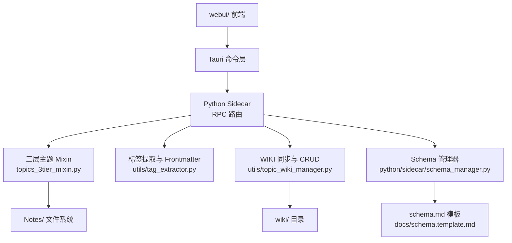
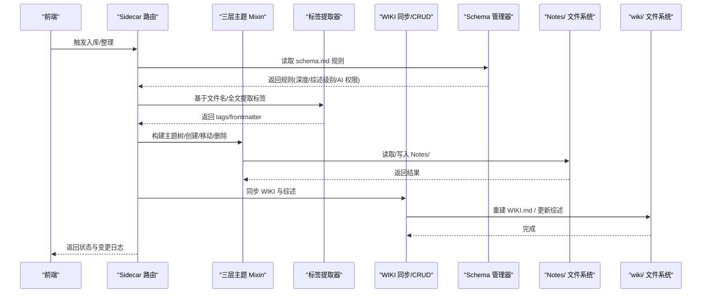
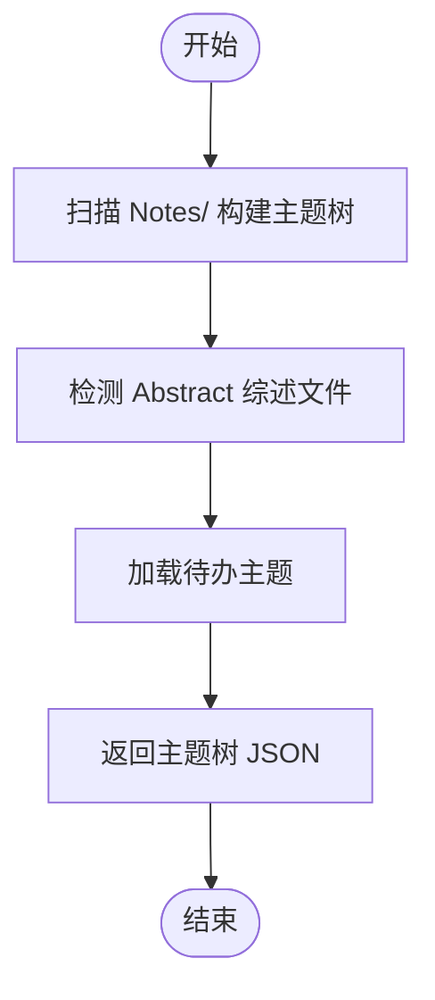
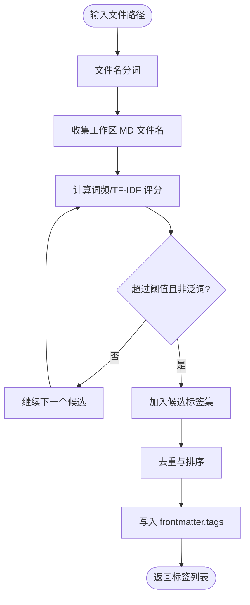
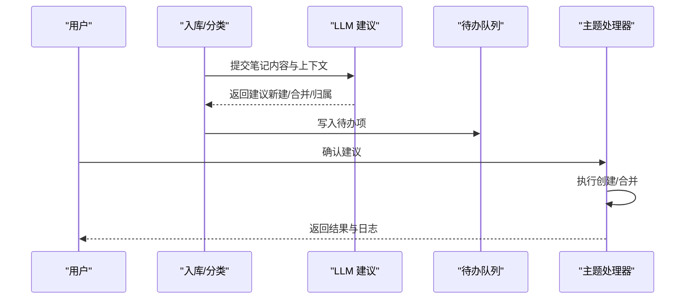
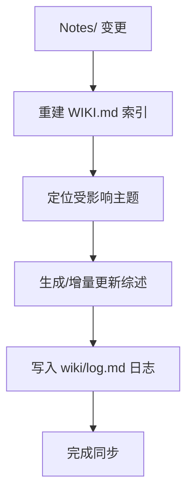
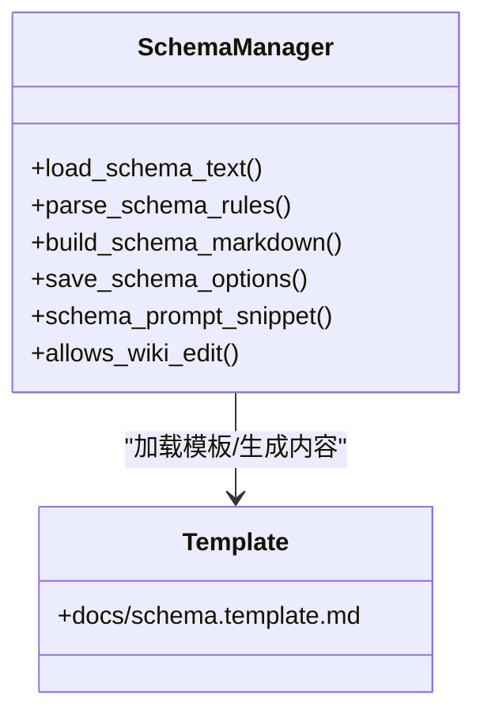
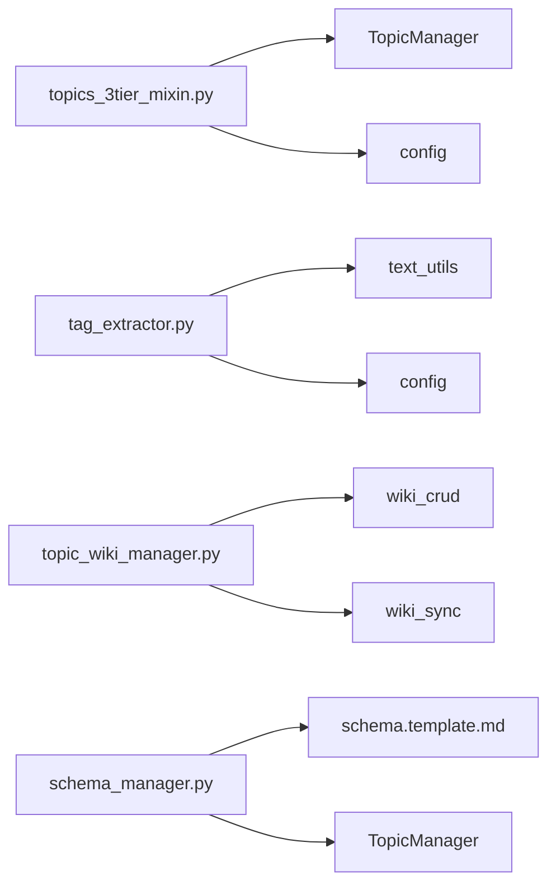

# 知识组织系统

<cite>
**本文引用的文件**   
- [README.md](file://README.md)
- [topics_3tier_mixin.py](file://python/sidecar/mixins/topics_3tier_mixin.py)
- [tag_extractor.py](file://utils/tag_extractor.py)
- [topic_wiki_manager.py](file://utils/topic_wiki_manager.py)
- [schema_manager.py](file://python/sidecar/schema_manager.py)
- [schema.template.md](file://docs/schema.template.md)
</cite>

## 目录
1. [引言](#引言)
2. [项目结构](#项目结构)
3. [核心组件](#核心组件)
4. [架构总览](#架构总览)
5. [详细组件分析](#详细组件分析)
6. [依赖关系分析](#依赖关系分析)
7. [性能考量](#性能考量)
8. [故障排查指南](#故障排查指南)
9. [结论](#结论)
10. [附录](#附录)

## 引言
本文件面向 NoteAI 的知识组织系统，聚焦以下目标：
- 三级主题体系（一级 > 二级 > 三级）的设计理念与工作机制，对应 Notes/ 目录结构与 frontmatter 元数据。
- 自动标签提取：基于 jieba 分词 + TF-IDF 算法，生成 2–5 个有区分度的中文标签。
- 主题建议系统：LLM 分析笔记结构与内容，建议新建或合并主题。
- WIKI 索引自动生成与维护：wiki/WIKI.md 主索引与各主题的综述文件。
- schema.md 工作区规范：定义 AI 可写范围、主题层级规则、冲突解决策略。
- 主题管理实际操作流程与最佳实践，帮助高效组织知识库结构。

## 项目结构
NoteAI 采用“前端 Tauri + Python sidecar”的桌面应用架构，知识组织相关能力集中在 Python sidecar 与 utils 工具层：
- 三层主题与图谱：通过 mixin 注入到 TopicsHandler，提供树构建、节点图、安全删除等能力。
- 标签提取与 Frontmatter：对 Markdown 进行 YAML front matter 解析/写入，并基于文件名与全文统计生成标签。
- WIKI 同步与 CRUD：负责 wiki/WIKI.md 重建、综述文件维护、主题增删改查。
- Schema 管理与模板：维护 schema.md，解析 AI 可写范围与主题深度等规则，并提供模板与提示片段。

图表来源
- [topics_3tier_mixin.py:44-124](file://python/sidecar/mixins/topics_3tier_mixin.py#L44-L124)
- [tag_extractor.py:458-527](file://utils/tag_extractor.py#L458-L527)
- [topic_wiki_manager.py:1-19](file://utils/topic_wiki_manager.py#L1-L19)
- [schema_manager.py:207-285](file://python/sidecar/schema_manager.py#L207-L285)
- [schema.template.md:1-208](file://docs/schema.template.md#L1-L208)

章节来源
- [README.md:141-176](file://README.md#L141-L176)

## 核心组件
- 三层主题系统（Topics3TierMixin）
  - 从文件系统扫描 Notes/ 构建主题树，支持创建/删除保护、摘要开关、图谱导出。
  - 将主题节点与文件节点组合为力导向图数据，支持按主题/标签过滤。
- 自动标签提取（tag_extractor）
  - 基于文件名分词与全局词频统计，结合停用词与通用词过滤，输出 2–5 个高区分度标签。
  - 统一读写 YAML front matter，确保 topic/tags/title/source/date 字段一致性。
- WIKI 索引与综述（topic_wiki_manager）
  - 以 Notes/ 文件夹为事实来源，重建 wiki/WIKI.md；维护各主题综述文件。
- Schema 管理器（schema_manager）
  - 加载/保存 schema.md，解析 AI 可写范围、最大主题深度、综述级别等规则。
  - 提供模板与提示片段，驱动 LLM 分类与综述更新。

章节来源
- [topics_3tier_mixin.py:44-124](file://python/sidecar/mixins/topics_3tier_mixin.py#L44-L124)
- [tag_extractor.py:94-175](file://utils/tag_extractor.py#L94-L175)
- [topic_wiki_manager.py:1-19](file://utils/topic_wiki_manager.py#L1-L19)
- [schema_manager.py:144-177](file://python/sidecar/schema_manager.py#L144-L177)

## 架构总览
知识组织系统在入库流水线中贯穿始终：schema → convert → compile → classify → index → crossref → cascade → lint → sync。其中：
- 分类阶段使用主题建议与标签提取辅助决策。
- 级联阶段根据 schema 规则更新 wiki 综述与索引。
- 运行时由 schema.md 约束 AI 可写范围与冲突处理策略。

图表来源
- [topics_3tier_mixin.py:50-86](file://python/sidecar/mixins/topics_3tier_mixin.py#L50-L86)
- [tag_extractor.py:529-581](file://utils/tag_extractor.py#L529-L581)
- [topic_wiki_manager.py:1-19](file://utils/topic_wiki_manager.py#L1-L19)
- [schema_manager.py:288-301](file://python/sidecar/schema_manager.py#L288-L301)

## 详细组件分析

### 三级主题体系（Notes/ 映射与 frontmatter）
- 设计理念
  - 以 Notes/ 目录为唯一事实来源，逻辑路径用“一级 > 二级 > 三级”表示，frontmatter 的 topic 与目录保持一致。
  - 当 frontmatter 与目录不一致时，以目录为准并回写 frontmatter，保证一致性。
- 工作机制
  - 构建主题树：扫描 Notes/ 目录，生成包含文件计数、摘要开关等信息的树结构。
  - 创建/删除保护：创建时校验非法字符与重复名；删除前检查是否满足删除条件。
  - 图谱导出：将主题与文件节点组合为力导向图数据，支持按主题/标签过滤。
  - 摘要开关：仅二级主题可开启综述，调用切换接口并校验可行性。

图表来源
- [topics_3tier_mixin.py:50-86](file://python/sidecar/mixins/topics_3tier_mixin.py#L50-L86)

章节来源
- [topics_3tier_mixin.py:44-124](file://python/sidecar/mixins/topics_3tier_mixin.py#L44-L124)
- [topics_3tier_mixin.py:126-154](file://python/sidecar/mixins/topics_3tier_mixin.py#L126-L154)
- [topics_3tier_mixin.py:256-286](file://python/sidecar/mixins/topics_3tier_mixin.py#L256-L286)

### 自动标签提取（jieba + TF-IDF）
- 设计要点
  - 基于文件名分词，结合工作区内所有 MD 文件名的全局词频统计，筛选出现频率高于阈值的词组。
  - 英文优先组合相邻单词形成双词短语，再考虑单英文词与中文词；过滤停用词与泛词。
  - 输出 2–5 个高区分度标签，写入 YAML front matter 的 tags 字段。
- 处理流程

图表来源
- [tag_extractor.py:94-175](file://utils/tag_extractor.py#L94-L175)
- [tag_extractor.py:529-581](file://utils/tag_extractor.py#L529-L581)

章节来源
- [tag_extractor.py:29-49](file://utils/tag_extractor.py#L29-L49)
- [tag_extractor.py:52-77](file://utils/tag_extractor.py#L52-L77)
- [tag_extractor.py:80-91](file://utils/tag_extractor.py#L80-L91)
- [tag_extractor.py:458-527](file://utils/tag_extractor.py#L458-L527)

### 主题建议系统（LLM 分析与建议）
- 功能概述
  - 在分类与入库阶段，结合 schema.md 的规则与当前主题树，由 LLM 分析笔记结构与内容，建议新建或合并主题。
  - 建议结果进入待办队列，用户确认后执行创建/合并操作，保持人工最终决定权。
- 交互流程

图表来源
- [schema_manager.py:288-301](file://python/sidecar/schema_manager.py#L288-L301)
- [topics_3tier_mixin.py:88-124](file://python/sidecar/mixins/topics_3tier_mixin.py#L88-L124)

章节来源
- [README.md:90-94](file://README.md#L90-L94)

### WIKI 索引与综述（自动生成与维护）
- 职责边界
  - WIKI.md 作为主题索引，必须与 Notes/ 目录结构完全一致；当不一致时以 Notes/ 为准重建。
  - 综述文件位于 wiki/ 下，命名取主题路径最后一级 + “_综述.md”，汇总该主题下所有笔记内容。
- 同步机制
  - 监听 Notes/ 变化，增量触发 WIKI 重建与综述更新；保留人类锁定段落，避免误删。
  - 变更日志写入 wiki/log.md，记录级联、主题操作、入库与问答归档等事件。

图表来源
- [topic_wiki_manager.py:1-19](file://utils/topic_wiki_manager.py#L1-L19)
- [schema.template.md:130-149](file://docs/schema.template.md#L130-L149)

章节来源
- [schema.template.md:130-149](file://docs/schema.template.md#L130-L149)

### Schema 工作区规范（AI 可写范围与冲突策略）
- 作用
  - 定义 AI 可写范围（如允许编辑 wiki/禁止编辑 notes）、最大主题深度、综述级别与自动更新策略。
  - 提供模板与提示片段，驱动 LLM 的分类与综述更新行为。
- 关键规则
  - 以 Notes/ 为事实来源，WIKI 与其保持一致。
  - 冲突解决：文件夹 vs frontmatter 以文件夹为准；WIKI vs 文件夹以 Notes/ 为准；综述与笔记观点不一致时并列记录差异。
  - 禁止第四级主题目录，禁止未经确认删除笔记或主题。

图表来源
- [schema_manager.py:207-285](file://python/sidecar/schema_manager.py#L207-L285)
- [schema.template.md:1-208](file://docs/schema.template.md#L1-L208)

章节来源
- [schema_manager.py:144-177](file://python/sidecar/schema_manager.py#L144-L177)
- [schema.template.md:152-178](file://docs/schema.template.md#L152-L178)

## 依赖关系分析
- 组件耦合
  - 三层主题 Mixin 依赖 TopicManager 与配置，负责文件系统与树结构。
  - 标签提取器依赖文本工具与配置，负责 frontmatter 解析与写入。
  - WIKI 同步模块封装 wiki_crud 与 wiki_sync，提供薄包装层。
  - Schema 管理器独立维护 schema.md，并为其他组件提供规则解析与提示片段。
- 外部依赖
  - jieba 用于中文分词；PyYAML 可选，若无则使用内置简单解析器。
  - 文件系统为 Notes/ 与 wiki/ 的事实来源。

图表来源
- [topics_3tier_mixin.py:1-10](file://python/sidecar/mixins/topics_3tier_mixin.py#L1-L10)
- [tag_extractor.py:1-18](file://utils/tag_extractor.py#L1-L18)
- [topic_wiki_manager.py:1-19](file://utils/topic_wiki_manager.py#L1-L19)
- [schema_manager.py:1-12](file://python/sidecar/schema_manager.py#L1-L12)

章节来源
- [topics_3tier_mixin.py:1-10](file://python/sidecar/mixins/topics_3tier_mixin.py#L1-L10)
- [tag_extractor.py:1-18](file://utils/tag_extractor.py#L1-L18)
- [topic_wiki_manager.py:1-19](file://utils/topic_wiki_manager.py#L1-L19)
- [schema_manager.py:1-12](file://python/sidecar/schema_manager.py#L1-L12)

## 性能考量
- 标签提取
  - 文件名分词与全局词频统计需遍历 Notes/Organized/Used 下的 MD 文件名，建议在批量场景下缓存文件名集合，减少重复 IO。
  - 英文双词组合生成与匹配应去重，避免重复计算。
- 主题树构建
  - 大规模 Notes/ 目录时，递归扫描可能耗时，可引入增量扫描与忽略目录优化。
- WIKI 同步
  - 重建 WIKI.md 与综述时应仅处理受影响主题，避免全库重算；保留人类锁定段落以减少不必要改写。
- Schema 解析
  - 轻量正则解析规则，开销较小；但频繁调用时可缓存解析结果。

[本节为通用指导，不直接分析具体文件]

## 故障排查指南
- 未设置工作区
  - 现象：创建主题或获取图谱返回“未设置工作区”。
  - 排查：确认 config.workspace_path 已正确初始化。
- 父目录不存在
  - 现象：创建主题失败，提示父目录不存在。
  - 排查：检查 parent_path 解析与 Notes/ 目录是否存在。
- 同名文件夹
  - 现象：创建主题失败，提示已存在同名文件夹。
  - 排查：修改名称或先删除冲突目录。
- 一级主题不可开启综述
  - 现象：设置摘要开关失败，提示一级主题是组织容器。
  - 排查：仅在二级主题启用综述。
- 无法写入 frontmatter
  - 现象：标签写入失败或格式异常。
  - 排查：检查 PyYAML 可用性；若不可用，使用内置解析器并确保值转义正确。
- WIKI 与 Notes/ 不一致
  - 现象：WIKI 索引与目录不同步。
  - 排查：触发同步重建，以 Notes/ 为准恢复一致。

章节来源
- [topics_3tier_mixin.py:88-124](file://python/sidecar/mixins/topics_3tier_mixin.py#L88-L124)
- [topics_3tier_mixin.py:126-154](file://python/sidecar/mixins/topics_3tier_mixin.py#L126-L154)
- [tag_extractor.py:458-527](file://utils/tag_extractor.py#L458-L527)
- [topic_wiki_manager.py:1-19](file://utils/topic_wiki_manager.py#L1-L19)

## 结论
NoteAI 的知识组织系统以 Notes/ 为事实来源，通过三级主题体系、自动标签提取、主题建议与 WIKI 编译层，实现“采集 → 整理 → 编译 → 检索”的闭环。schema.md 作为工作区宪法，明确 AI 可写范围与冲突策略，保障人机协作的可控性与一致性。遵循本文档的流程与最佳实践，可有效提升知识库的结构化程度与可检索性。

[本节为总结，不直接分析具体文件]

## 附录
- 主题管理最佳实践
  - 命名规范：中文优先，2–8 字为宜，避免“其他/杂项/资料/未分类”。
  - 层级控制：最多三级；不确定归类时写入待办，不强行自动归类。
  - 综述粒度：默认二级主题生成综述，可按需在二级主题开启。
  - 标签质量：2–5 个有区分度的中文标签，避免泛词；可在 UI 中修正。
  - 冲突处理：以 Notes/ 为准，WIKI 与之保持一致；综述与笔记观点不一致时并列记录差异。
  - 变更追踪：关注 wiki/log.md，了解级联与主题操作的变更记录。

[本节为通用指导，不直接分析具体文件]