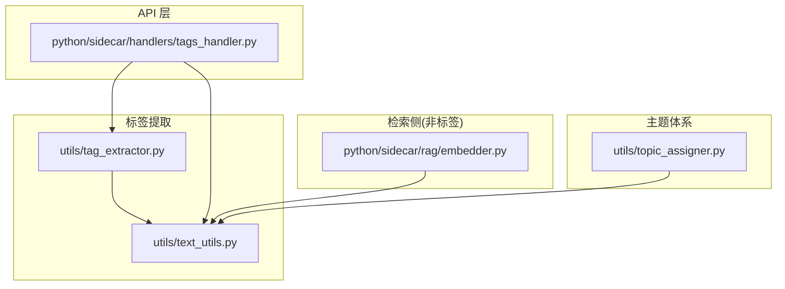
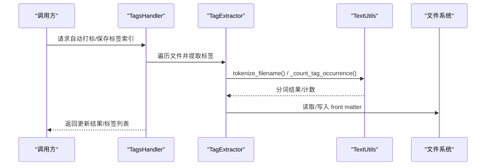
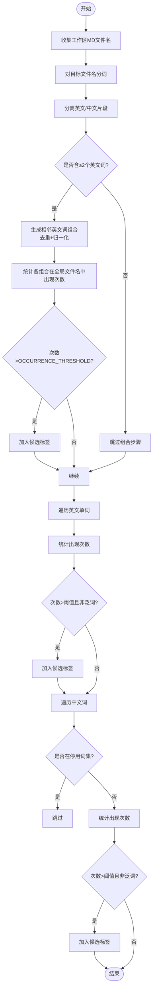
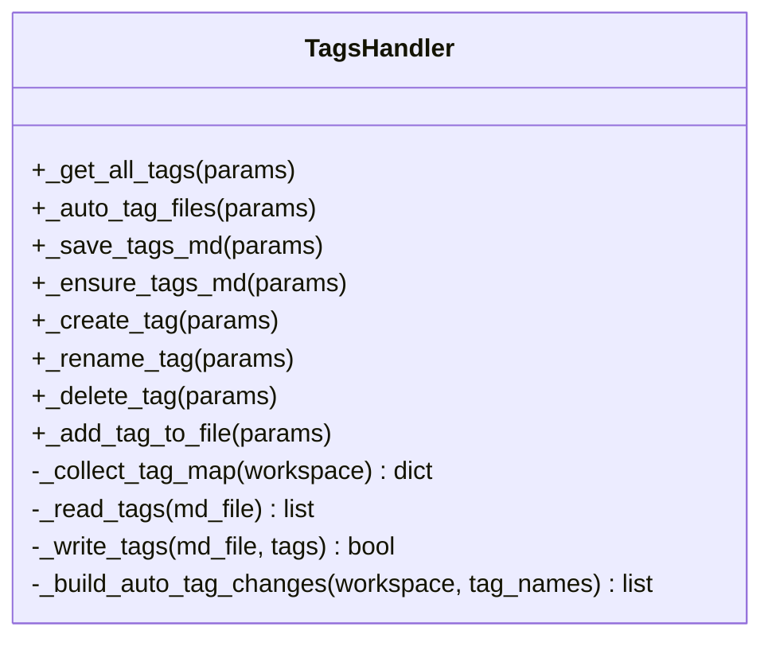
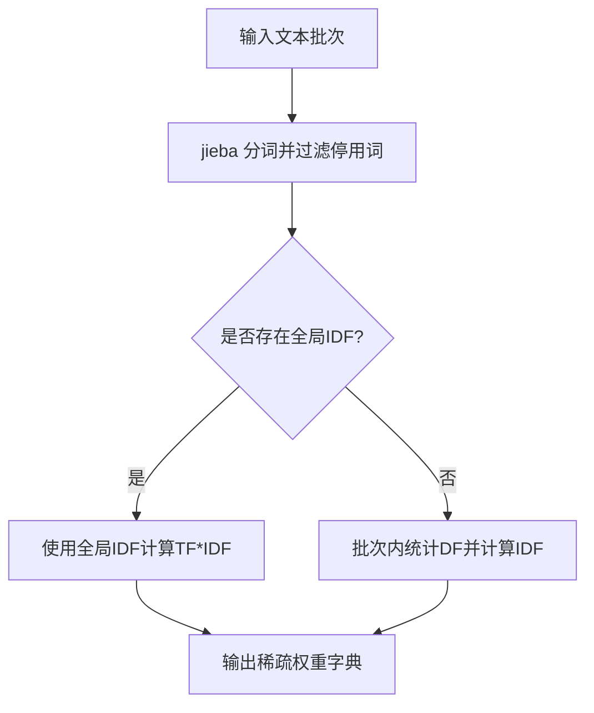
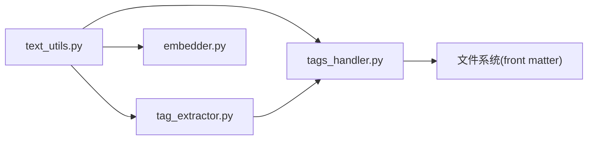

# 自动标签提取

<cite>
**本文引用的文件**   
- [utils/tag_extractor.py](file://utils/tag_extractor.py)
- [utils/text_utils.py](file://utils/text_utils.py)
- [python/sidecar/handlers/tags_handler.py](file://python/sidecar/handlers/tags_handler.py)
- [python/sidecar/rag/embedder.py](file://python/sidecar/rag/embedder.py)
- [utils/topic_assigner.py](file://utils/topic_assigner.py)
</cite>

## 目录
1. [简介](#简介)
2. [项目结构](#项目结构)
3. [核心组件](#核心组件)
4. [架构总览](#架构总览)
5. [详细组件分析](#详细组件分析)
6. [依赖关系分析](#依赖关系分析)
7. [性能与可扩展性](#性能与可扩展性)
8. [故障排查指南](#故障排查指南)
9. [结论](#结论)
10. [附录：配置与调优](#附录配置与调优)

## 简介
本文件面向 NoteAI 的“自动标签提取系统”，聚焦基于 jieba 分词 + TF-IDF 思想的中文标签提取机制，覆盖以下方面：
- 文本预处理、分词策略、关键词权重计算
- 标签生成流程：从笔记内容（当前实现以文件名为主）中提取 2–5 个有区分度的中文标签，确保相关性与代表性
- 标签与主题体系的关联机制：如何将生成的标签应用到主题体系，支持手动调整与 AI 建议
- 标签的存储格式与使用场景：在笔记元数据中标签的组织方式，标签云展示与搜索过滤
- 标签提取的配置选项与调优方法：自定义词典与停用词管理

说明：
- 当前自动标签提取主要基于“文件名”进行分词与统计筛选；正文内容的 TF-IDF 用于检索侧稀疏向量构建，不直接参与标签生成。
- 标签写入采用 Markdown YAML front matter 的 tags 字段，便于前端渲染标签云与后端检索过滤。

## 项目结构
与自动标签提取相关的核心代码分布在如下模块：
- utils/text_utils.py：通用文本工具（分词、泛词/停用词集合、前/后缀处理等）
- utils/tag_extractor.py：基于文件名的标签提取与 YAML front matter 读写
- python/sidecar/handlers/tags_handler.py：标签操作 API 处理器（批量打标、重命名、删除、导出标签索引等）
- python/sidecar/rag/embedder.py：RAG 检索侧的稀疏权重计算（jieba 分词 + TF-IDF），用于检索而非标签生成
- utils/topic_assigner.py：主题分配与同步逻辑（与标签协同工作）

图表来源
- [utils/tag_extractor.py:1-661](file://utils/tag_extractor.py#L1-L661)
- [utils/text_utils.py:1-1367](file://utils/text_utils.py#L1-L1367)
- [python/sidecar/handlers/tags_handler.py:1-305](file://python/sidecar/handlers/tags_handler.py#L1-L305)
- [python/sidecar/rag/embedder.py:60-259](file://python/sidecar/rag/embedder.py#L60-L259)
- [utils/topic_assigner.py:1-200](file://utils/topic_assigner.py#L1-L200)

章节来源
- [utils/tag_extractor.py:1-661](file://utils/tag_extractor.py#L1-L661)
- [utils/text_utils.py:1-1367](file://utils/text_utils.py#L1-L1367)
- [python/sidecar/handlers/tags_handler.py:1-305](file://python/sidecar/handlers/tags_handler.py#L1-L305)
- [python/sidecar/rag/embedder.py:60-259](file://python/sidecar/rag/embedder.py#L60-L259)
- [utils/topic_assigner.py:1-200](file://utils/topic_assigner.py#L1-L200)

## 核心组件
- 文本工具与分词
  - 提供中英文混合分词、CamelCase 拆分、最小长度过滤、泛词与停用词集合、front matter 解析与写入等能力。
- 标签提取器
  - 基于文件名分词，结合全局出现次数阈值与泛词过滤，输出候选标签并写入 YAML front matter。
- 标签 API 处理器
  - 提供获取全部标签、批量自动打标、保存标签索引、创建/重命名/删除标签、向文件追加标签等操作。
- RAG 稀疏权重（TF-IDF）
  - 使用 jieba 分词与 IDF 计算稀疏向量，服务于检索，不直接用于标签生成。
- 主题分配器
  - 将文件分配到主题文件夹，并与 wiki 同步；可与标签协同提升可发现性。

章节来源
- [utils/text_utils.py:1256-1330](file://utils/text_utils.py#L1256-L1330)
- [utils/tag_extractor.py:94-175](file://utils/tag_extractor.py#L94-L175)
- [python/sidecar/handlers/tags_handler.py:47-305](file://python/sidecar/handlers/tags_handler.py#L47-L305)
- [python/sidecar/rag/embedder.py:173-224](file://python/sidecar/rag/embedder.py#L173-L224)
- [utils/topic_assigner.py:40-179](file://utils/topic_assigner.py#L40-L179)

## 架构总览
下图展示了“自动标签提取”的整体流程：从文件名到候选标签，再到写入 front matter，以及标签的聚合与导出。

图表来源
- [python/sidecar/handlers/tags_handler.py:60-98](file://python/sidecar/handlers/tags_handler.py#L60-L98)
- [utils/tag_extractor.py:177-200](file://utils/tag_extractor.py#L177-L200)
- [utils/text_utils.py:1282-1298](file://utils/text_utils.py#L1282-L1298)

## 详细组件分析

### 文本工具与分词策略（utils/text_utils.py）
- 分词入口
  - tokenize(text)：优先使用 jieba.lcut，失败时回退为正则切分；对 CamelCase 做拆分；过滤空串与短词（MIN_TAG_LENGTH）。
  - tokenize_filename(filename)：先去除扩展名再分词。
- 词汇过滤
  - GENERIC_WORDS：大量泛词集合，避免“教程/示例/README”等无区分度词进入标签。
  - CHINESE_STOPWORDS：中文停用词集合，排除常见虚词与高频词。
- 匹配与计数
  - _normalize_for_match(s)：去空格并小写，用于模糊匹配（如“Machine Learning”与“MachineLearning”）。
  - _count_tag_occurrence(tag, filenames)：在工作区所有 MD 文件名中统计候选标签的出现次数。
- Front matter 读写
  - parse_frontmatter(text)/write_frontmatter(meta, body)：解析/重建 YAML front matter，兼容 BOM。

复杂度与特性
- 分词时间复杂度近似 O(n)，n 为字符数；计数阶段为 O(m·k)，m 为文件名数量，k 为候选标签数。
- 通过 MIN_TAG_LENGTH 与泛词/停用词过滤，提高标签质量与稳定性。

章节来源
- [utils/text_utils.py:1256-1330](file://utils/text_utils.py#L1256-L1330)
- [utils/text_utils.py:1332-1367](file://utils/text_utils.py#L1332-L1367)

### 标签提取器（utils/tag_extractor.py）
- 核心流程
  - extract_tags_from_filename(file_path)：
    1) 收集工作区 Notes/Abstract/Used 下所有 MD 文件名
    2) 对目标文件名分词，分离英文与中文片段
    3) 英文双词组合优先（相邻词拼接多种形态），若在全局出现次数 > OCCURRENCE_THRESHOLD 则入选
    4) 英文单词与中文词依次判断，同样需超过阈值且不在泛词集合
    5) 去重后返回唯一标签列表
  - tag_files_by_filename(file_paths)：批量为文件添加 front matter 中的 tags 字段
  - process_and_tag_file_with_yaml(file_path, source, title)：读取现有 front matter，补全标题与标签后写回
- 标签持久化
  - generate_yaml_frontmatter()/parse_yaml_frontmatter()/add_yaml_frontmatter_to_content()/add_yaml_frontmatter_to_file()：负责 YAML front matter 的生成、解析与写入
  - save_tags_md(workspace_path)：扫描工作区，汇总所有标签及其对应文件，生成 wiki/tags.md 供展示

算法要点
- 优先级：英文双词组合 > 英文单词 > 中文词
- 阈值控制：OCCURRENCE_THRESHOLD=3，降低噪声
- 泛词过滤：_is_generic_word(word) 使用 GENERIC_WORDS 统一过滤
- 大小写与空格归一化：_normalize_for_match 保证跨形态匹配

图表来源
- [utils/tag_extractor.py:94-175](file://utils/tag_extractor.py#L94-L175)
- [utils/text_utils.py:1282-1330](file://utils/text_utils.py#L1282-L1330)

章节来源
- [utils/tag_extractor.py:29-175](file://utils/tag_extractor.py#L29-L175)
- [utils/tag_extractor.py:355-409](file://utils/tag_extractor.py#L355-L409)
- [utils/tag_extractor.py:411-456](file://utils/tag_extractor.py#L411-L456)
- [utils/tag_extractor.py:458-527](file://utils/tag_extractor.py#L458-L527)
- [utils/tag_extractor.py:529-581](file://utils/tag_extractor.py#L529-L581)
- [utils/tag_extractor.py:583-661](file://utils/tag_extractor.py#L583-L661)

### 标签 API 处理器（python/sidecar/handlers/tags_handler.py）
- 功能概览
  - get_all_tags：聚合工作区所有文件的 tags，按文件数降序返回
  - auto_tag_files：根据已有标签集合，对文件名包含匹配项的文件批量追加标签（支持 dry_run 预览）
  - save_tags_md/ensure_tags_md：生成 wiki/tags.md 索引
  - create_tag/rename_tag/delete_tag/add_tag_to_file：标签生命周期管理
- 关键实现
  - _collect_tag_map：遍历 MD 文件，解析 front matter 的 tags 字段，构建 {tag:[files]} 映射
  - _read_tags/_write_tags：标准化 tags 输入（字符串或列表），保持 BOM 一致性，避免重复写入
  - _build_auto_tag_changes：基于文件名 stem 的小写匹配，计算需要新增的标签

图表来源
- [python/sidecar/handlers/tags_handler.py:47-305](file://python/sidecar/handlers/tags_handler.py#L47-L305)

章节来源
- [python/sidecar/handlers/tags_handler.py:1-305](file://python/sidecar/handlers/tags_handler.py#L1-L305)

### 检索侧 TF-IDF（python/sidecar/rag/embedder.py）
- 作用范围
  - 用于检索的稀疏向量权重计算，不直接参与标签生成
- 实现要点
  - jieba.cut 分词，过滤内置停用词
  - 优先加载全局 IDF，否则回退为批次内局部 IDF
  - 计算 TF*IDF 得到稀疏权重字典

图表来源
- [python/sidecar/rag/embedder.py:173-224](file://python/sidecar/rag/embedder.py#L173-L224)

章节来源
- [python/sidecar/rag/embedder.py:60-259](file://python/sidecar/rag/embedder.py#L60-L259)

### 标签与主题的关联（utils/topic_assigner.py）
- 标签与主题的关系
  - 标签用于细粒度检索与展示，主题用于结构化组织与导航
  - 主题分配器可将文件移动到 Notes/<主题路径>/ 下，并在 wiki 中同步
- 与标签的协作
  - 标签可作为主题分配的辅助信号（例如文件名中包含的主题词也可作为标签）
  - 用户可在 front matter 中同时维护 tags 与 topic，形成互补

章节来源
- [utils/topic_assigner.py:40-179](file://utils/topic_assigner.py#L40-L179)

## 依赖关系分析
- 内部依赖
  - tag_extractor 依赖 text_utils 的分词、泛词/停用词、front matter 工具
  - tags_handler 依赖 tag_extractor 与 text_utils，封装 API 并提供缓存与批量操作
  - embedder 依赖 text_utils 的分词能力，但独立于标签提取流程
  - topic_assigner 与标签解耦，主要通过 front matter 的 tags 字段与标签生态互通
- 外部依赖
  - jieba：中文分词库（可选，不可用时回退正则切分）
  - PyYAML：front matter 解析/序列化（可选，不可用时使用简易解析器）

图表来源
- [utils/text_utils.py:1-1367](file://utils/text_utils.py#L1-L1367)
- [utils/tag_extractor.py:1-661](file://utils/tag_extractor.py#L1-L661)
- [python/sidecar/handlers/tags_handler.py:1-305](file://python/sidecar/handlers/tags_handler.py#L1-L305)
- [python/sidecar/rag/embedder.py:60-259](file://python/sidecar/rag/embedder.py#L60-L259)

章节来源
- [utils/text_utils.py:1-1367](file://utils/text_utils.py#L1-L1367)
- [utils/tag_extractor.py:1-661](file://utils/tag_extractor.py#L1-L661)
- [python/sidecar/handlers/tags_handler.py:1-305](file://python/sidecar/handlers/tags_handler.py#L1-L305)
- [python/sidecar/rag/embedder.py:60-259](file://python/sidecar/rag/embedder.py#L60-L259)

## 性能与可扩展性
- 性能特征
  - 分词：jieba 首次加载较慢，后续复用；回退正则切分更快但精度较低
  - 计数：对文件名集合进行子串匹配，整体 O(m·k)；可通过减少候选标签或优化匹配策略提升
  - I/O：批量写入 front matter 时注意合并写入与错误重试
- 可扩展点
  - 引入更精细的停用词/泛词白名单
  - 增加基于正文内容的关键词抽取（可选），与文件名标签融合
  - 对英文多词组合引入 n-gram 与领域词典增强

[本节为通用指导，无需源码引用]

## 故障排查指南
- 常见问题
  - 未设置工作区：API 返回“未设置工作区”
  - 权限不足：无法访问某些目录或文件
  - YAML 解析异常：PyYAML 缺失或 front matter 格式不规范
- 定位建议
  - 查看日志中 “[tag_extractor]”、“[tags]” 警告信息
  - 检查 wiki/tags.md 是否正确生成
  - 确认 front matter 的 tags 字段为数组或字符串

章节来源
- [python/sidecar/handlers/tags_handler.py:60-98](file://python/sidecar/handlers/tags_handler.py#L60-L98)
- [utils/tag_extractor.py:529-581](file://utils/tag_extractor.py#L529-L581)

## 结论
NoteAI 的自动标签提取系统以“文件名分词 + 全局频次阈值 + 泛词/停用词过滤”为核心，稳定地产出具有区分度的中文标签，并通过 YAML front matter 持久化，支撑标签云与搜索过滤。检索侧的 TF-IDF 独立运行，保障检索质量而不干扰标签生成。配合主题分配器，可实现“标签 + 主题”的双轨组织，兼顾灵活性与结构性。

[本节为总结，无需源码引用]

## 附录：配置与调优
- 可调参数
  - MIN_TAG_LENGTH：最小标签长度（默认 2）
  - OCCURRENCE_THRESHOLD：全局出现次数阈值（默认 3）
  - GENERIC_WORDS：泛词集合，可按业务增删
  - CHINESE_STOPWORDS：中文停用词集合，可按业务增删
- 自定义词典
  - 通过 jieba.load_userdict(...) 加载领域词典，提升专业术语识别
  - 建议在启动时加载，避免每次调用重复加载
- 停用词管理
  - 在 CHINESE_STOPWORDS 中补充高频虚词与无关词
  - 对英文停用词可参考 GENERIC_WORDS 中的冠词/代词/介词/连词等类别
- 标签生成策略
  - 如需从正文提取标签，可在现有流程基础上增加正文分词与 TF-IDF 排序，与文件名标签融合（保留当前文件名优先策略）
- 标签与主题联动
  - 在 front matter 中同时维护 tags 与 topic，利用主题路径与标签共同提升可发现性
  - 使用 tags_handler 提供的 rename_tag/delete_tag 维护标签一致性

章节来源
- [utils/text_utils.py:14-16](file://utils/text_utils.py#L14-L16)
- [utils/text_utils.py:17-852](file://utils/text_utils.py#L17-L852)
- [utils/text_utils.py:855-1234](file://utils/text_utils.py#L855-L1234)
- [utils/tag_extractor.py:147-164](file://utils/tag_extractor.py#L147-L164)
- [python/sidecar/rag/embedder.py:71-100](file://python/sidecar/rag/embedder.py#L71-L100)