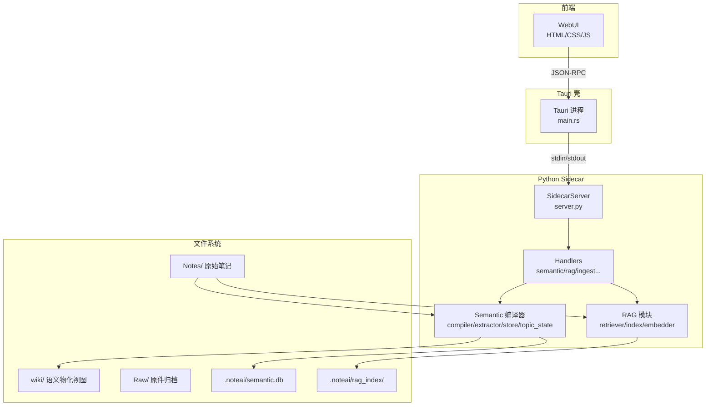
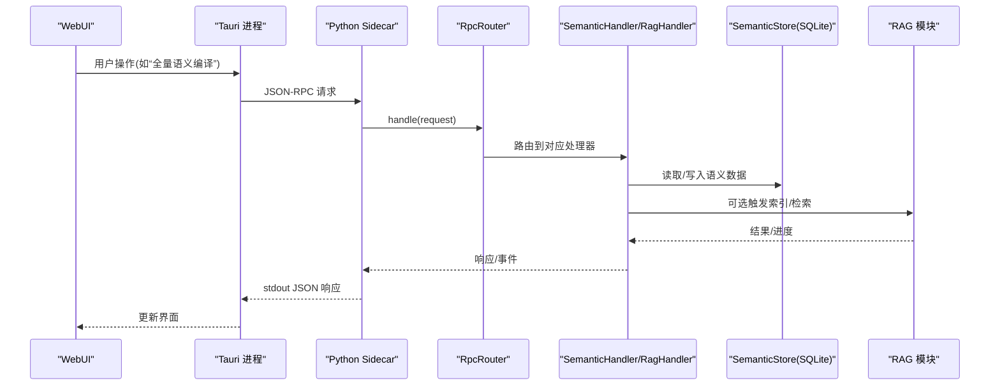
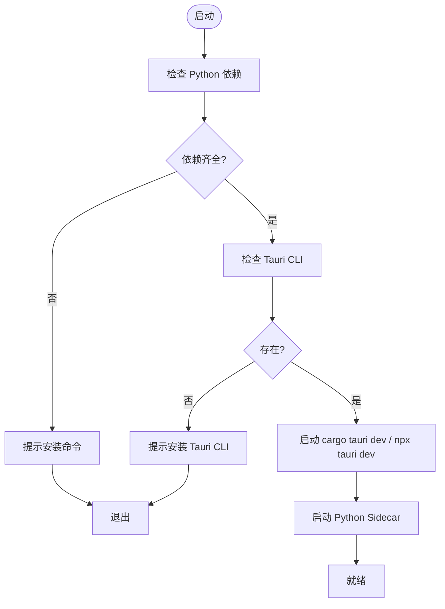
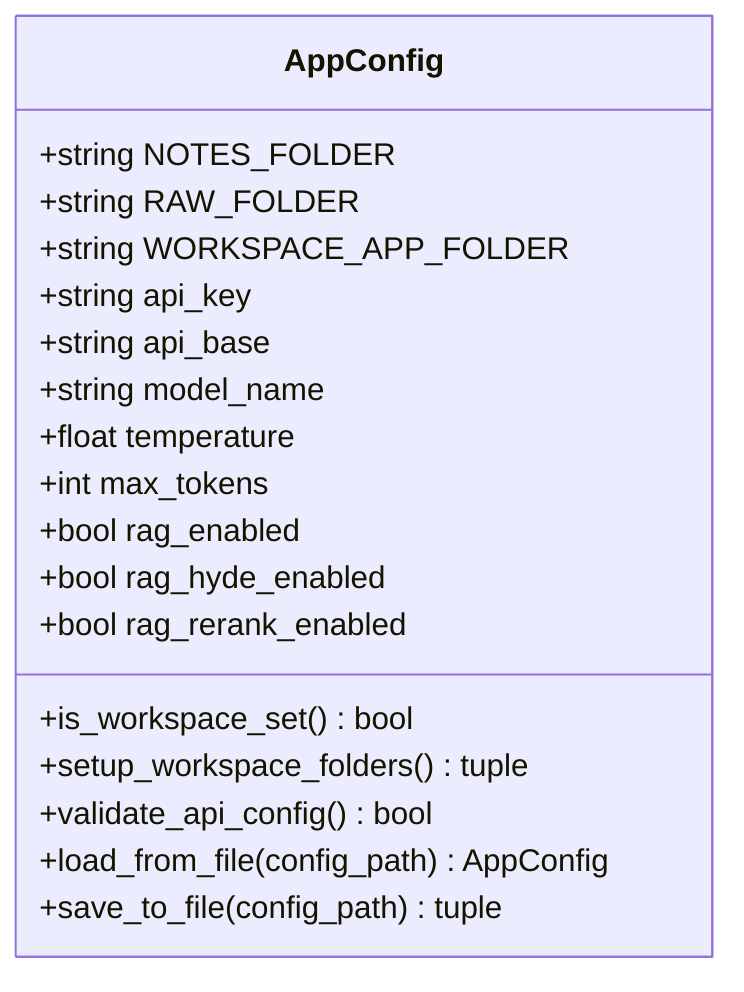
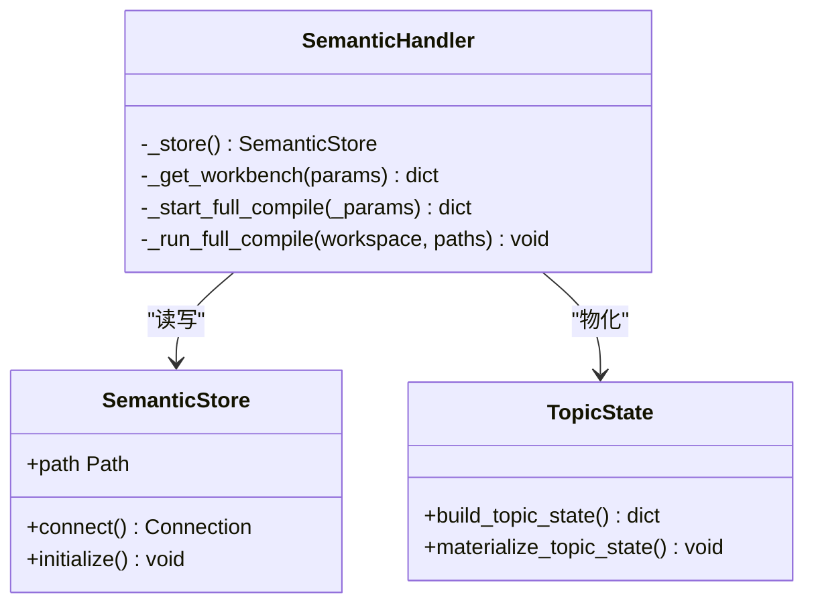
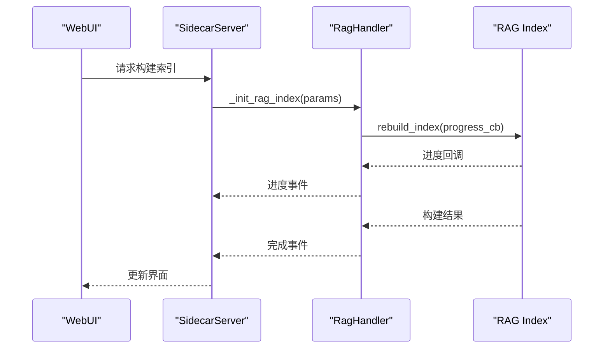
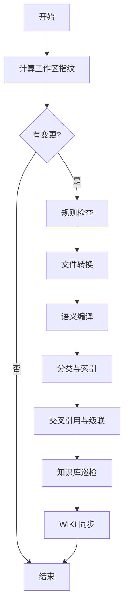
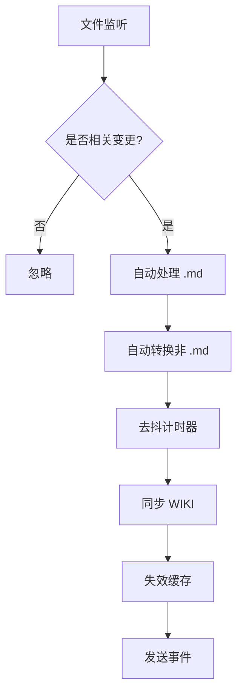
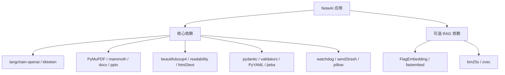

# 语义知识系统

<cite>
**本文引用的文件**   
- [README.md](file://README.md)
- [pyproject.toml](file://pyproject.toml)
- [run.py](file://run.py)
- [python/main.py](file://python/main.py)
- [config/app_config.py](file://config/app_config.py)
- [config/settings.py](file://config/settings.py)
- [config/constants.py](file://config/constants.py)
- [python/sidecar/server.py](file://python/sidecar/server.py)
- [python/sidecar/semantic/__init__.py](file://python/sidecar/semantic/__init__.py)
- [python/sidecar/rag/__init__.py](file://python/sidecar/rag/__init__.py)
- [python/sidecar/handlers/semantic_handler.py](file://python/sidecar/handlers/semantic_handler.py)
- [python/sidecar/handlers/rag_handler.py](file://python/sidecar/handlers/rag_handler.py)
- [python/sidecar/ingest_pipeline.py](file://python/sidecar/ingest_pipeline.py)
- [src-tauri/src/main.rs](file://src-tauri/src/main.rs)
- [webui/index.html](file://webui/index.html)
</cite>

## 目录
1. [简介](#简介)
2. [项目结构](#项目结构)
3. [核心组件](#核心组件)
4. [架构总览](#架构总览)
5. [详细组件分析](#详细组件分析)
6. [依赖关系分析](#依赖关系分析)
7. [性能考量](#性能考量)
8. [故障排查指南](#故障排查指南)
9. [结论](#结论)
10. [附录](#附录)

## 简介
NoteAI 是一个本地优先的 AI 原生个人知识工作流桌面应用。它将原始资料编译为可追溯的语义知识库，并基于该库进行整理、检索问答、主题阅读、回顾与输出。与传统“每次提问都重新读一遍笔记”的 RAG 不同，NoteAI 先对 Notes 进行语义编译，生成实体、概念、命题、证据与主题状态等中间层，再派生出 wiki 与检索索引。Notes 是不可变事实来源，语义库与 wiki 均为可重建的派生产物。

## 项目结构
- 前端：Tauri v2 Shell + WebUI（HTML/CSS/JS）
- 后端：Python Sidecar，通过 stdin/stdout JSON-RPC 与 Tauri 通信
- 配置：集中式 AppConfig 与常量定义，支持环境变量覆盖与加密存储 API Key
- 语义编译：解析文档块、抽取实体/概念/命题/证据、构建主题状态与物化视图
- RAG：可选的向量检索（zvec/bm25s/fastembed），支持混合检索与重排序
- 采集与转换：自动将 PDF/DOCX/PPTX/网页等转换为 Markdown，归档原件并分类

**图表来源** 
- [src-tauri/src/main.rs:1-4](file://src-tauri/src/main.rs#L1-L4)
- [python/sidecar/server.py:55-133](file://python/sidecar/server.py#L55-L133)
- [python/sidecar/semantic/__init__.py:1-18](file://python/sidecar/semantic/__init__.py#L1-L18)
- [python/sidecar/rag/__init__.py:1-25](file://python/sidecar/rag/__init__.py#L1-L25)

**章节来源**
- [README.md:1-167](file://README.md#L1-L167)
- [pyproject.toml:1-132](file://pyproject.toml#L1-L132)

## 核心组件
- 启动器与依赖检查：run.py 负责检查 Python 依赖与 Tauri CLI，并启动开发模式
- Sidecar 服务：python/main.py 作为 Sidecar 入口，加载 sidecar.server.main 提供 JSON-RPC
- 配置中心：config.app_config.AppConfig 管理工作区、模型、RAG、界面等配置；config.constants 提供路径常量
- 语义编译器：sidecar.semantic 提供文档解析、语义抽取、存储与主题状态物化
- RAG 模块：sidecar.rag 提供分块、嵌入、索引与检索能力（可选）
- 处理器集合：handlers.* 暴露 RPC 路由，包括语义工作台、RAG、Ingest、文件、标签、主题等

**章节来源**
- [run.py:1-175](file://run.py#L1-L175)
- [python/main.py:1-21](file://python/main.py#L1-L21)
- [config/app_config.py:1-397](file://config/app_config.py#L1-L397)
- [config/constants.py:1-52](file://config/constants.py#L1-L52)
- [python/sidecar/server.py:1-133](file://python/sidecar/server.py#L1-L133)
- [python/sidecar/semantic/__init__.py:1-18](file://python/sidecar/semantic/__init__.py#L1-L18)
- [python/sidecar/rag/__init__.py:1-25](file://python/sidecar/rag/__init__.py#L1-L25)

## 架构总览
NoteAI 采用 Tauri + Python Sidecar 的分层架构。前端通过 Tauri 调用 Python 侧的 JSON-RPC 接口，Sidecar 内部由 RpcRouter 分发到各 Handler，Handler 再调用语义编译器或 RAG 模块完成具体任务。文件系统以 Notes 为事实源，语义库与 wiki 为派生视图，RAG 索引用于检索增强。

**图表来源** 
- [python/sidecar/server.py:549-603](file://python/sidecar/server.py#L549-L603)
- [python/sidecar/handlers/semantic_handler.py:1-200](file://python/sidecar/handlers/semantic_handler.py#L1-L200)
- [python/sidecar/handlers/rag_handler.py:1-200](file://python/sidecar/handlers/rag_handler.py#L1-L200)

## 详细组件分析

### 启动流程与依赖检查
- run.py 解析 pyproject.toml 中的依赖，检查缺失包并提示安装命令；检测 Tauri CLI 是否存在
- python/main.py 设置必要环境变量后导入 sidecar.server.main，启动 Sidecar 服务

**图表来源** 
- [run.py:44-175](file://run.py#L44-L175)
- [python/main.py:1-21](file://python/main.py#L1-L21)

**章节来源**
- [run.py:1-175](file://run.py#L1-L175)
- [python/main.py:1-21](file://python/main.py#L1-L21)

### 配置系统
- AppConfig 使用 dataclass 管理所有配置项，支持从配置文件、系统目录 API 配置、环境变量与工作区状态合并加载
- 保存时分离普通配置与敏感字段（API Key 存入系统目录加密存储），并提供工作区文件夹初始化与校验

**图表来源** 
- [config/app_config.py:28-397](file://config/app_config.py#L28-L397)
- [config/constants.py:1-52](file://config/constants.py#L1-L52)

**章节来源**
- [config/app_config.py:1-397](file://config/app_config.py#L1-L397)
- [config/settings.py:1-41](file://config/settings.py#L1-L41)
- [config/constants.py:1-52](file://config/constants.py#L1-L52)

### 语义编译器
- 入口导出 compile_note_semantics、extract_document_semantics、parse_semantic_blocks、build_topic_state、materialize_topic_state
- SemanticStore 封装 SQLite 访问，SemanticHandler 提供只读工作台查询与显式审查动作，支持概览、命题、概念、实体、质量、冲突、链接等视图
- 全量编译通过后台任务执行，进度通过 job_status 上报，失败保留上一版产物

**图表来源** 
- [python/sidecar/semantic/__init__.py:1-18](file://python/sidecar/semantic/__init__.py#L1-L18)
- [python/sidecar/handlers/semantic_handler.py:1-200](file://python/sidecar/handlers/semantic_handler.py#L1-L200)

**章节来源**
- [python/sidecar/semantic/__init__.py:1-18](file://python/sidecar/semantic/__init__.py#L1-L18)
- [python/sidecar/handlers/semantic_handler.py:1-200](file://python/sidecar/handlers/semantic_handler.py#L1-L200)

### RAG 模块
- RagHandler 提供索引构建、增量添加/删除文本块、错误冷却与并发控制
- RAG 为可选功能，依赖 zvec、bm25s、fastembed、numpy；未启用时返回明确提示
- 启动时可自动检查索引是否最新，必要时提示手动重建

**图表来源** 
- [python/sidecar/handlers/rag_handler.py:1-200](file://python/sidecar/handlers/rag_handler.py#L1-L200)
- [python/sidecar/rag/__init__.py:1-25](file://python/sidecar/rag/__init__.py#L1-L25)

**章节来源**
- [python/sidecar/handlers/rag_handler.py:1-200](file://python/sidecar/handlers/rag_handler.py#L1-L200)
- [python/sidecar/rag/__init__.py:1-25](file://python/sidecar/rag/__init__.py#L1-L25)

### 采集与处理流水线（Ingest）
- ingest_pipeline 统一编排：规则 → 转换 → 编译 → 分类 → 语义 → 索引 → 交叉引用 → 级联 → 巡检 → 同步
- 使用指纹（mtime+size）快速判断变更，避免重复扫描；支持中断恢复与取消
- 启动时自动修复损坏链接、合并元数据到项目规则、同步 WIKI 与文件夹主题

**图表来源** 
- [python/sidecar/ingest_pipeline.py:1-200](file://python/sidecar/ingest_pipeline.py#L1-L200)

**章节来源**
- [python/sidecar/ingest_pipeline.py:1-200](file://python/sidecar/ingest_pipeline.py#L1-L200)

### 文件监听与自动处理
- SidecarServer 使用 watchdog 监听工作区文件变化，过滤忽略目录与 wiki 目录
- 对 .md 自动分配主题，对非 Markdown 文件自动转换为 Markdown 并归档原件
- 批量去抖触发 WIKI 同步与缓存失效，发送 workspace_files_changed 事件

**图表来源** 
- [python/sidecar/server.py:306-547](file://python/sidecar/server.py#L306-L547)

**章节来源**
- [python/sidecar/server.py:224-547](file://python/sidecar/server.py#L224-L547)

### 前端集成
- webui/index.html 引入 CSS/JS 资源，包含语义工作台导航、编译按钮与进度展示区域
- 通过 Tauri 调用后端能力，渲染语义类别、覆盖率与编译进度

**章节来源**
- [webui/index.html:1-200](file://webui/index.html#L1-L200)

## 依赖关系分析
- 运行时依赖：langchain-openai、tiktoken、requests、beautifulsoup4、markdownify、readability-lxml、validators、pydantic、PyMuPDF、mammoth、python-docx、python-pptx、olefile、pillow、markdown、PyYAML、jieba、html2text、watchdog、send2trash、numpy、cryptography、snownlp
- 可选依赖（RAG）：FlagEmbedding、bm25s、zvec、fastembed
- 开发依赖：pytest、ruff、mypy
- 包映射：setuptools 将 import name `sidecar` 映射到目录 python/sidecar

**图表来源** 
- [pyproject.toml:10-57](file://pyproject.toml#L10-L57)

**章节来源**
- [pyproject.toml:1-132](file://pyproject.toml#L1-L132)

## 性能考量
- 增量编译与物化：仅重编受影响的块、实体、命题、主题状态和页面，失败保留上一版产物
- 文件监听去抖：批量合并变更，减少频繁同步与缓存失效
- 全文检索与 RAG 缓存：变更时失效缓存，避免锁冲突；RAG 构建使用并发锁与错误冷却
- 线程与任务管理：后台任务通过线程池与 job_status 跟踪，避免阻塞主循环

[本节为通用指导，不直接分析具体文件]

## 故障排查指南
- 依赖缺失：run.py 会列出缺失包并给出推荐安装命令；若未安装 RAG 依赖，可在设置中关闭 RAG 组件
- Tauri CLI 未找到：提示安装 cargo tauri 或 npm install -g @tauri-apps/cli
- 工作区未设置或权限不足：AppConfig.setup_workspace_folders 返回错误信息；确保路径存在且可写
- RAG 索引构建失败：查看 error_state.json 冷却期内的错误消息；确认索引是否已存在且文件清单有效
- 语义编译中断：ingest_state.json 会将 running 状态标记为 interrupted，下次启动自动续跑

**章节来源**
- [run.py:44-175](file://run.py#L44-L175)
- [config/app_config.py:147-176](file://config/app_config.py#L147-L176)
- [python/sidecar/handlers/rag_handler.py:117-152](file://python/sidecar/handlers/rag_handler.py#L117-L152)
- [python/sidecar/ingest_pipeline.py:178-188](file://python/sidecar/ingest_pipeline.py#L178-L188)

## 结论
NoteAI 通过“Notes 不可变 + 语义编译 + 物化视图 + 可选 RAG”的架构，实现了低维护成本、高可追溯性的个人知识工作流。前端交互简洁，后端模块化清晰，支持增量更新与稳健的错误恢复。未来可在 Graph RAG 与自动化审查方面继续演进。

[本节为总结性内容，不直接分析具体文件]

## 附录
- 快速开始：参考 README 中的环境要求与启动命令
- 工作区结构：Notes/ 为事实源，wiki/ 为语义物化视图，Raw/ 为原件归档，.noteai/ 为数据库与索引

**章节来源**
- [README.md:70-111](file://README.md#L70-L111)