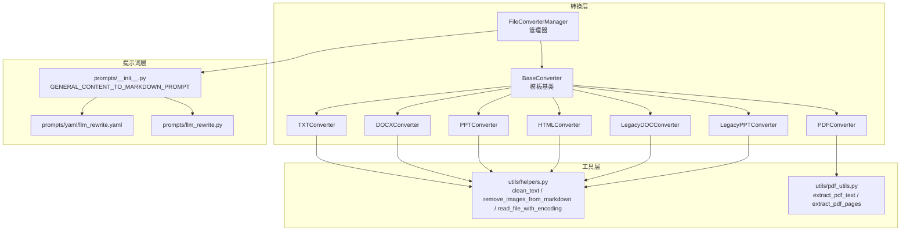
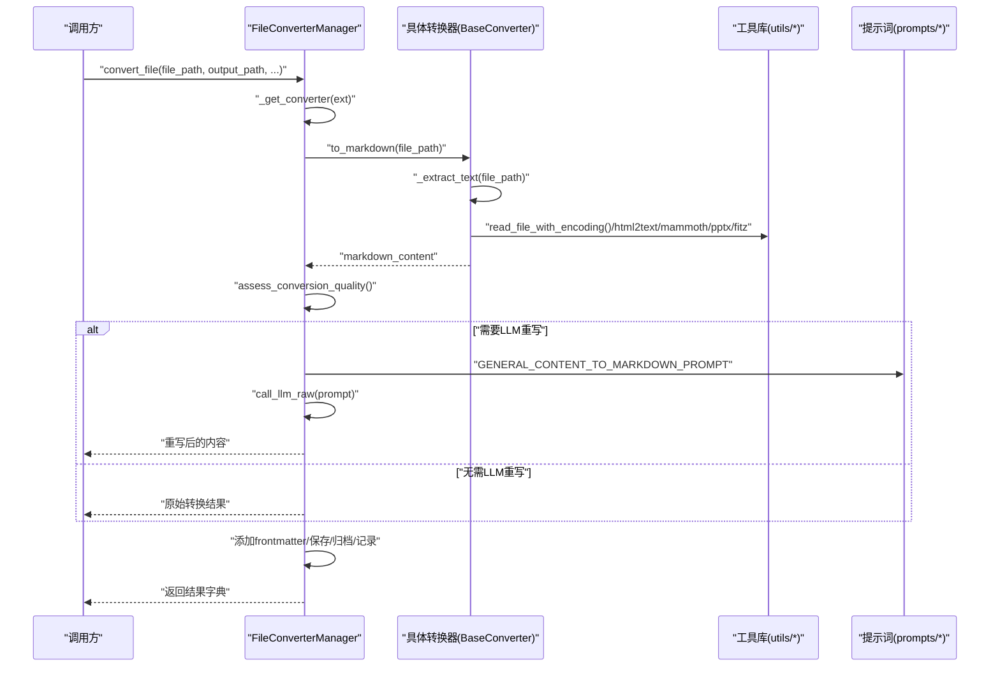
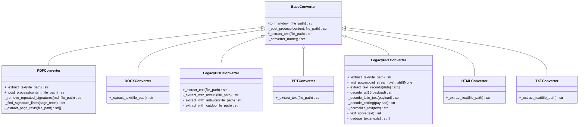
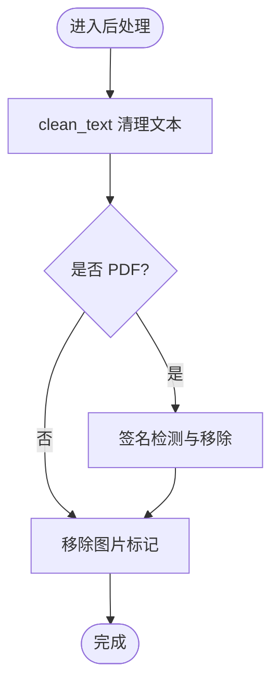
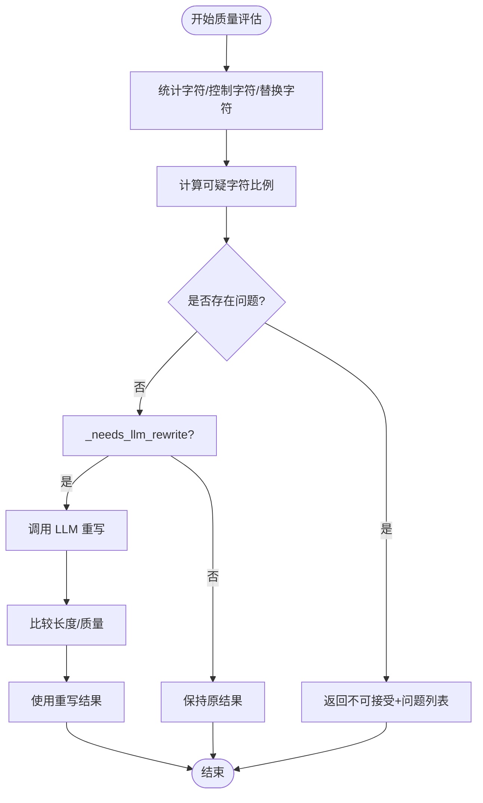
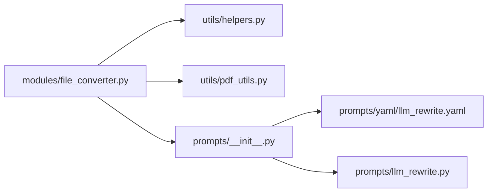

# 多格式文件转换

<cite>
**本文引用的文件**
- [modules/file_converter.py](file://modules/file_converter.py)
- [utils/helpers.py](file://utils/helpers.py)
- [utils/pdf_utils.py](file://utils/pdf_utils.py)
- [prompts/__init__.py](file://prompts/__init__.py)
- [prompts/llm_rewrite.py](file://prompts/llm_rewrite.py)
- [prompts/yaml/llm_rewrite.yaml](file://prompts/yaml/llm_rewrite.yaml)
</cite>

## 目录
1. [简介](#简介)
2. [项目结构](#项目结构)
3. [核心组件](#核心组件)
4. [架构总览](#架构总览)
5. [详细组件分析](#详细组件分析)
6. [依赖关系分析](#依赖关系分析)
7. [性能与质量评估](#性能与质量评估)
8. [故障排查指南](#故障排查指南)
9. [结论](#结论)
10. [附录：使用示例](#附录使用示例)

## 简介
本文件为 NoteAI 的多格式文件转换能力提供系统化文档，覆盖支持的输入格式（PDF、DOCX、PPTX、HTML、TXT 以及旧版 .doc/.ppt），并深入解析基于模板方法模式的转换器设计、文本提取算法、后处理流程、质量评估与 LLM 重写优化。同时给出 FileConverterManager 的调用方式与错误处理策略，帮助读者快速理解与集成该模块。

## 项目结构
与多格式转换相关的核心代码位于 modules/file_converter.py，辅以 utils/helpers.py 的通用工具函数与 utils/pdf_utils.py 的 PDF 专用提取工具；LLM 重写相关提示词由 prompts 包统一加载与管理。

图表来源
- [modules/file_converter.py:27-862](file://modules/file_converter.py#L27-L862)
- [utils/helpers.py:26-48](file://utils/helpers.py#L26-L48)
- [utils/pdf_utils.py:1-40](file://utils/pdf_utils.py#L1-L40)
- [prompts/__init__.py:56-66](file://prompts/__init__.py#L56-L66)
- [prompts/yaml/llm_rewrite.yaml:1-29](file://prompts/yaml/llm_rewrite.yaml#L1-L29)
- [prompts/llm_rewrite.py:1-29](file://prompts/llm_rewrite.py#L1-L29)

章节来源
- [modules/file_converter.py:27-862](file://modules/file_converter.py#L27-L862)
- [utils/helpers.py:26-48](file://utils/helpers.py#L26-L48)
- [utils/pdf_utils.py:1-40](file://utils/pdf_utils.py#L1-L40)
- [prompts/__init__.py:56-66](file://prompts/__init__.py#L56-L66)
- [prompts/yaml/llm_rewrite.yaml:1-29](file://prompts/yaml/llm_rewrite.yaml#L1-L29)
- [prompts/llm_rewrite.py:1-29](file://prompts/llm_rewrite.py#L1-L29)

## 核心组件
- BaseConverter（模板方法模式）
  - 定义统一的 to_markdown() 流程：日志记录 → 文本提取 → 后处理 → 异常处理。
  - 子类仅需实现 _extract_text()，并可覆写 _post_process() 插入特定步骤。
- 具体转换器
  - PDFConverter：基于 PyMuPDF 提取文本，并在后处理中执行签名检测与移除。
  - DOCXConverter：基于 mammoth 将 .docx 转为 Markdown。
  - LegacyDOCConverter：对旧版 .doc 依次尝试 textutil/antiword/catdoc 进行文本提取。
  - PPTConverter：基于 python-pptx 读取 .pptx 幻灯片文本与表格。
  - LegacyPPTConverter：解析 OLE PowerPoint Document 流中的文本记录以支持 .ppt。
  - HTMLConverter：基于 html2text 将 HTML 转为 Markdown。
  - TXTConverter：按自动编码探测读取纯文本。
- FileConverterManager
  - 根据扩展名选择对应转换器，提供 convert_file() 单文件转换与 convert_batch() 批量转换。
  - 内置 assess_conversion_quality() 质量评估与 _needs_llm_rewrite() 触发条件判断。
  - 可选 LLM 重写优化，写入 YAML frontmatter，归档原始文件到 Raw，更新 source 字段。

章节来源
- [modules/file_converter.py:27-158](file://modules/file_converter.py#L27-L158)
- [modules/file_converter.py:160-405](file://modules/file_converter.py#L160-L405)
- [modules/file_converter.py:407-862](file://modules/file_converter.py#L407-L862)

## 架构总览
下图展示了从入口到各转换器的调用链路与关键外部依赖。

图表来源
- [modules/file_converter.py:569-730](file://modules/file_converter.py#L569-L730)
- [utils/helpers.py:292-304](file://utils/helpers.py#L292-L304)
- [utils/pdf_utils.py:4-22](file://utils/pdf_utils.py#L4-L22)
- [prompts/__init__.py:63-66](file://prompts/__init__.py#L63-L66)

## 详细组件分析

### 模板方法与转换器体系
- BaseConverter
  - to_markdown(): 统一流程控制，包含日志、异常捕获与后处理钩子。
  - _post_process(): 默认执行 clean_text 与 remove_images_from_markdown，子类可覆写追加逻辑。
- PDFConverter
  - 文本提取：调用 utils/pdf_utils.extract_pdf_text。
  - 后处理：clean_text → 签名检测与移除 → remove_images_from_markdown。
  - 签名检测：逐页提取文本，计算跨页公共行集合，过滤长度在阈值范围内的重复行。
- DOCXConverter
  - 文本提取：通过 mammoth.convert_to_markdown 将 .docx 转为 Markdown。
- LegacyDOCConverter
  - 文本提取：依次尝试 textutil、antiword、catdoc，任一成功即返回。
- PPTConverter
  - 文本提取：python-pptx 遍历幻灯片形状，提取文本与表格（Markdown 表格）。
- LegacyPPTConverter
  - 文本提取：olefile 打开 OLE 容器，定位 PowerPoint Document 数据流，解析文本记录（UTF-16/latin-1/cstring），去重与评分择优。
- HTMLConverter
  - 文本提取：html2text 将 HTML 转为 Markdown，保留链接与图片占位（后续由后处理移除）。
- TXTConverter
  - 文本提取：read_file_with_encoding 自动探测编码读取。

图表来源
- [modules/file_converter.py:27-158](file://modules/file_converter.py#L27-L158)
- [modules/file_converter.py:160-405](file://modules/file_converter.py#L160-L405)

章节来源
- [modules/file_converter.py:27-158](file://modules/file_converter.py#L27-L158)
- [modules/file_converter.py:160-405](file://modules/file_converter.py#L160-L405)

### 文本提取算法与外部依赖
- PDF：PyMuPDF（fitz）逐页提取文本，拼接为双换行分隔的整体文本；另提供逐页文本列表用于签名检测。
- Word（.docx）：mammoth 直接输出 Markdown。
- 旧版 Word（.doc）：系统工具 textutil/antiword/catdoc 顺序尝试，失败则抛出运行时错误。
- 演示文稿（.pptx）：python-pptx 遍历 shapes，提取文本与表格。
- 旧版演示文稿（.ppt）：olefile 解析 OLE 流，识别文本记录类型并进行解码与去重。
- HTML：html2text 转换为 Markdown。
- TXT：read_file_with_encoding 多编码回退读取。

章节来源
- [utils/pdf_utils.py:4-39](file://utils/pdf_utils.py#L4-L39)
- [modules/file_converter.py:174-181](file://modules/file_converter.py#L174-L181)
- [modules/file_converter.py:189-251](file://modules/file_converter.py#L189-L251)
- [modules/file_converter.py:260-286](file://modules/file_converter.py#L260-L286)
- [modules/file_converter.py:298-387](file://modules/file_converter.py#L298-L387)
- [modules/file_converter.py:396-404](file://modules/file_converter.py#L396-L404)
- [modules/file_converter.py:163-165](file://modules/file_converter.py#L163-L165)

### 后处理流程
- 通用后处理（BaseConverter._post_process）
  - clean_text：清理控制字符、合并空白、规范化段落。
  - remove_images_from_markdown：移除图片标记与引用。
- PDF 专属后处理（PDFConverter._post_process）
  - 先 clean_text，再执行签名检测与移除，最后移除图片。
  - 签名检测：仅当页数达到阈值时启用，跨页公共行且长度在阈值范围内视为签名/页眉/页脚。

图表来源
- [modules/file_converter.py:60-64](file://modules/file_converter.py#L60-L64)
- [modules/file_converter.py:87-92](file://modules/file_converter.py#L87-L92)
- [modules/file_converter.py:126-157](file://modules/file_converter.py#L126-L157)
- [utils/helpers.py:26-48](file://utils/helpers.py#L26-L48)

章节来源
- [modules/file_converter.py:60-64](file://modules/file_converter.py#L60-L64)
- [modules/file_converter.py:87-92](file://modules/file_converter.py#L87-L92)
- [modules/file_converter.py:126-157](file://modules/file_converter.py#L126-L157)
- [utils/helpers.py:26-48](file://utils/helpers.py#L26-L48)

### 质量评估与 LLM 重写优化
- 质量评估 assess_conversion_quality()
  - 统计非空白字符数、替换字符与控制字符比例，判定“疑似乱码”或“扫描 PDF”。
  - 返回 acceptable 标志与 issues 列表，供上层决策。
- LLM 重写触发 _needs_llm_rewrite()
  - 若内容过短或缺少标题/标点/段落等结构特征，则判定需要重写。
  - 仅在内容长度不超过阈值时调用 LLM，避免过大上下文。
- 重写流程
  - 检查 API 配置，构造 GENERAL_CONTENT_TO_MARKDOWN_PROMPT，调用 call_llm_raw 获取重写结果。
  - 若重写结果显著更长，则替换原内容并记录日志。

图表来源
- [modules/file_converter.py:509-534](file://modules/file_converter.py#L509-L534)
- [modules/file_converter.py:428-443](file://modules/file_converter.py#L428-L443)
- [modules/file_converter.py:641-657](file://modules/file_converter.py#L641-L657)
- [prompts/__init__.py:63-66](file://prompts/__init__.py#L63-L66)
- [prompts/yaml/llm_rewrite.yaml:1-29](file://prompts/yaml/llm_rewrite.yaml#L1-L29)
- [prompts/llm_rewrite.py:1-29](file://prompts/llm_rewrite.py#L1-L29)

章节来源
- [modules/file_converter.py:509-534](file://modules/file_converter.py#L509-L534)
- [modules/file_converter.py:428-443](file://modules/file_converter.py#L428-L443)
- [modules/file_converter.py:641-657](file://modules/file_converter.py#L641-L657)
- [prompts/__init__.py:63-66](file://prompts/__init__.py#L63-L66)
- [prompts/yaml/llm_rewrite.yaml:1-29](file://prompts/yaml/llm_rewrite.yaml#L1-L29)
- [prompts/llm_rewrite.py:1-29](file://prompts/llm_rewrite.py#L1-L29)

## 依赖关系分析
- 内部依赖
  - FileConverterManager 依赖 BaseConverter 及其子类实现。
  - 转换器依赖 utils/helpers.py 的通用工具（clean_text、remove_images_from_markdown、read_file_with_encoding）。
  - PDFConverter 额外依赖 utils/pdf_utils.py 的 PDF 提取工具。
- 外部依赖
  - PDF：PyMuPDF（fitz）
  - Word：mammoth
  - 演示文稿：python-pptx
  - HTML：html2text
  - 旧版 .doc：textutil/antiword/catdoc（系统命令）
  - 旧版 .ppt：olefile
- 提示词加载
  - prompts/__init__.py 统一暴露 GENERAL_CONTENT_TO_MARKDOWN_PROMPT 等常量，优先从 YAML 加载，Python 常量作为后备。

图表来源
- [modules/file_converter.py:1-25](file://modules/file_converter.py#L1-L25)
- [utils/helpers.py:26-48](file://utils/helpers.py#L26-L48)
- [utils/pdf_utils.py:1-40](file://utils/pdf_utils.py#L1-L40)
- [prompts/__init__.py:1-16](file://prompts/__init__.py#L1-L16)
- [prompts/yaml/llm_rewrite.yaml:1-29](file://prompts/yaml/llm_rewrite.yaml#L1-L29)
- [prompts/llm_rewrite.py:1-29](file://prompts/llm_rewrite.py#L1-L29)

章节来源
- [modules/file_converter.py:1-25](file://modules/file_converter.py#L1-L25)
- [utils/helpers.py:26-48](file://utils/helpers.py#L26-L48)
- [utils/pdf_utils.py:1-40](file://utils/pdf_utils.py#L1-L40)
- [prompts/__init__.py:1-16](file://prompts/__init__.py#L1-L16)
- [prompts/yaml/llm_rewrite.yaml:1-29](file://prompts/yaml/llm_rewrite.yaml#L1-L29)
- [prompts/llm_rewrite.py:1-29](file://prompts/llm_rewrite.py#L1-L29)

## 性能与质量评估
- 性能要点
  - PDF 转换采用逐页文本提取，适合中等规模文档；签名检测仅在页数达到阈值时启用，避免小文档开销。
  - DOCX/PPTX 转换依赖第三方库，建议缓存中间结果以避免重复 IO。
  - 旧版 .doc/.ppt 转换涉及系统命令或二进制解析，耗时较长，建议在批处理中串行化并记录进度。
- 质量评估
  - assess_conversion_quality() 提供保守的质量判定，防止低质量内容入库。
  - 结合 _needs_llm_rewrite() 与 LLM 重写，可在结构化不足时提升可读性与可用性。

[本节为通用指导，不直接分析具体文件]

## 故障排查指南
- 常见错误与定位
  - 不支持的文件格式：确认扩展名是否在 get_supported_formats() 列表中。
  - 旧版 .doc 无法转换：检查系统是否安装 textutil/antiword/catdoc 之一。
  - 旧版 .ppt 无法转换：确认 olefile 可用且文件包含 PowerPoint Document 数据流。
  - PDF 扫描图像：质量评估会标记“疑似扫描 PDF”，需考虑 OCR 方案。
  - LLM 重写失败：检查 API 配置与网络连通性，降级为原始转换结果。
- 日志与诊断
  - 转换器名称与路径会在日志中输出，便于定位失败文件。
  - 批量转换结果会记录至转换失败汇总，便于复盘。

章节来源
- [modules/file_converter.py:189-251](file://modules/file_converter.py#L189-L251)
- [modules/file_converter.py:298-387](file://modules/file_converter.py#L298-L387)
- [modules/file_converter.py:509-534](file://modules/file_converter.py#L509-L534)
- [modules/file_converter.py:732-770](file://modules/file_converter.py#L732-L770)

## 结论
NoteAI 的多格式转换模块以模板方法模式为核心，统一了日志、异常与后处理流程，并通过可扩展的转换器族适配多种输入格式。配合质量评估与 LLM 重写机制，能够在保证稳定性的前提下持续提升输出质量。对于旧版 .doc/.ppt 的支持依赖于系统工具或二进制解析，建议在部署环境中提前准备相应依赖。

[本节为总结性内容，不直接分析具体文件]

## 附录：使用示例
- 单文件转换
  - 调用 FileConverterManager.convert_file(file_path, output_path, output_format="markdown", assign_topic=True, raw_path=None)
  - 返回结果包含 success、output_path、error、quality、tags、source_sha256、archived_source 等字段。
- 批量转换
  - 调用 FileConverterManager.convert_batch(file_paths, output_path, raw_path=None, output_format="markdown", assign_topic=True)
  - 支持 progress_callback 回调报告进度，最终记录批量结果。
- 文件夹转换
  - 调用 FileConverterManager.convert_folder(folder_path, output_path, raw_path=None, output_format="markdown", recursive=True)
  - 自动递归收集可转换文件并调用 convert_batch。

章节来源
- [modules/file_converter.py:569-730](file://modules/file_converter.py#L569-L730)
- [modules/file_converter.py:732-770](file://modules/file_converter.py#L732-L770)
- [modules/file_converter.py:812-848](file://modules/file_converter.py#L812-L848)
- [modules/file_converter.py:850-862](file://modules/file_converter.py#L850-L862)