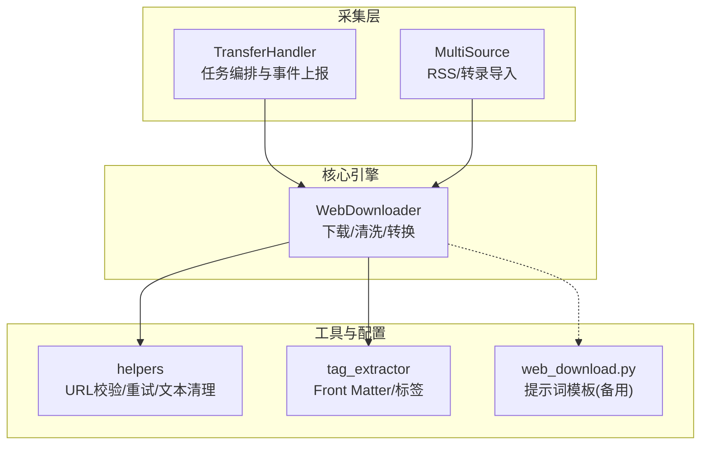
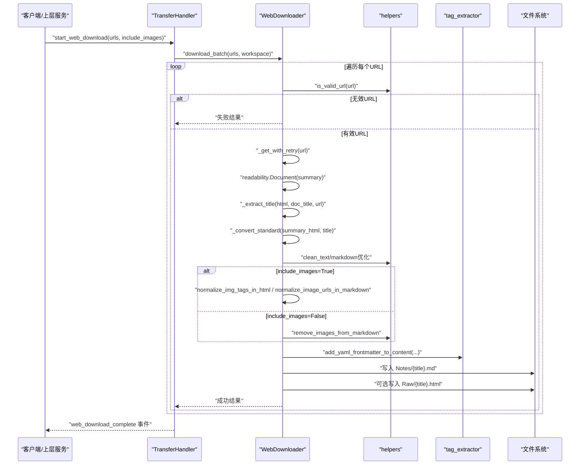
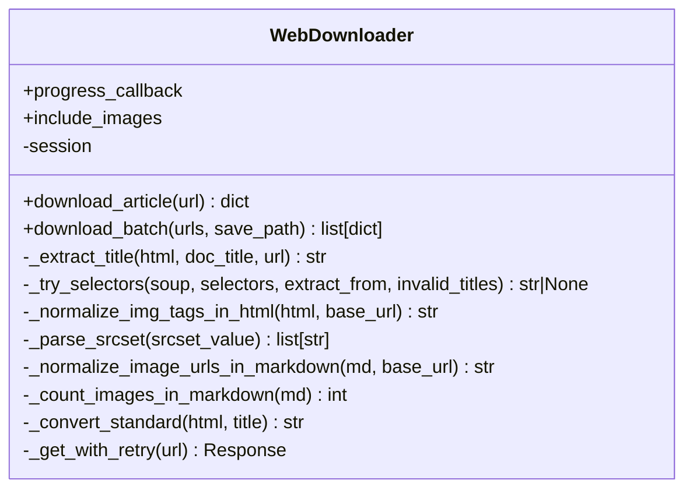
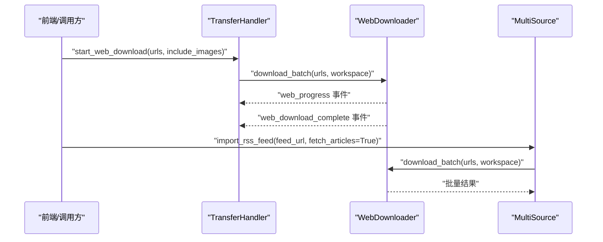
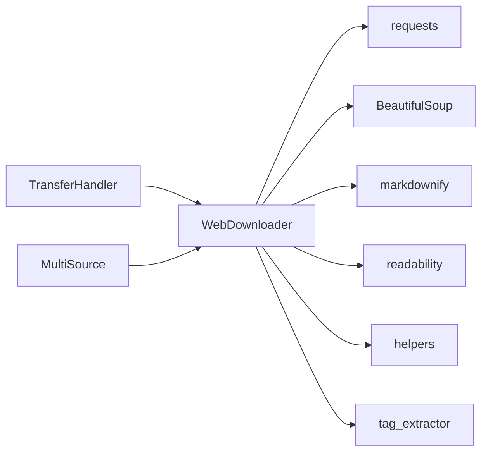

# 网页内容采集

<cite>
**本文引用的文件**   
- [modules/web_downloader.py](file://modules/web_downloader.py)
- [utils/helpers.py](file://utils/helpers.py)
- [utils/tag_extractor.py](file://utils/tag_extractor.py)
- [prompts/web_download.py](file://prompts/web_download.py)
- [python/sidecar/handlers/transfer_handler.py](file://python/sidecar/handlers/transfer_handler.py)
- [python/sidecar/multi_source.py](file://python/sidecar/multi_source.py)
</cite>

## 目录
1. [简介](#简介)
2. [项目结构](#项目结构)
3. [核心组件](#核心组件)
4. [架构总览](#架构总览)
5. [详细组件分析](#详细组件分析)
6. [依赖关系分析](#依赖关系分析)
7. [性能与可扩展性](#性能与可扩展性)
8. [故障排查指南](#故障排查指南)
9. [结论](#结论)
10. [附录：使用示例与最佳实践](#附录使用示例与最佳实践)

## 简介
本章节面向 NoteAI 的“网页内容采集”能力，聚焦于批量 URL 转 Markdown 的核心实现。该功能支持微信公众号、知乎等主流网站的页面抓取与结构化清洗，输出可检索、可编辑的 Markdown 文档，并附带 YAML front matter（标题、标签、来源等元数据）。同时提供进度回调、错误重试、HTML 原始存档等工程化保障。

## 项目结构
围绕网页下载器，相关代码主要分布在以下模块：
- 核心下载与转换逻辑：modules/web_downloader.py
- 通用工具（URL 校验、文本清理、重试装饰器等）：utils/helpers.py
- 标签与 Front Matter 处理：utils/tag_extractor.py
- 提示词模板（备用参考）：prompts/web_download.py
- 侧车服务集成（任务调度、事件上报）：python/sidecar/handlers/transfer_handler.py
- 多源采集入口（RSS 拉取后调用下载器）：python/sidecar/multi_source.py

图表来源
- [python/sidecar/handlers/transfer_handler.py:74-120](file://python/sidecar/handlers/transfer_handler.py#L74-L120)
- [python/sidecar/multi_source.py:105-157](file://python/sidecar/multi_source.py#L105-L157)
- [modules/web_downloader.py:29-538](file://modules/web_downloader.py#L29-L538)
- [utils/helpers.py:235-277](file://utils/helpers.py#L235-L277)
- [utils/tag_extractor.py:458-491](file://utils/tag_extractor.py#L458-L491)
- [prompts/web_download.py:1-16](file://prompts/web_download.py#L1-L16)

章节来源
- [modules/web_downloader.py:29-538](file://modules/web_downloader.py#L29-L538)
- [utils/helpers.py:235-277](file://utils/helpers.py#L235-L277)
- [utils/tag_extractor.py:458-491](file://utils/tag_extractor.py#L458-L491)
- [python/sidecar/handlers/transfer_handler.py:74-120](file://python/sidecar/handlers/transfer_handler.py#L74-L120)
- [python/sidecar/multi_source.py:105-157](file://python/sidecar/multi_source.py#L105-L157)
- [prompts/web_download.py:1-16](file://prompts/web_download.py#L1-L16)

## 核心组件
- WebDownloader：封装单篇与批量下载流程，包含标题提取、HTML 正文抽取、Markdown 转换、图片处理、前后置清洗、保存与归档。
- helpers：提供 URL 合法性校验（含 SSRF 防护）、文本清理、图片移除、重试装饰器等基础能力。
- tag_extractor：负责为生成的 Markdown 添加 YAML front matter，并从文件名智能提取标签，最终汇总生成 tags.md。
- transfer_handler：在侧车服务中暴露“开始网页下载”接口，管理任务生命周期与进度事件。
- multi_source：RSS 订阅导入时，自动解析条目链接并调用 WebDownloader 进行批量抓取。

章节来源
- [modules/web_downloader.py:29-538](file://modules/web_downloader.py#L29-L538)
- [utils/helpers.py:235-277](file://utils/helpers.py#L235-L277)
- [utils/tag_extractor.py:458-491](file://utils/tag_extractor.py#L458-L491)
- [python/sidecar/handlers/transfer_handler.py:74-120](file://python/sidecar/handlers/transfer_handler.py#L74-L120)
- [python/sidecar/multi_source.py:105-157](file://python/sidecar/multi_source.py#L105-L157)

## 架构总览
下图展示了从外部请求到最终落盘的完整链路，包括网络访问、内容清洗、Markdown 转换、元数据注入与持久化。

图表来源
- [python/sidecar/handlers/transfer_handler.py:74-120](file://python/sidecar/handlers/transfer_handler.py#L74-L120)
- [modules/web_downloader.py:356-425](file://modules/web_downloader.py#L356-L425)
- [modules/web_downloader.py:446-533](file://modules/web_downloader.py#L446-L533)
- [utils/helpers.py:235-277](file://utils/helpers.py#L235-L277)
- [utils/tag_extractor.py:458-491](file://utils/tag_extractor.py#L458-L491)

## 详细组件分析

### WebDownloader 类
职责与流程
- 初始化会话与请求头，支持是否保留图片链接。
- 单篇下载：URL 校验 -> 带重试的请求 -> 正文抽取 -> 标题提取 -> Markdown 转换 -> 文本清洗 -> 图片处理 -> 写入文件与可选 HTML 存档。
- 批量下载：循环调用单篇下载，插入进度回调，统一保存与统计，最后更新全局 tags.md。

关键方法说明
- _extract_title：多策略标题提取，覆盖 meta、平台特定选择器（微信、知乎、小红书等）、DOM 层级回退与 URL 路径兜底。
- _normalize_img_tags_in_html：规范化懒加载属性与相对路径，统一转为绝对 URL，便于后续转换与渲染。
- _normalize_image_urls_in_markdown：将 Markdown 中的相对图片路径转换为绝对 URL。
- download_article：单篇文章主流程，包含异常捕获与日志记录。
- _convert_standard：基于 markdownify 的标准转换，确保存在一级标题。
- _get_with_retry：带指数退避的重试 GET 请求。
- download_batch：批量处理、进度回调、保存 Front Matter、写入 Notes/Raw 目录、更新 tags.md。

适配策略
- 微信公众号：通过一组针对微信文章的结构选择器与 meta 字段组合，提升标题与正文识别率。
- 知乎：优先匹配知乎特有选择器与 itemprop 字段，增强结构化信息获取。
- 通用网页：以 readability 摘要 + markdownify 为标准路径，辅以多级标题回退与 URL 路径兜底。

质量保障机制
- 广告与导航去除：readability 摘要过滤无关区域；clean_text 清理乱码与多余空白；必要时移除图片。
- 正文识别算法：readability 摘要为主，结合多策略标题提取与 DOM 回退。
- 图片处理：懒加载属性归一化、srcset 解析、相对路径转绝对路径、按需移除或保留链接。

错误处理与降级
- 网络异常：_get_with_retry 使用装饰器实现最大重试次数与延迟等待。
- 处理异常：download_article 捕获请求与处理异常，返回结构化错误信息。
- 保存异常：保存失败不影响整体批次，仅记录错误并继续。

图表来源
- [modules/web_downloader.py:29-538](file://modules/web_downloader.py#L29-L538)

章节来源
- [modules/web_downloader.py:45-175](file://modules/web_downloader.py#L45-L175)
- [modules/web_downloader.py:203-314](file://modules/web_downloader.py#L203-L314)
- [modules/web_downloader.py:356-425](file://modules/web_downloader.py#L356-L425)
- [modules/web_downloader.py:441-444](file://modules/web_downloader.py#L441-L444)
- [modules/web_downloader.py:446-533](file://modules/web_downloader.py#L446-L533)

### 工具与辅助模块
- helpers.is_valid_url：URL 格式校验与 SSRF 防护，阻止私有 IP、回环地址等不安全目标。
- helpers.clean_text：清理不可见字符、合并多余空白、规范换行。
- helpers.remove_images_from_markdown：按正则移除 Markdown 中的图片语法与引用块。
- helpers.retry_on_failure：通用重试装饰器，支持最大重试次数与递增延迟。
- tag_extractor.add_yaml_frontmatter_to_content：为 Markdown 内容注入标准 front matter（title/tags/date/source）。
- tag_extractor.save_tags_md：扫描工作区，汇总所有文件的 tags 并生成 wiki/tags.md。

章节来源
- [utils/helpers.py:235-277](file://utils/helpers.py#L235-L277)
- [utils/helpers.py:26-38](file://utils/helpers.py#L26-L38)
- [utils/helpers.py:41-48](file://utils/helpers.py#L41-L48)
- [utils/helpers.py:331-353](file://utils/helpers.py#L331-L353)
- [utils/tag_extractor.py:458-491](file://utils/tag_extractor.py#L458-L491)
- [utils/tag_extractor.py:583-661](file://utils/tag_extractor.py#L583-L661)

### 侧车服务集成
- TransferHandler._start_web_download：接收前端参数，启动异步任务，设置进度回调与 include_images 标志，调用 WebDownloader.download_batch。
- TransferHandler._do_web_download：执行下载，发送 web-progress 与完成事件，异常时发送错误事件。
- MultiSource.import_rss_feed：解析 RSS/Atom 条目，若开启 fetch_articles，则构造 URL 列表并调用 WebDownloader 批量抓取。

图表来源
- [python/sidecar/handlers/transfer_handler.py:74-120](file://python/sidecar/handlers/transfer_handler.py#L74-L120)
- [python/sidecar/multi_source.py:105-157](file://python/sidecar/multi_source.py#L105-L157)
- [modules/web_downloader.py:446-533](file://modules/web_downloader.py#L446-L533)

章节来源
- [python/sidecar/handlers/transfer_handler.py:74-120](file://python/sidecar/handlers/transfer_handler.py#L74-L120)
- [python/sidecar/multi_source.py:105-157](file://python/sidecar/multi_source.py#L105-L157)

## 依赖关系分析
- WebDownloader 依赖 requests、BeautifulSoup、markdownify、readability 进行网络访问、HTML 解析、Markdown 转换与正文抽取。
- 与 utils.helpers 紧密耦合：URL 校验、文本清理、图片移除、重试装饰器。
- 与 utils.tag_extractor 协作：生成 front matter、提取标签、汇总 tags.md。
- 与 sidecar 集成：TransferHandler 作为 API 入口，MultiSource 作为多源采集入口。

图表来源
- [modules/web_downloader.py:1-27](file://modules/web_downloader.py#L1-L27)
- [python/sidecar/handlers/transfer_handler.py:74-120](file://python/sidecar/handlers/transfer_handler.py#L74-L120)
- [python/sidecar/multi_source.py:105-157](file://python/sidecar/multi_source.py#L105-L157)

章节来源
- [modules/web_downloader.py:1-27](file://modules/web_downloader.py#L1-L27)
- [python/sidecar/handlers/transfer_handler.py:74-120](file://python/sidecar/handlers/transfer_handler.py#L74-L120)
- [python/sidecar/multi_source.py:105-157](file://python/sidecar/multi_source.py#L105-L157)

## 性能与可扩展性
- 并发与限流：当前批量下载采用串行循环并在每篇之间 sleep(1)，避免对目标站点造成压力。如需提升吞吐，可在外层引入线程池或协程，并结合速率限制与队列控制。
- 图片处理开销：当 include_images=True 时，HTML 预处理与 Markdown 图片 URL 规范化会增加 CPU 与 I/O 成本。建议默认关闭，仅在需要外链展示时启用。
- 重试策略：_get_with_retry 使用固定最大重试次数与线性递增延迟，可根据目标站点稳定性调整 max_retries 与 delay。
- 可扩展点：
  - 新增网站适配：在 _extract_title 的选择器集合中添加对应平台的 meta 或 DOM 选择器。
  - 自定义清洗规则：在 clean_text 与 remove_images_from_markdown 基础上扩展正则或规则集。
  - LLM 辅助：提示词模板位于 prompts/web_download.py，可作为未来接入 LLM 进行二次优化的入口（当前未在主流程中使用）。

[本节为通用指导，不直接分析具体文件]

## 故障排查指南
常见问题与定位要点
- 网络异常：检查 _get_with_retry 的重试次数与延迟，确认目标站点可达性与反爬策略。
- 标题缺失：查看 _extract_title 的多策略回退链，确认是否存在平台特定的 meta 或选择器缺失。
- 正文为空：readability 摘要可能因页面结构复杂而失效，可考虑增加平台专用解析器或启用 LLM 辅助。
- 图片丢失：确认 include_images 开关与图片 URL 规范化逻辑，检查 srcset 与懒加载属性是否正确处理。
- 保存失败：检查 Notes/Raw 目录权限与磁盘空间，关注保存异常日志。
- 进度无响应：确认 progress_callback 已正确绑定，且事件上报未被拦截。

章节来源
- [modules/web_downloader.py:356-425](file://modules/web_downloader.py#L356-L425)
- [modules/web_downloader.py:441-444](file://modules/web_downloader.py#L441-L444)
- [python/sidecar/handlers/transfer_handler.py:74-120](file://python/sidecar/handlers/transfer_handler.py#L74-L120)

## 结论
NoteAI 的网页内容采集模块以 WebDownloader 为核心，结合 readability 与 markdownify 实现了跨站点的标准化抓取与转换流程。通过多策略标题提取、图片 URL 规范化、front matter 注入与 tags.md 汇总，形成了完整的“URL → Markdown”流水线。侧车服务提供了任务编排与事件上报能力，RSS 多源采集进一步扩展了输入渠道。整体架构清晰、容错完善，具备良好的可扩展性与工程可用性。

[本节为总结性内容，不直接分析具体文件]

## 附录：使用示例与最佳实践

- 批量导入 URL 列表
  - 通过 TransferHandler 的 start_web_download 接口传入 urls 数组与 include_images 选项，系统会创建 Notes 目录并按标题命名 .md 文件，同时将原始 HTML 保存到 Raw 目录。
  - 参考路径：[python/sidecar/handlers/transfer_handler.py:74-120](file://python/sidecar/handlers/transfer_handler.py#L74-L120)

- 配置自定义网站规则
  - 在 WebDownloader._extract_title 中选择器集合中追加目标站点的 meta 或 DOM 选择器，以提升标题与正文识别准确率。
  - 参考路径：[modules/web_downloader.py:45-175](file://modules/web_downloader.py#L45-L175)

- 处理动态加载内容
  - 当前实现基于静态 HTML 抓取与 readability 摘要。对于强动态页面，建议在外部先通过浏览器自动化（如 Playwright/Selenium）渲染后，再传入下载器或直接提供渲染后的 HTML。
  - 参考路径：[modules/web_downloader.py:356-425](file://modules/web_downloader.py#L356-L425)

- 错误处理策略
  - 网络异常重试：_get_with_retry 使用 retry_on_failure 装饰器，默认最多重试 3 次，间隔递增。
  - 内容提取失败降级：readability 摘要失败时，仍可通过标题回退与 URL 路径兜底生成基本内容。
  - 进度跟踪与状态报告：download_batch 内调用 progress_callback，TransferHandler 上报 web-progress 与完成事件。
  - 参考路径：
    - [utils/helpers.py:331-353](file://utils/helpers.py#L331-L353)
    - [modules/web_downloader.py:441-444](file://modules/web_downloader.py#L441-L444)
    - [python/sidecar/handlers/transfer_handler.py:74-120](file://python/sidecar/handlers/transfer_handler.py#L74-L120)

- 最佳实践
  - 默认 include_images=False，减少带宽与存储压力；仅在需要外链展示时开启。
  - 合理设置重试次数与延迟，避免对目标站点造成过大压力。
  - 定期运行 tags.md 汇总，保持知识库标签一致性。
  - 对高频站点建立专属选择器与清洗规则，提高转化率与内容质量。

章节来源
- [python/sidecar/handlers/transfer_handler.py:74-120](file://python/sidecar/handlers/transfer_handler.py#L74-L120)
- [modules/web_downloader.py:45-175](file://modules/web_downloader.py#L45-L175)
- [modules/web_downloader.py:356-425](file://modules/web_downloader.py#L356-L425)
- [utils/helpers.py:331-353](file://utils/helpers.py#L331-L353)