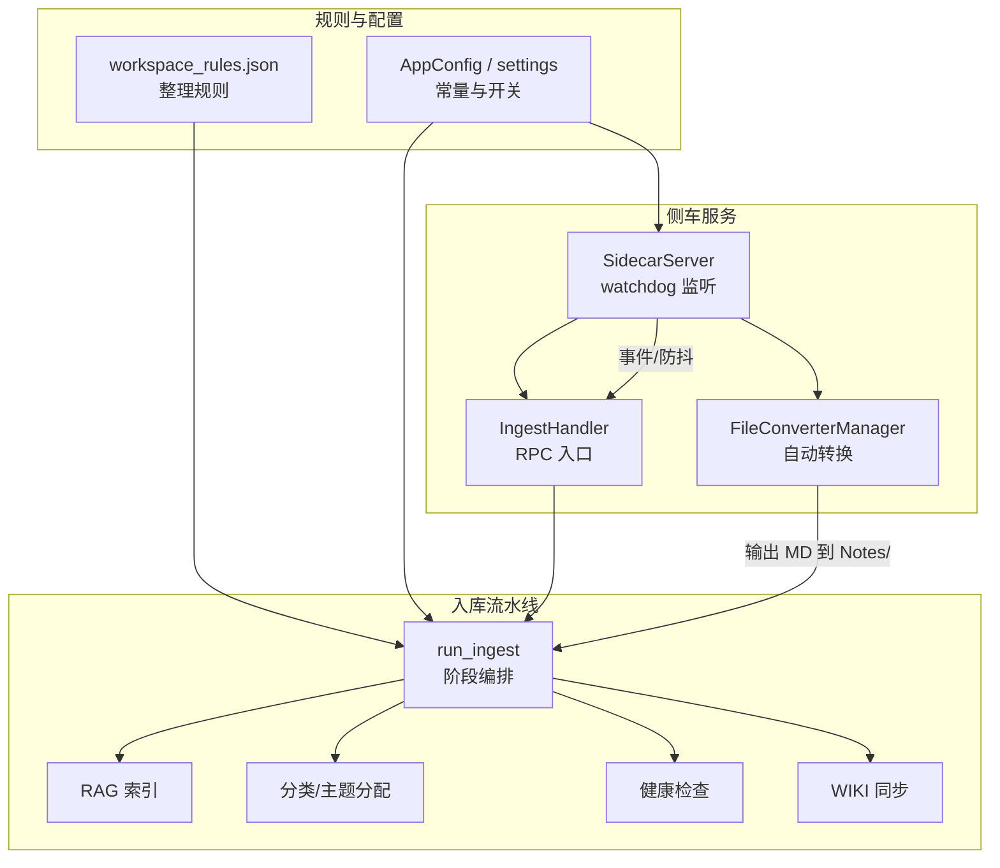
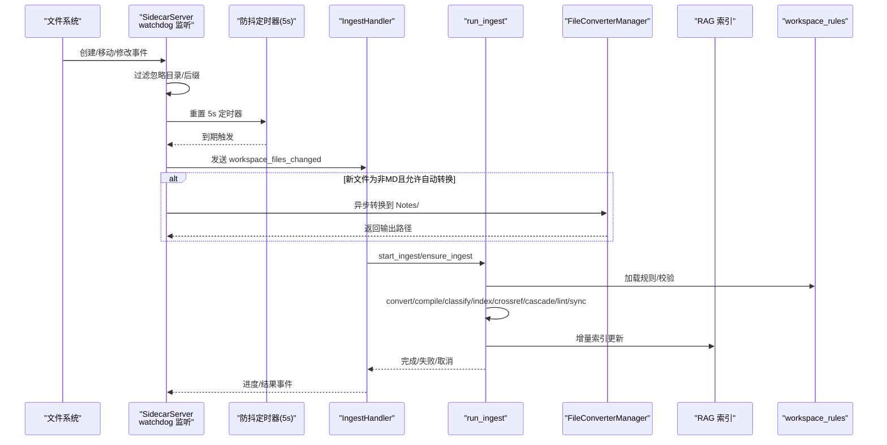
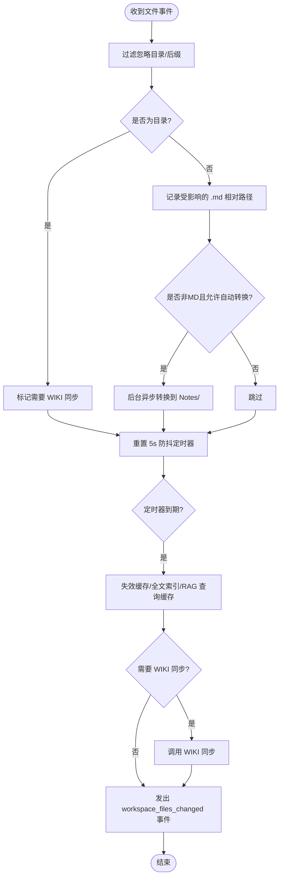
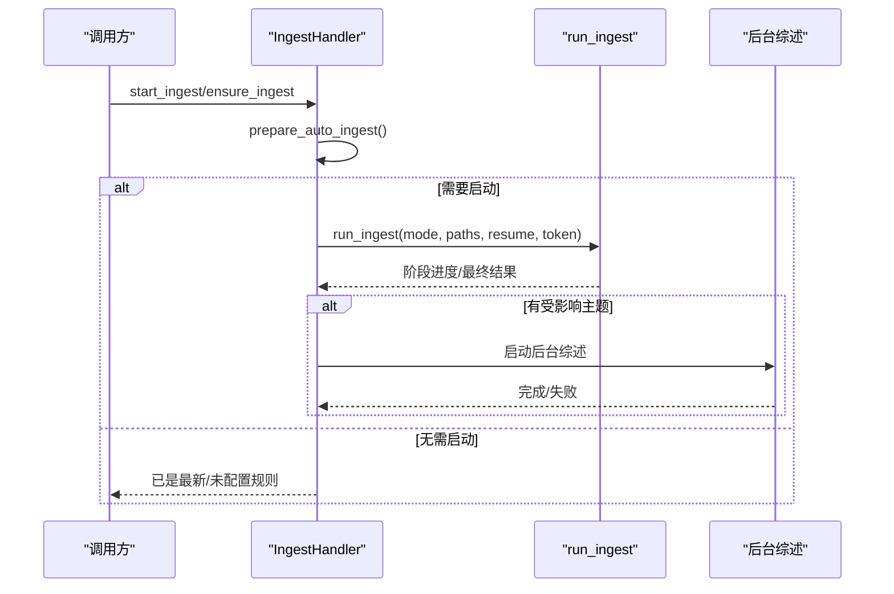
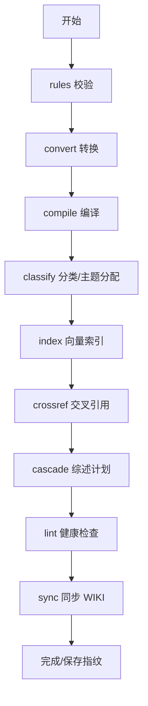
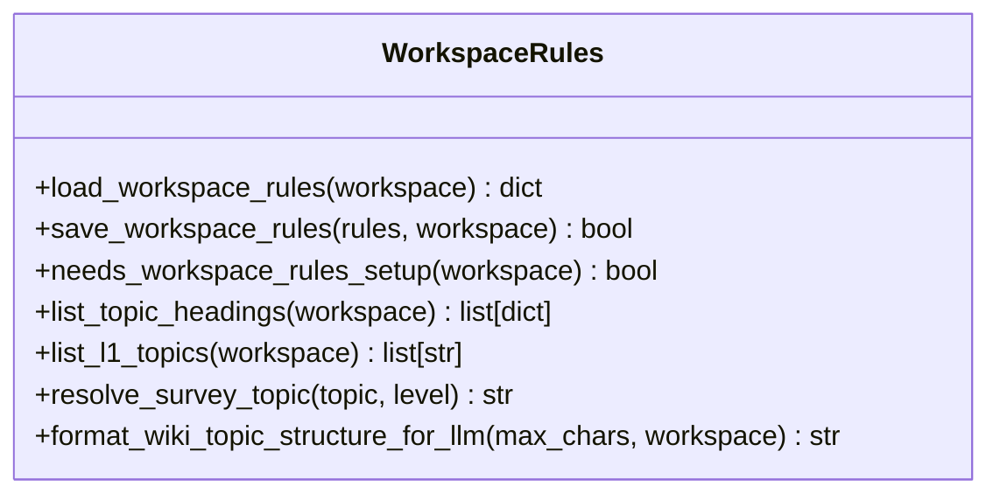
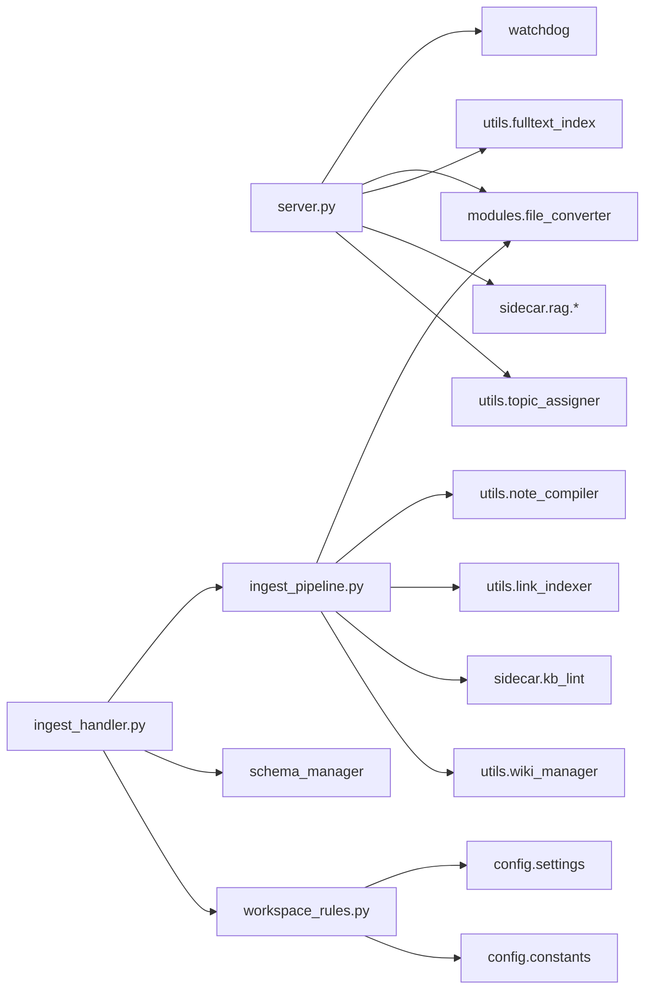

# 自动监控与同步

<cite>
**本文引用的文件**   
- [server.py](file://python/sidecar/server.py)
- [ingest_handler.py](file://python/sidecar/handlers/ingest_handler.py)
- [ingest_pipeline.py](file://python/sidecar/ingest_pipeline.py)
- [workspace_rules.py](file://python/sidecar/workspace_rules.py)
- [settings.py](file://config/settings.py)
- [app_config.py](file://config/app_config.py)
- [constants.py](file://config/constants.py)
- [file_converter.py](file://modules/file_converter.py)
</cite>

## 目录
1. [简介](#简介)
2. [项目结构](#项目结构)
3. [核心组件](#核心组件)
4. [架构总览](#架构总览)
5. [详细组件分析](#详细组件分析)
6. [依赖关系分析](#依赖关系分析)
7. [性能考虑](#性能考虑)
8. [故障排查指南](#故障排查指南)
9. [结论](#结论)
10. [附录：配置项与调优](#附录配置项与调优)

## 简介
本章节面向 NoteAI 的“自动监控与同步”能力，系统性说明工作区变更监听、防抖策略、IngestHandler 处理流程、工作区规则系统、Raw/Notes 同步机制、配置选项与性能优化。目标是帮助开发者与用户理解从“拖拽文件到工作区”到“后台转换、主题分配、索引更新”的完整链路。

## 项目结构
与自动监控与同步相关的核心代码分布在 sidecar 服务层、入库流水线与工作区规则模块中：
- 文件系统监听与事件分发：sidecar.server
- 入库任务编排与状态管理：sidecar.handlers.ingest_handler + sidecar.ingest_pipeline
- 工作区规则与主题层级约束：sidecar.workspace_rules
- 常量与路径定义：config.settings, config.constants
- 文件转换：modules.file_converter

图表来源
- [server.py:298-539](file://python/sidecar/server.py#L298-L539)
- [ingest_handler.py:32-151](file://python/sidecar/handlers/ingest_handler.py#L32-L151)
- [ingest_pipeline.py:480-947](file://python/sidecar/ingest_pipeline.py#L480-L947)
- [workspace_rules.py:15-96](file://python/sidecar/workspace_rules.py#L15-L96)
- [settings.py:1-41](file://config/settings.py#L1-L41)

章节来源
- [server.py:298-539](file://python/sidecar/server.py#L298-L539)
- [ingest_handler.py:32-151](file://python/sidecar/handlers/ingest_handler.py#L32-L151)
- [ingest_pipeline.py:480-947](file://python/sidecar/ingest_pipeline.py#L480-L947)
- [workspace_rules.py:15-96](file://python/sidecar/workspace_rules.py#L15-L96)
- [settings.py:1-41](file://config/settings.py#L1-L41)

## 核心组件
- SidecarServer（文件监听与事件派发）
  - 基于 watchdog 的工作区递归监听，过滤隐藏目录、wiki 目录与非关注后缀；对创建/移动/删除/修改事件进行去重与合并。
  - 实现 5 秒防抖，批量触发 workspace_files_changed 事件，并可选同步 WIKI.md。
  - 自动将非 Markdown 文件转换为 Markdown，输出到 Notes/，原始文件保留在 Raw/。
- IngestHandler（入库 RPC 入口）
  - 提供启动/取消/重试/状态查询等接口；内部调度 run_ingest 执行多阶段流水线。
  - 支持增量/全量模式、断点续跑、后台综述计划。
- ingest_pipeline（流水线编排）
  - 阶段：rules → convert → compile → classify → index → crossref → cascade → lint → sync。
  - 使用指纹与 mtime/size 快速判断是否需要扫描；保存运行状态以支持中断恢复。
- workspace_rules（工作区规则）
  - 读取/写入 .noteai/workspace_rules.json，提供主题深度限制、是否自动更新综述、综述级别等。
  - 提供 Notes/ 目录主题树构建与 LLM 提示的结构摘要。

章节来源
- [server.py:298-539](file://python/sidecar/server.py#L298-L539)
- [ingest_handler.py:32-151](file://python/sidecar/handlers/ingest_handler.py#L32-L151)
- [ingest_pipeline.py:480-947](file://python/sidecar/ingest_pipeline.py#L480-L947)
- [workspace_rules.py:15-96](file://python/sidecar/workspace_rules.py#L15-L96)

## 架构总览
下图展示从“文件进入工作区”到“入库完成”的整体时序。

图表来源
- [server.py:298-539](file://python/sidecar/server.py#L298-L539)
- [ingest_handler.py:132-215](file://python/sidecar/handlers/ingest_handler.py#L132-L215)
- [ingest_pipeline.py:480-947](file://python/sidecar/ingest_pipeline.py#L480-L947)
- [workspace_rules.py:15-96](file://python/sidecar/workspace_rules.py#L15-L96)
- [file_converter.py](file://modules/file_converter.py)

## 详细组件分析

### 工作区变更监听与防抖
- 监听范围
  - 递归监听工作区根目录，忽略隐藏目录、wiki 目录以及 IGNORED_DIRS 中的别名。
  - 仅关注 .md/.txt/.pdf/.docx/.pptx/.html/.doc/.ppt 等后缀的文件变化。
- 事件处理
  - 对 created/moved/deleted/modified 进行分类处理；目录级变动用于触发后续逻辑。
  - 当工作区发生影响 Notes/ 的变动时，标记需要重新同步 WIKI.md。
- 防抖策略
  - 每次收到相关事件后重置 5 秒定时器；若期间有新事件则覆盖旧定时器，避免频繁触发。
  - 到期后统一失效缓存、清理变更集合，并发出 workspace_files_changed 事件，附带受影响文件相对路径列表。
- 自动转换
  - 对新出现的非 Markdown 文件，在后台线程调用 FileConverterManager 进行转换，输出到 Notes/，原始文件保留在 Raw/。
  - 转换完成后通过事件通知前端，便于 UI 刷新。

图表来源
- [server.py:376-539](file://python/sidecar/server.py#L376-L539)

章节来源
- [server.py:298-539](file://python/sidecar/server.py#L298-L539)

### IngestHandler 处理流程
- 入口方法
  - ensure_running/_ensure_ingest：根据当前工作区与状态决定是否需要启动入库；支持指定 file_paths 的增量处理。
  - _start_ingest/_cancel_ingest/_retry_ingest：显式控制流水线生命周期。
  - _get_ingest_status/_check_ingest_updates：查询状态与是否有待处理的更新。
- 执行路径
  - 内部通过 _do_ingest 调用 run_ingest(mode, file_paths, resume, cancel_token)。
  - 在流水线完成后，若有主题被改动，会安排后台综述任务（cascade）。
- 进度与事件
  - 通过 send_progress/send_event 回调推送阶段进度与最终结果；支持取消与错误上报。

图表来源
- [ingest_handler.py:50-151](file://python/sidecar/handlers/ingest_handler.py#L50-L151)
- [ingest_handler.py:152-304](file://python/sidecar/handlers/ingest_handler.py#L152-L304)
- [ingest_pipeline.py:480-947](file://python/sidecar/ingest_pipeline.py#L480-L947)

章节来源
- [ingest_handler.py:32-304](file://python/sidecar/handlers/ingest_handler.py#L32-L304)
- [ingest_pipeline.py:480-947](file://python/sidecar/ingest_pipeline.py#L480-L947)

### 入库流水线（run_ingest）阶段详解
- rules：检查工作区规则是否已配置，未配置则中止并提示。
- convert：扫描可转换文件，批量转换到 Notes/，原始文件放入 Raw/。
- compile：对转换或导入的笔记进行编译与改写。
- classify：对 Inbox/孤儿文件进行主题自动分配，必要时标记待确认。
- index：增量索引 Notes/ 下的 Markdown，包含分块、向量化与替换更新。
- crossref：为新增/改动的文件建立交叉引用（小批量时使用 LLM）。
- cascade：收集受影响的主题，按规则生成综述计划（实际生成在后台）。
- lint：知识库健康检查（断链、孤儿页、过时综述等）。
- sync：同步 WIKI.md。

图表来源
- [ingest_pipeline.py:480-947](file://python/sidecar/ingest_pipeline.py#L480-L947)

章节来源
- [ingest_pipeline.py:480-947](file://python/sidecar/ingest_pipeline.py#L480-L947)

### 工作区规则系统（workspace_rules.py）
- 存储位置
  - .noteai/workspace_rules.json，位于工作区应用数据目录下。
- 关键字段
  - max_topic_depth：最大主题层级（默认 3）。
  - auto_update_survey：是否自动更新综述（默认 True）。
  - survey_at_level：综述所在层级（默认 2）。
  - ai_may_edit_wiki/ai_may_edit_notes：AI 编辑权限控制。
  - configured：是否已完成初始化设置。
- 功能要点
  - 从旧的 schema.md 迁移一次到 JSON 格式。
  - 提供 Notes/ 目录主题树构建与 LLM 使用的结构摘要。
  - 提供 resolve_survey_topic 将具体主题映射到综述目标层级。
- 安全与约束
  - 保存时对深度与级别做边界裁剪，确保不会越界。
  - 提供 list_l1_topics 与 list_topic_headings 作为权威主题来源。

图表来源
- [workspace_rules.py:15-200](file://python/sidecar/workspace_rules.py#L15-L200)

章节来源
- [workspace_rules.py:15-200](file://python/sidecar/workspace_rules.py#L15-L200)

### 同步机制：Raw/ 中转站与 Notes/ 终态
- Raw/ 目录
  - 作为原始文件的落盘位置，由转换流程产出，供审计与回溯。
- Notes/ 目录
  - 作为最终归档与索引的目标目录，所有 Markdown 文件在此参与分类、索引与综述。
- 增量同步策略
  - 使用工作区指纹（mtime+size）快速判断是否需要扫描。
  - 仅在 Notes/ 下对变动的 Markdown 进行索引更新，删除的文件会从索引中清理。
  - 入库完成后保存指纹，下次启动可快速跳过。

章节来源
- [ingest_pipeline.py:65-105](file://python/sidecar/ingest_pipeline.py#L65-L105)
- [ingest_pipeline.py:277-347](file://python/sidecar/ingest_pipeline.py#L277-L347)
- [ingest_pipeline.py:350-477](file://python/sidecar/ingest_pipeline.py#L350-L477)
- [ingest_pipeline.py:896-947](file://python/sidecar/ingest_pipeline.py#L896-L947)

### 实际工作流程示例
- 场景：将 PDF 拖入工作区
  1. watchdog 捕获创建事件，过滤通过后进入防抖队列。
  2. 5 秒后触发，检测到非 Markdown 文件，后台异步调用转换器。
  3. 转换器将 PDF 转为 Markdown，输出到 Notes/，原始 PDF 保存到 Raw/。
  4. 触发入库流水线（增量），依次执行 convert/compile/classify/index/crossref/cascade/lint/sync。
  5. 完成后保存指纹，UI 收到 workspace_files_changed 与入库完成事件。

章节来源
- [server.py:440-511](file://python/sidecar/server.py#L440-L511)
- [ingest_pipeline.py:627-654](file://python/sidecar/ingest_pipeline.py#L627-L654)
- [ingest_pipeline.py:896-947](file://python/sidecar/ingest_pipeline.py#L896-L947)

## 依赖关系分析
- 外部依赖
  - watchdog：文件系统事件监听。
- 内部依赖
  - server.py 依赖 modules.file_converter、utils.fulltext_index、sidecar.rag.*、utils.topic_assigner 等。
  - ingest_handler.py 依赖 ingest_pipeline、schema_manager、workspace_rules。
  - ingest_pipeline.py 依赖 modules.file_converter、utils.note_compiler、utils.link_indexer、sidecar.rag.*、sidecar.kb_lint、utils.wiki_manager。
  - workspace_rules.py 依赖 config.settings、config.constants、utils.topic_manager。

图表来源
- [server.py:1-125](file://python/sidecar/server.py#L1-L125)
- [ingest_handler.py:1-49](file://python/sidecar/handlers/ingest_handler.py#L1-L49)
- [ingest_pipeline.py:1-22](file://python/sidecar/ingest_pipeline.py#L1-L22)
- [workspace_rules.py:1-12](file://python/sidecar/workspace_rules.py#L1-L12)

章节来源
- [server.py:1-125](file://python/sidecar/server.py#L1-L125)
- [ingest_handler.py:1-49](file://python/sidecar/handlers/ingest_handler.py#L1-L49)
- [ingest_pipeline.py:1-22](file://python/sidecar/ingest_pipeline.py#L1-L22)
- [workspace_rules.py:1-12](file://python/sidecar/workspace_rules.py#L1-L12)

## 性能考虑
- 异步处理
  - 文件自动转换与入库任务均在后台线程执行，避免阻塞主循环。
- 内存管理
  - 使用 TTLCache 缓存 RPC 与检索结果，降低重复计算。
  - 索引阶段采用分批准备与原子替换，减少锁竞争与中间态。
- 错误恢复
  - 运行状态持久化，支持 interrupted/failed 后的续跑；取消通过 generation 号隔离，避免竞态。
- 快速路径
  - 工作区指纹与 mtime/size 比较，避免全量扫描；仅在必要时触发 heavy checks。
- 索引完整性修复
  - 当 manifest 与实际 chunk 数量不一致时，自动修复全部笔记索引。

章节来源
- [server.py:75-76](file://python/sidecar/server.py#L75-L76)
- [ingest_pipeline.py:107-145](file://python/sidecar/ingest_pipeline.py#L107-L145)
- [ingest_pipeline.py:167-178](file://python/sidecar/ingest_pipeline.py#L167-L178)
- [ingest_pipeline.py:386-403](file://python/sidecar/ingest_pipeline.py#L386-L403)

## 故障排查指南
- 常见问题
  - 未设置工作区：ensure_running 直接返回未设置提示。
  - 工作区规则未配置：流水线在 rules 阶段中止，需先完成规则设置。
  - 索引不可用：RAG 索引被其他实例占用或损坏，需关闭其他实例或重建索引。
  - 取消/失败：查看状态接口获取 status/message/stats，支持重试。
- 定位步骤
  - 检查日志中的 [watcher]/[ingest] 前缀信息。
  - 查看 ingest_state.json 的阶段与统计信息。
  - 确认 Raw/ 与 Notes/ 目录结构与权限。
  - 验证 workspace_rules.json 的配置是否符合预期。

章节来源
- [ingest_handler.py:50-78](file://python/sidecar/handlers/ingest_handler.py#L50-L78)
- [ingest_pipeline.py:597-617](file://python/sidecar/ingest_pipeline.py#L597-L617)
- [ingest_pipeline.py:929-942](file://python/sidecar/ingest_pipeline.py#L929-L942)

## 结论
NoteAI 的自动监控与同步体系以 watchdog 为基础，结合 5 秒防抖与后台异步处理，实现了低延迟、高吞吐的文件入库与索引更新。IngestHandler 与 ingest_pipeline 提供了稳健的流水线编排与状态管理，workspace_rules 确保了主题层级与综述更新的规范性。整体设计兼顾了性能与可靠性，适合大规模知识管理工作区的日常运维。

## 附录：配置项与调优
- 监控间隔调整
  - 防抖时长固定为 5 秒，如需调整可在 SidecarServer 的定时器处修改。
- 忽略文件模式
  - 通过 IGNORED_DIRS 与 is_ignored_dir 控制忽略目录；watchdog 还会忽略隐藏目录与 wiki 目录。
- 转换队列设置
  - 自动转换在后台线程执行，可通过并发与队列参数扩展（当前为单线程逐个转换）。
- 开关项
  - ingest_auto_enabled：是否启用自动入库。
  - rag_enabled：是否启用 RAG 索引。
  - 这些开关来自 AppConfig/settings，影响启动自检与自动重建索引行为。

章节来源
- [server.py:447-458](file://python/sidecar/server.py#L447-L458)
- [server.py:253-254](file://python/sidecar/server.py#L253-L254)
- [settings.py:1-41](file://config/settings.py#L1-L41)
- [constants.py](file://config/constants.py)
- [app_config.py](file://config/app_config.py)