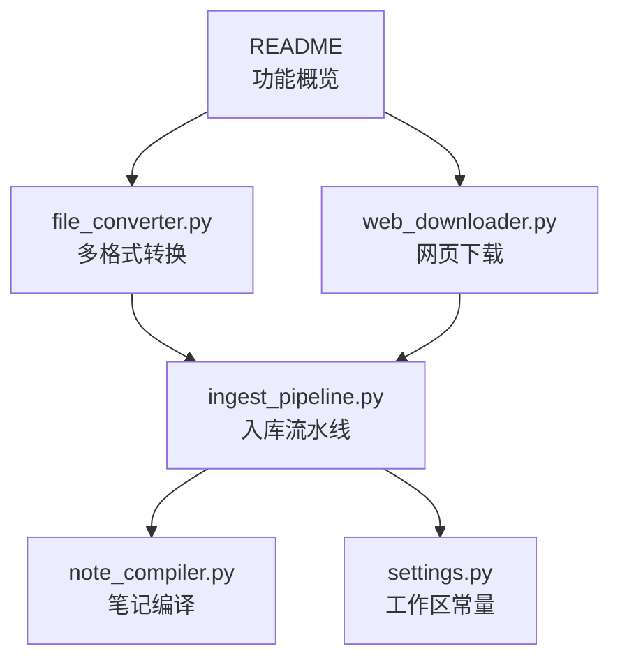
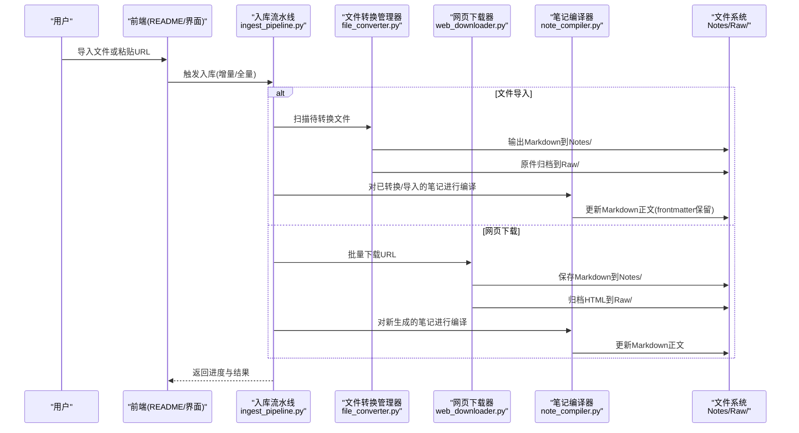
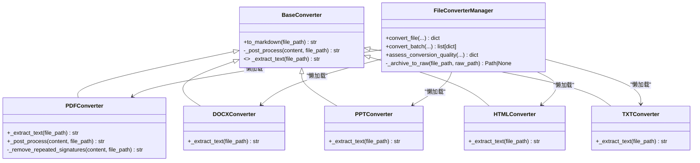
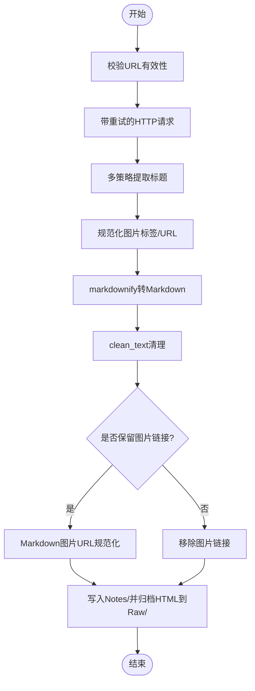
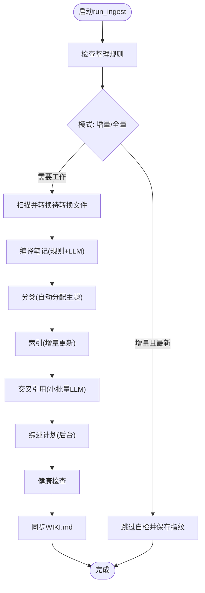
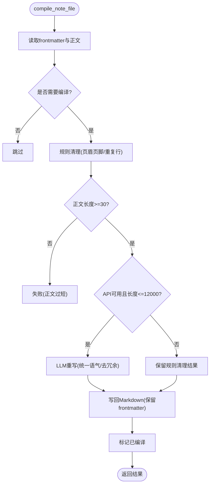
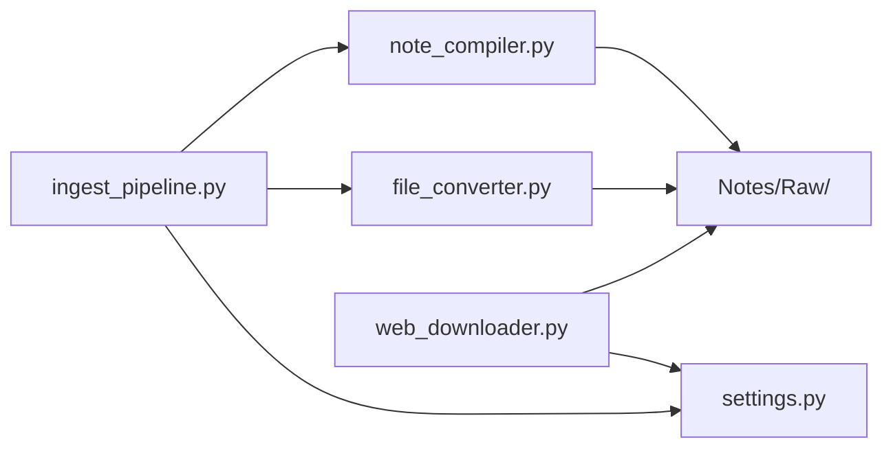

# 资料采集与转换

<cite>
**本文引用的文件**
- [README.md](file://README.md)
- [file_converter.py](file://modules/file_converter.py)
- [web_downloader.py](file://modules/web_downloader.py)
- [ingest_pipeline.py](file://python/sidecar/ingest_pipeline.py)
- [note_compiler.py](file://utils/note_compiler.py)
- [settings.py](file://config/settings.py)
</cite>

## 目录
1. [简介](#简介)
2. [项目结构](#项目结构)
3. [核心组件](#核心组件)
4. [架构总览](#架构总览)
5. [详细组件分析](#详细组件分析)
6. [依赖关系分析](#依赖关系分析)
7. [性能考量](#性能考量)
8. [故障排查指南](#故障排查指南)
9. [结论](#结论)
10. [附录：使用示例与最佳实践](#附录使用示例与最佳实践)

## 简介
本章节聚焦 NoteAI 的“资料采集与转换”能力，覆盖多格式文件自动转换、网页批量下载、工作区变更监听与后台异步处理、笔记编译（LLM 去页眉页脚、统一语气风格、生成可检索正文）以及导入文件的完整流程。目标是帮助读者快速理解从“原始资料”到“可检索 Markdown 笔记”的全链路机制，并掌握常见格式的处理差异与最佳实践。

## 项目结构
NoteAI 将采集与转换相关能力分布在以下模块：
- 前端入口与说明：README 中概述了采集与转换功能点与工作区布局
- 文件转换：modules/file_converter.py 提供 PDF/DOCX/PPTX/HTML/TXT 等格式的转换器与管理器
- 网页下载：modules/web_downloader.py 支持微信公众号、知乎等多平台 URL → Markdown
- 入库流水线：python/sidecar/ingest_pipeline.py 串联 convert → compile → classify → index → crossref → cascade → lint → sync
- 笔记编译：utils/note_compiler.py 负责规则清理与可选 LLM 重写
- 配置常量：config/settings.py 定义 NOTES_FOLDER、RAW_FOLDER 等工作区路径常量

图表来源
- [README.md:76-84](file://README.md#L76-L84)
- [file_converter.py:407-507](file://modules/file_converter.py#L407-L507)
- [web_downloader.py:29-44](file://modules/web_downloader.py#L29-L44)
- [ingest_pipeline.py:23-23](file://python/sidecar/ingest_pipeline.py#L23-L23)
- [note_compiler.py:1-17](file://utils/note_compiler.py#L1-L17)
- [settings.py:1-41](file://config/settings.py#L1-L41)

章节来源
- [README.md:76-84](file://README.md#L76-L84)
- [settings.py:1-41](file://config/settings.py#L1-L41)

## 核心组件
- 文件转换管理器：根据扩展名选择具体转换器，执行文本提取、质量评估、可选 LLM 重写、frontmatter 注入、主题分配、归档到 Raw/ 等
- 网页下载器：抓取 HTML、解析标题、转换为 Markdown、可选保留图片链接或移除图片、写入 Notes/ 并归档 HTML 到 Raw/
- 入库流水线：统一编排转换、编译、分类、索引、交叉引用、综述计划、健康检查、同步；支持增量/全量、断点续跑、取消与进度上报
- 笔记编译器：规则清理（页码、版权、重复行）、可选 LLM 重写（去除页眉页脚、统一语气风格），产出可检索正文

章节来源
- [file_converter.py:407-731](file://modules/file_converter.py#L407-L731)
- [web_downloader.py:356-533](file://modules/web_downloader.py#L356-L533)
- [ingest_pipeline.py:480-947](file://python/sidecar/ingest_pipeline.py#L480-L947)
- [note_compiler.py:43-210](file://utils/note_compiler.py#L43-L210)

## 架构总览
下图展示从“采集”到“入库”的整体数据流与关键组件交互。

图表来源
- [ingest_pipeline.py:480-947](file://python/sidecar/ingest_pipeline.py#L480-L947)
- [file_converter.py:569-731](file://modules/file_converter.py#L569-L731)
- [web_downloader.py:446-533](file://modules/web_downloader.py#L446-L533)
- [note_compiler.py:128-210](file://utils/note_compiler.py#L128-L210)

## 详细组件分析

### 文件转换组件（PDF/DOCX/PPTX/HTML/TXT）
- 设计模式：模板方法模式。BaseConverter 统一日志、异常、后处理（文本清洗、图片移除），子类仅实现 _extract_text
- 支持的格式与策略：
  - PDF：PyMuPDF 提取文本；针对重复签名/页眉/页脚做行级过滤
  - DOCX：mammoth 转 Markdown
  - PPTX：python-pptx 提取文本与表格为 Markdown
  - HTML：html2text 转 Markdown
  - TXT：按编码读取
  - 旧版 .doc/.ppt：通过系统工具或 OLE 解析回退方案
- 质量评估与 LLM 重写：在转换后评估内容质量，必要时调用 LLM 重写以提升可读性与可检索性
- 主题分配与归档：转换成功后尝试自动分配主题，并将原件归档到 Raw/，同时更新 frontmatter 中的 source 字段

图表来源
- [file_converter.py:27-69](file://modules/file_converter.py#L27-L69)
- [file_converter.py:72-158](file://modules/file_converter.py#L72-L158)
- [file_converter.py:168-181](file://modules/file_converter.py#L168-L181)
- [file_converter.py:254-286](file://modules/file_converter.py#L254-L286)
- [file_converter.py:390-405](file://modules/file_converter.py#L390-L405)
- [file_converter.py:407-507](file://modules/file_converter.py#L407-L507)
- [file_converter.py:569-731](file://modules/file_converter.py#L569-L731)

章节来源
- [file_converter.py:27-69](file://modules/file_converter.py#L27-L69)
- [file_converter.py:407-507](file://modules/file_converter.py#L407-L507)
- [file_converter.py:569-731](file://modules/file_converter.py#L569-L731)

### 网页下载组件（公众号/知乎等）
- 标题提取：多策略（meta、h1/h2、平台特定选择器）确保准确标题
- HTML 预处理：规范化懒加载图片属性、相对路径转绝对 URL
- 转换与清理：markdownify 转 Markdown，clean_text 清理，按需移除图片链接
- 持久化：写入 Notes/ 并归档 HTML 到 Raw/，添加 frontmatter（title/tags/source）

图表来源
- [web_downloader.py:45-175](file://modules/web_downloader.py#L45-L175)
- [web_downloader.py:203-347](file://modules/web_downloader.py#L203-L347)
- [web_downloader.py:356-425](file://modules/web_downloader.py#L356-L425)
- [web_downloader.py:446-533](file://modules/web_downloader.py#L446-L533)

章节来源
- [web_downloader.py:45-175](file://modules/web_downloader.py#L45-L175)
- [web_downloader.py:356-425](file://modules/web_downloader.py#L356-L425)
- [web_downloader.py:446-533](file://modules/web_downloader.py#L446-L533)

### 入库流水线（Ingest Pipeline）
- 阶段定义：rules → convert → compile → classify → index → crossref → cascade → lint → sync
- 增量/全量：基于工作区指纹（mtime+size）快速判断是否需要重新扫描；首次或中断后可全量
- 断点续跑：记录已完成阶段与统计信息，失败/中断后可恢复
- 取消与进度：全局取消事件与进度回调，支持长时间任务的可控终止
- 转换与归档：扫描非 Raw/ 下的可转换文件，批量转换并归档原件到 Raw/
- 编译：对转换/导入的笔记进行规则清理与可选 LLM 重写
- 索引与交叉引用：增量更新向量索引，仅在改动时重算；小批量启用 LLM 辅助发现双向链接
- 综述计划与健康检查：收集受影响主题，安排后台综述；运行健康检查并记录报告

图表来源
- [ingest_pipeline.py:23-23](file://python/sidecar/ingest_pipeline.py#L23-L23)
- [ingest_pipeline.py:480-947](file://python/sidecar/ingest_pipeline.py#L480-L947)

章节来源
- [ingest_pipeline.py:23-23](file://python/sidecar/ingest_pipeline.py#L23-L23)
- [ingest_pipeline.py:480-947](file://python/sidecar/ingest_pipeline.py#L480-L947)

### 笔记编译（Rule + LLM）
- 规则清理：去除页码、版权、重复分隔线、高频短行（典型页眉页脚）
- 长度阈值：正文过短直接拒绝编译
- LLM 重写：当 API 可用且内容长度受限时，调用提示词进行语气统一、去冗余、增强可检索性
- Frontmatter 保留：重写后保持元数据不变，标记编译状态

图表来源
- [note_compiler.py:43-80](file://utils/note_compiler.py#L43-L80)
- [note_compiler.py:128-210](file://utils/note_compiler.py#L128-L210)

章节来源
- [note_compiler.py:43-80](file://utils/note_compiler.py#L43-L80)
- [note_compiler.py:128-210](file://utils/note_compiler.py#L128-L210)

## 依赖关系分析
- 模块耦合
  - ingest_pipeline 依赖 file_converter 与 note_compiler，协调转换与编译
  - web_downloader 独立于转换器，但同样遵循 Notes/ 与 Raw/ 的工作区约定
  - 两者均通过 settings 常量定位 Notes/ 与 Raw/ 目录
- 外部依赖
  - PyMuPDF、mammoth、python-pptx、html2text、readability、markdownify、requests、BeautifulSoup 等
- 潜在循环依赖
  - 当前未见明显循环；各模块职责清晰，通过函数式接口与常量解耦

图表来源
- [ingest_pipeline.py:480-947](file://python/sidecar/ingest_pipeline.py#L480-L947)
- [file_converter.py:569-731](file://modules/file_converter.py#L569-L731)
- [web_downloader.py:446-533](file://modules/web_downloader.py#L446-L533)
- [settings.py:1-41](file://config/settings.py#L1-L41)

章节来源
- [ingest_pipeline.py:480-947](file://python/sidecar/ingest_pipeline.py#L480-L947)
- [file_converter.py:569-731](file://modules/file_converter.py#L569-L731)
- [web_downloader.py:446-533](file://modules/web_downloader.py#L446-L533)
- [settings.py:1-41](file://config/settings.py#L1-L41)

## 性能考量
- 防抖与增量：工作区变更采用 mtime+size 指纹快速判断，避免全量扫描；仅在必要时计算更重的内容检查
- 懒加载转换器：FileConverterManager 按需实例化具体转换器，减少初始开销
- 批量处理：convert_batch 与 download_batch 支持进度回调，便于前端反馈与中断控制
- 索引优化：仅对改动的 Markdown 文件重建分块与嵌入，删除不存在的文件以清理索引
- LLM 调用限制：对长文档与大批量场景采取跳过或降级策略，避免阻塞流水线

章节来源
- [ingest_pipeline.py:65-104](file://python/sidecar/ingest_pipeline.py#L65-L104)
- [file_converter.py:445-488](file://modules/file_converter.py#L445-L488)
- [ingest_pipeline.py:748-800](file://python/sidecar/ingest_pipeline.py#L748-L800)

## 故障排查指南
- 转换失败
  - 检查文件格式是否受支持；查看质量评估结果（如“正文过短”“疑似乱码”“扫描 PDF”）
  - 确认系统工具链（旧版 .doc/.ppt 依赖 textutil/antiword/catdoc）
- 网页下载失败
  - 网络超时或反爬导致请求失败；检查重试次数与 User-Agent 设置
  - 标题提取失败会回退到 h1/h2 或 URL 片段
- 编译失败
  - 正文过短会被拒绝；LLM 不可用或超长文档会跳过重写，仅保留规则清理结果
- 流水线中断
  - 检查 ingest_state.json 的状态与错误信息；支持“续跑”，上次未完成会自动标记为 interrupted

章节来源
- [file_converter.py:509-534](file://modules/file_converter.py#L509-L534)
- [file_converter.py:183-251](file://modules/file_converter.py#L183-L251)
- [web_downloader.py:356-425](file://modules/web_downloader.py#L356-L425)
- [note_compiler.py:158-194](file://utils/note_compiler.py#L158-L194)
- [ingest_pipeline.py:167-177](file://python/sidecar/ingest_pipeline.py#L167-L177)

## 结论
NoteAI 的资料采集与转换体系以“模块化 + 流水线”为核心：文件转换与网页下载作为输入源，入库流水线统一编排转换、编译、分类、索引、交叉引用、综述计划、健康检查与同步；配合工作区常量与增量指纹机制，实现高效、可恢复、可扩展的知识编译流程。

## 附录：使用示例与最佳实践
- 导入文件流程
  - 选择文件 → 复制到 Raw/（由转换流程归档）→ 后台立即转换 → 输出 Markdown 到 Notes/ → 可选 LLM 重写 → 自动分配主题
- 网页批量下载
  - 批量 URL → 下载文章 → 提取标题 → 转为 Markdown → 写入 Notes/ → 归档 HTML 到 Raw/
- 工作区变更监听与自动转换
  - 工作区变更后触发指纹对比（5s 防抖）→ 若检测到新增/修改的可转换文件 → 进入 convert 阶段
- 笔记编译
  - 规则清理（去页眉页脚、重复行）→ 可选 LLM 重写（统一语气风格、提升可检索性）→ 保留 frontmatter
- 常见格式差异与建议
  - PDF：优先保证文本层；扫描型 PDF 可能无法可靠提取正文
  - DOCX：结构化较好，适合直接转换
  - PPTX：注意表格与文本框顺序；复杂排版建议人工校对
  - HTML：不同站点结构差异大，标题提取策略需覆盖 meta/h1/h2 与平台选择器
  - TXT：注意编码探测；必要时手动指定编码
- 配置选项要点
  - 工作区路径与 Notes/Raw 目录由 settings 常量管理
  - 是否启用自动入库、RAG 索引、LLM 重写等可通过运行时配置控制

章节来源
- [README.md:76-84](file://README.md#L76-L84)
- [file_converter.py:569-731](file://modules/file_converter.py#L569-L731)
- [web_downloader.py:446-533](file://modules/web_downloader.py#L446-L533)
- [ingest_pipeline.py:202-267](file://python/sidecar/ingest_pipeline.py#L202-L267)
- [note_compiler.py:128-210](file://utils/note_compiler.py#L128-L210)
- [settings.py:1-41](file://config/settings.py#L1-L41)