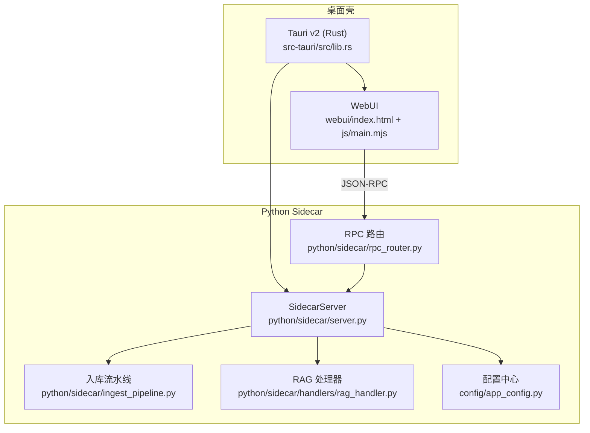
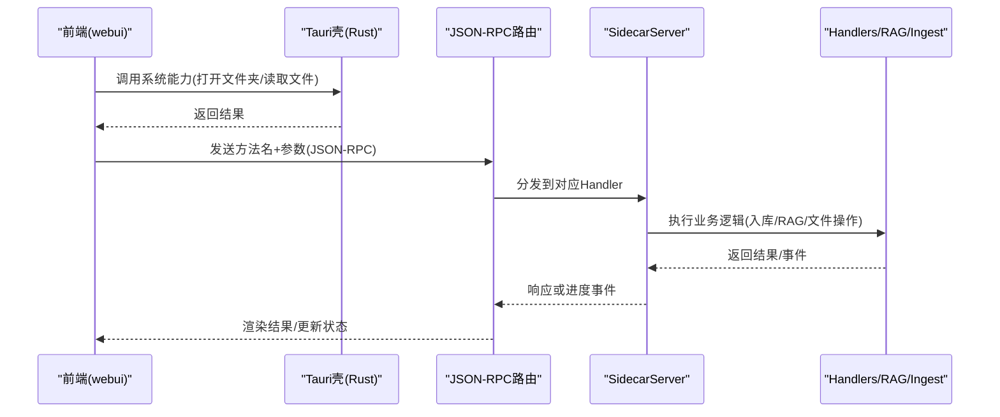
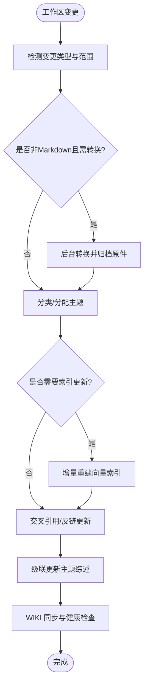
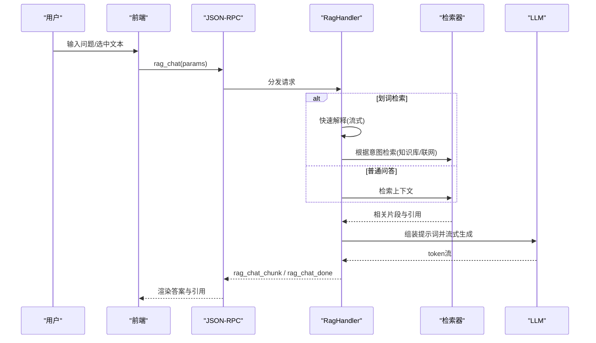
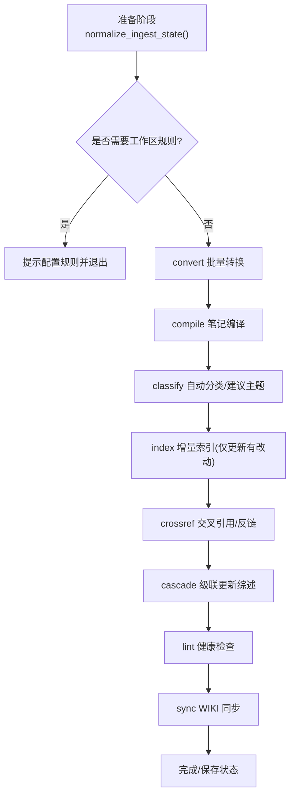
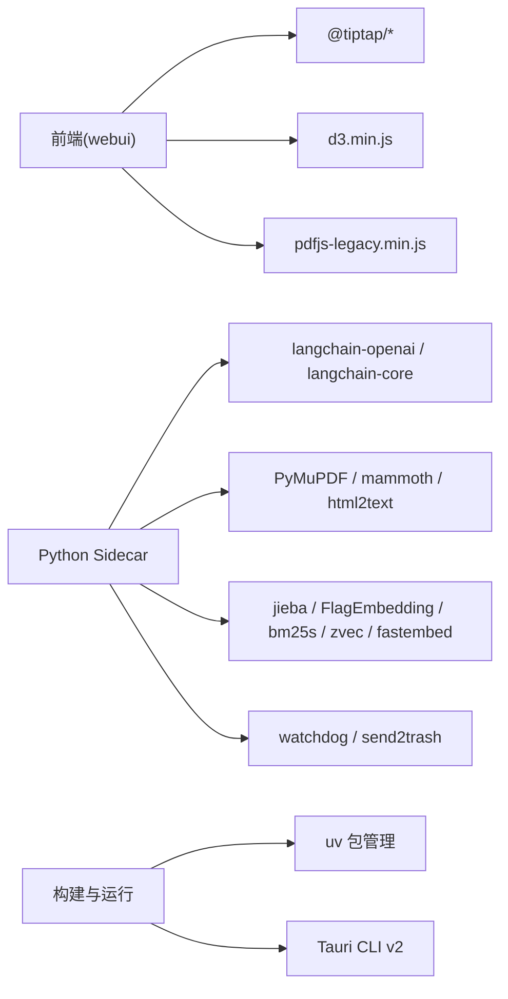

# 项目概述

<cite>
**本文引用的文件**   
- [README.md](file://README.md)
- [run.py](file://run.py)
- [pyproject.toml](file://pyproject.toml)
- [package.json](file://package.json)
- [src-tauri/Cargo.toml](file://src-tauri/Cargo.toml)
- [src-tauri/src/lib.rs](file://src-tauri/src/lib.rs)
- [python/sidecar/server.py](file://python/sidecar/server.py)
- [python/sidecar/rpc_router.py](file://python/sidecar/rpc_router.py)
- [python/sidecar/ingest_pipeline.py](file://python/sidecar/ingest_pipeline.py)
- [python/sidecar/handlers/rag_handler.py](file://python/sidecar/handlers/rag_handler.py)
- [config/app_config.py](file://config/app_config.py)
- [webui/index.html](file://webui/index.html)
- [webui/js/main.mjs](file://webui/js/main.mjs)
</cite>

## 目录
1. [简介](#简介)
2. [项目结构](#项目结构)
3. [核心组件](#核心组件)
4. [架构总览](#架构总览)
5. [详细组件分析](#详细组件分析)
6. [依赖关系分析](#依赖关系分析)
7. [性能与可用性](#性能与可用性)
8. [故障排查指南](#故障排查指南)
9. [结论](#结论)
10. [附录：快速开始](#附录快速开始)

## 简介
NoteAI 是一款 AI 原生的个人知识库桌面应用，围绕“采集 → 整理 → 研究 → 问答”的闭环，将零散资料编译为可检索、可演进的知识库。与传统笔记工具（如 Obsidian）相比，NoteAI 强调“知识编译”而非一次性 RAG；与纯对话式 AI 工具（如 Claude）相比，NoteAI 把对话证据沉淀回工作区，避免每次从零解释背景。

核心价值主张
- 本地优先：Tauri v2 + Python sidecar，数据留在本地工作区
- 持续增值：自动入库流水线将资料编译为结构化主题与综述
- 智能问答：RAG 助手基于你的笔记与综述回答，支持划词检索与联网补充
- 统一入口：四栏布局、待办中心、健康度指标，降低认知负担

目标用户
- 需要长期积累知识的个人研究者、工程师、写作者
- 希望用 AI 辅助整理、发现关联并即时问答的用户
- 重视隐私与本地化的团队或个人

设计理念
- 以“工作区”为中心，所有产出与规则都落在本地文件系统
- 以“三级主题体系”组织内容，自动生成 wiki 与综述
- 以“流水线”驱动自动化，断点续跑、可观测、可干预

## 项目结构
仓库采用分层与模块化组织：
- src-tauri：Tauri v2 壳（Rust），负责 UI 加载、系统能力与 sidecar 进程管理
- webui：前端页面与交互逻辑（HTML/CSS/JS，Tiptap 编辑器）
- python/sidecar：JSON-RPC 后端服务，包含 handlers、RAG、入库流水线、CLI agent 桥接等
- config：配置与常量定义
- modules：下载、转换、预览等模块
- utils：通用工具（LLM、主题、链接、日志等）
- prompts：提示词模板
- tests：单元与集成测试

图表来源
- [src-tauri/src/lib.rs:10-49](file://src-tauri/src/lib.rs#L10-L49)
- [webui/index.html:1-120](file://webui/index.html#L1-L120)
- [webui/js/main.mjs:1-40](file://webui/js/main.mjs#L1-L40)
- [python/sidecar/server.py:54-125](file://python/sidecar/server.py#L54-L125)
- [python/sidecar/rpc_router.py:43-83](file://python/sidecar/rpc_router.py#L43-L83)
- [python/sidecar/ingest_pipeline.py:1-30](file://python/sidecar/ingest_pipeline.py#L1-L30)
- [python/sidecar/handlers/rag_handler.py:22-30](file://python/sidecar/handlers/rag_handler.py#L22-L30)
- [config/app_config.py:28-98](file://config/app_config.py#L28-L98)

章节来源
- [README.md:155-203](file://README.md#L155-L203)
- [src-tauri/Cargo.toml:1-27](file://src-tauri/Cargo.toml#L1-L27)
- [package.json:1-28](file://package.json#L1-L28)

## 核心组件
- Tauri 壳与命令通道：通过 Rust 暴露系统能力（对话框、Shell、文件读写），并启动 Python sidecar
- JSON-RPC 路由：轻量路由，统一错误处理与线程池执行
- SidecarServer：聚合各 Handler，注册路由，监听工作区变更，触发自动转换与索引
- 入库流水线：convert → compile → classify → index → crossref → cascade → lint → sync，支持增量与断点续跑
- RAG 助手：HyDE + 混合检索 + 重排序 + MMR，流式输出，支持划词检索与联网补充
- 配置中心：集中管理 API Key、模型参数、工作区路径、RAG 开关与权重等

章节来源
- [src-tauri/src/lib.rs:10-49](file://src-tauri/src/lib.rs#L10-L49)
- [python/sidecar/rpc_router.py:43-83](file://python/sidecar/rpc_router.py#L43-L83)
- [python/sidecar/server.py:54-125](file://python/sidecar/server.py#L54-L125)
- [python/sidecar/ingest_pipeline.py:23-30](file://python/sidecar/ingest_pipeline.py#L23-L30)
- [python/sidecar/handlers/rag_handler.py:22-30](file://python/sidecar/handlers/rag_handler.py#L22-L30)
- [config/app_config.py:28-98](file://config/app_config.py#L28-L98)

## 架构总览
NoteAI 采用“Tauri v2 + Python sidecar”的混合架构：
- 前端在 Tauri 窗口中运行，使用原生能力与侧边栏/编辑器/图谱等界面
- 后端通过 stdin/stdout JSON-RPC 通信，提供文件操作、RAG、入库、云同步等能力
- 工作区位于本地磁盘，便于版本控制与跨工具复用

图表来源
- [src-tauri/src/lib.rs:10-49](file://src-tauri/src/lib.rs#L10-L49)
- [python/sidecar/rpc_router.py:43-83](file://python/sidecar/rpc_router.py#L43-L83)
- [python/sidecar/server.py:54-125](file://python/sidecar/server.py#L54-L125)

## 详细组件分析

### 工作区与三级主题体系
- 工作区根目录包含 Notes/wiki/Raw/.noteai/.ai_memory 等子目录，分别承载原始笔记、编译产物、原件归档、运行时状态与用户画像
- 三级主题 L1 > L2 > L3 映射到 Notes 下的文件夹结构与 frontmatter，配合 wiki/WIKI.md 与 {topic}_survey.md 形成知识索引
- 自动扫描与级联更新：当 Notes 下文件变化时，触发分类、索引、交叉引用与综述更新

图表来源
- [python/sidecar/server.py:416-539](file://python/sidecar/server.py#L416-L539)
- [python/sidecar/ingest_pipeline.py:480-800](file://python/sidecar/ingest_pipeline.py#L480-L800)

章节来源
- [README.md:370-406](file://README.md#L370-L406)
- [config/app_config.py:146-174](file://config/app_config.py#L146-L174)
- [python/sidecar/server.py:416-539](file://python/sidecar/server.py#L416-L539)
- [python/sidecar/ingest_pipeline.py:480-800](file://python/sidecar/ingest_pipeline.py#L480-L800)

### RAG 助手（问答与划词检索）
- 模式：问答模式（默认）与助手模式（可创建主题、移动笔记、刷新综述、触发入库）
- 检索链路：提问 → HyDE → zvec + bm25s 混合检索（稠密 0.7 + 稀疏 0.3）→ 重排序 → MMR → 流式 LLM
- 划词检索：先给出快速解释，再按意图选择“知识库补充”或“联网补充”，并附带引用质量评估

图表来源
- [python/sidecar/handlers/rag_handler.py:231-296](file://python/sidecar/handlers/rag_handler.py#L231-L296)
- [python/sidecar/handlers/rag_handler.py:329-362](file://python/sidecar/handlers/rag_handler.py#L329-L362)
- [python/sidecar/handlers/rag_handler.py:478-554](file://python/sidecar/handlers/rag_handler.py#L478-L554)

章节来源
- [README.md:342-356](file://README.md#L342-L356)
- [python/sidecar/handlers/rag_handler.py:231-296](file://python/sidecar/handlers/rag_handler.py#L231-L296)
- [python/sidecar/handlers/rag_handler.py:478-554](file://python/sidecar/handlers/rag_handler.py#L478-L554)

### 入库流水线（Ingest）
- 阶段：rules → convert → compile → classify → index → crossref → cascade → lint → sync
- 特性：增量扫描、断点续跑、取消信号、指纹对比、完整性修复
- 自动触发：工作区变更后自动扫描，必要时触发转换、分类与索引

图表来源
- [python/sidecar/ingest_pipeline.py:23-30](file://python/sidecar/ingest_pipeline.py#L23-L30)
- [python/sidecar/ingest_pipeline.py:480-800](file://python/sidecar/ingest_pipeline.py#L480-L800)

章节来源
- [python/sidecar/ingest_pipeline.py:23-30](file://python/sidecar/ingest_pipeline.py#L23-L30)
- [python/sidecar/ingest_pipeline.py:480-800](file://python/sidecar/ingest_pipeline.py#L480-L800)

### CLI Agent 桥接
- 支持 Claude Code / OpenCode / Codex / Gemini 等外部 CLI agent
- 自动生成 AGENTS.md 描述 vault 结构，供外部 agent 读取
- 通过事件流实时展示输出/完成/错误

章节来源
- [README.md:357-365](file://README.md#L357-L365)
- [python/sidecar/server.py:90-95](file://python/sidecar/server.py#L90-L95)

## 依赖关系分析
- 前端依赖：Tiptap、D3、PDF.js、Marked、高亮库等
- 后端依赖：LangChain/OpenAI、PyMuPDF、mammoth、html2text、jieba、watchdog、FlagEmbedding、bm25s、zvec、fastembed 等
- 构建与打包：uv 管理 Python 依赖，Tauri CLI 构建桌面应用

图表来源
- [package.json:18-26](file://package.json#L18-L26)
- [pyproject.toml:10-58](file://pyproject.toml#L10-L58)
- [src-tauri/Cargo.toml:9-18](file://src-tauri/Cargo.toml#L9-L18)

章节来源
- [pyproject.toml:10-58](file://pyproject.toml#L10-L58)
- [package.json:18-26](file://package.json#L18-L26)
- [src-tauri/Cargo.toml:9-18](file://src-tauri/Cargo.toml#L9-L18)

## 性能与可用性
- 并发与线程池：RPC 路由使用线程池执行 handler，避免阻塞 stdin 读循环
- 缓存策略：TTLCache 对 RPC 与全文检索结果进行短期缓存，工作区变更时失效
- 增量与去重：指纹对比与 mtime/size 快速判断，避免重复索引与编译
- 资源保护：RAG 索引互斥锁、聊天互斥锁、冷却期错误记录，防止雪崩
- 用户体验：流式输出、进度事件、统一待办中心与健康度指标

[本节为通用指导，不直接分析具体文件]

## 故障排查指南
常见问题与定位要点
- 未安装依赖或缺少 RAG 组件：启动时会提示缺失包与推荐安装命令
- Tauri CLI 未找到：请安装 cargo tauri 或 npx tauri
- Python sidecar 启动失败：查看 Tauri 窗口事件中的 sidecar_error 消息
- RAG 索引损坏或不一致：流水线会尝试修复，必要时手动重建索引
- API Key 或模型配置无效：设置面板校验失败，需重新配置

章节来源
- [run.py:44-122](file://run.py#L44-L122)
- [run.py:125-143](file://run.py#L125-L143)
- [src-tauri/src/lib.rs:20-35](file://src-tauri/src/lib.rs#L20-L35)
- [python/sidecar/handlers/rag_handler.py:117-152](file://python/sidecar/handlers/rag_handler.py#L117-L152)
- [python/sidecar/ingest_pipeline.py:386-402](file://python/sidecar/ingest_pipeline.py#L386-L402)

## 结论
NoteAI 通过“本地工作区 + 自动入库流水线 + RAG 助手”的组合，将碎片化资料转化为可持续增长的个人知识库。其 Tauri v2 + Python sidecar 的架构兼顾了桌面体验与 Python 生态能力，既适合初学者快速上手，也为开发者提供了清晰的扩展点与可观测性。

[本节为总结，不直接分析具体文件]

## 附录：快速开始
环境要求
- Python 3.10+
- Rust 与 Tauri CLI v2
- 推荐使用 uv 管理依赖

安装步骤
- 克隆仓库并进入目录
- 使用 uv 安装依赖（含 dev 与 rag 可选集）
- 运行开发启动脚本，自动检查依赖并启动 Tauri 开发模式

基本使用流程
- 打开一个本地文件夹作为工作区
- 在设置中配置 LLM API Key（OpenAI 兼容接口）
- 导入资料（PDF/DOCX/网页），等待自动转换与入库
- 打开 RAG 助手进行问答或浏览笔记与图谱

章节来源
- [README.md:273-291](file://README.md#L273-L291)
- [run.py:146-174](file://run.py#L146-L174)
- [pyproject.toml:38-58](file://pyproject.toml#L38-L58)